#+title:Customization of the CVA6 core
:properties:
#+language: en
#+exclude_tags: journal code noexport
#+date: March 10, 2026
#+BEAMER_HEADER: \title[PDS Research Project]{Customization of the CVA6 core}
#+latex_header: \usepackage[style=apa,backend=bibtex]{biblatex}
#+LATEX_HEADER: \definecolor{purple_plain}{RGB}{94,129,172}
#+LATEX_HEADER: \definecolor{grey}{RGB}{51, 63, 72}
#+LATEX_HEADER: \definecolor{DodgerBlue4}{RGB}{16, 78, 139}
#+LATEX_HEADER: \definecolor{PaleGreen1}{RGB}{154, 255, 154}
#+LATEX_HEADER: \definecolor{darkskyblue}{RGB}{0, 103, 165}
#+LATEX_HEADER: \definecolor{darkgreen}{RGB}{0,128,0}
#+LATEX_HEADER: \definecolor{amaranth}{rgb}{0.9, 0.17,0.31}
#+LATEX_HEADER: \definecolor{ao-english}{rgb}{0.0,0.5, 0.0}
#+LATEX_HEADER: \usepackage{amsmath,amsfonts,amssymb,amsthm,enumerate,multirow,array,graphicx,lscape,lastpage,mathabx,csquotes}
#+LATEX_HEADER: \usetheme{Madrid}
#+LATEX_HEADER: \usepackage{fontawesome}
#+LaTeX_HEADER: \hypersetup{linktoc = all, colorlinks = true, urlcolor = DodgerBlue4, citecolor = PaleGreen1, linkcolor = black}
#+LATEX_HEADER: \usefonttheme{professionalfonts}
#+LATEX_HEADER: \usepackage{tikz}
#+LATEX_HEADER: \usetikzlibrary{calc}
#+LATEX_HEADER: \usepackage{subfig}
#+LATEX_HEADER: \captionsetup[figure]{labelformat=empty}
#+LATEX_HEADER: \usecolortheme{seahorse}
#+LATEX_HEADER: \usepackage{appendixnumberbeamer}
#+LATEX_HEADER: \title[]{Customization of the CVA6 core}
#+LATEX_HEADER: \author[Hanan Quispe] % (optional)
#+LATEX_HEADER: {\textbf{Hanan Quispe}\inst{1}}
#+LATEX_HEADER: \institute[]
#+LATEX_HEADER: {\inst{1}%
#+LATEX_HEADER: 	Institut Polytechnique de Paris}
#+LATEX_HEADER: \titlegraphic {
#+LATEX_HEADER: \begin{tikzpicture}[overlay,remember picture]
#+LATEX_HEADER:     \node[left=0.7cm] at (current page.340){
#+LATEX_HEADER:         \includegraphics[width=1.8cm]{figures/logo_ip.png}};
#+LATEX_HEADER:     \node[right=0.7cm] at (current page.200){
#+LATEX_HEADER:         \includegraphics[width=1.5cm]{figures/logo_TSP.png}};
#+LATEX_HEADER: \end{tikzpicture}
#+LATEX_HEADER: }
#+OPTIONS: num:nil toc:nil todo:nil title:nil author:nil H:2
# #+REVEAL_TRANS: Slide
# #+REVEAL_INIT_OPTIONS: width:"100%", height:"100%", margin: 0.1, minScale:1, maxScale:1, slideNumber:true
# #+REVEAL_THEME: Serif
# #+BIND: org-beamer-frame-default-options "allowframebreaks"
#+LaTeX_CLASS: beamer
#+LaTeX_CLASS_OPTIONS: [bigger]
#+LATEX_CLASS_OPTIONS: [aspectratio=1610]
:end:
#+begin_export latex
\begin{frame}
    \titlepage
\end{frame}
\begin{frame}{Outline}
        \tableofcontents[hideallsubsections]
\end{frame}

\AtBeginSection[]
{
  \begin{frame}
    \frametitle{Outline}
    \tableofcontents[currentsection,hideallsubsections]
  \end{frame}
}
#+end_export
* Motivation
** The CVA6 Core :B_frame:
:PROPERTIES:
:BEAMER_env: frame
:END:
#+BEAMER: \framesubtitle{A 6-stage RISC-V Open-Source core}
*** Column 1 :BMCOL:
:PROPERTIES:
:BEAMER_col: 0.5
:END:

- \small Industry Standard: CVA6 is a single-issue, in-order design maintained by the OpenHW Foundation (with Thales).
- \small Versatility: Ideal for ISA extensions (Virtualization), prototyping, and integration into complex multi-core structures like OpenPiton.
- \small Local Implementation: Internal dual-core prototype developed by the Inria Benagil team for FPGA deployment.

*** Column 2 :BMCOL:
:PROPERTIES:
:BEAMER_col: 0.5
:END:

#+attr_org: :width 500
#+name: fig:openhw
#+attr_latex: :width 4.0cm :options angle=0 :placement [!htb]

#+attr_org: :width 500
#+name: fig:inria
#+attr_latex: :width 5.0cm :options angle=0 :placement [!htb]

** The CVA6 Core :B_frame:
:PROPERTIES:
:BEAMER_env: frame
:END:
#+BEAMER: \framesubtitle{Original Single Core Version}
#+attr_org: :width 500
#+name: fig:openhw
#+attr_latex: :width 15cm :options angle=0 :placement [!htb]
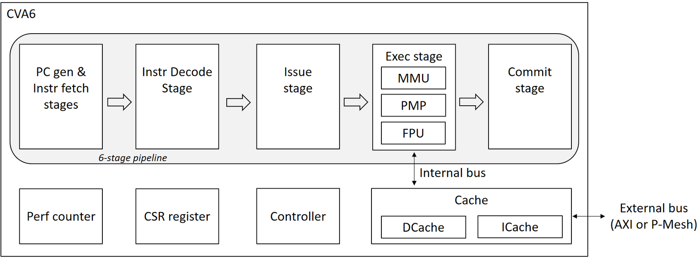

** The CVA6 Core :B_frame:
:PROPERTIES:
:BEAMER_env: frame
:END:
#+BEAMER: \framesubtitle{Benagil Team's Dual Core Version}
#+attr_org: :width 500
#+name: fig:dualcore
#+attr_latex: :width 12cm :options trim=0 0 50 0, clip :placement [H]
[[./figures/multicore_cva6.pdf]]

** Problem Statement :B_frame:
:PROPERTIES:
:BEAMER_env: frame
:END:
*** Problem :B_alertblock:
:PROPERTIES:
:BEAMER_env: alertblock
:END:

\small The dual-core system is limited by a 1-request-per-cycle bandwidth at the L1D cache.

*** Research Objectives :B_exampleblock:
:PROPERTIES:
:BEAMER_env: exampleblock
:END:

- \small How does the sharing of functional units (starting with the FPU) between two CVA6 cores affect the trade-off between hardware area efficiency and multi-core performance?

** Project Roadmap :B_frame:
:PROPERTIES:
:BEAMER_env: frame
:END:

#+attr_org: :width 500
#+name: fig:roadmap
#+attr_latex: :width \textwidth :options trim=0 0 0 0, clip :placement [H]
#+results: roadmap
[[file:roadmap.pdf]]
* Performance and Resource Usage Measurement
** How do We Measure Performance? :B_frame:
:PROPERTIES:
:BEAMER_env: frame
:END:
#+BEAMER: \framesubtitle{What do we measure?}
\small We evaluate performance using well-known workloads: UnixBench and the NAS Parallel Benchmarks (NPB). For each benchmark, we also measure instructions per cycle (/IPC/).

      #+begin_equation
#+begin_split
$IPC = \frac{\text{Number of Instructions}}{\text{Number of cycles}}$
#+end_split
#+end_equation

- \small Hardware performance counters. /Single Core/ available performance counters:
  - Number of Instructions
  - Number of cycles
   
- \small Benchmark scores:
  - \small NPB: *Mop/s (Millions of Operations per Second)*
  - \small Unixbench: *Loops per second (lps), KB/sec, and operations per second*

** How do We Measure Performance and Resource Usage? :B_frame:
:PROPERTIES:
:BEAMER_env: frame
:END:
#+BEAMER: \framesubtitle{Experimental Setup}

#+attr_org: :width 500
#+name: fig:pynq
#+attr_latex: :width 14.0cm :options angle=0 :placement [!htb]
#+caption: CVA6 /Single Core/ deployment on a PYNQ-Z2 FPGA with PMod Modules
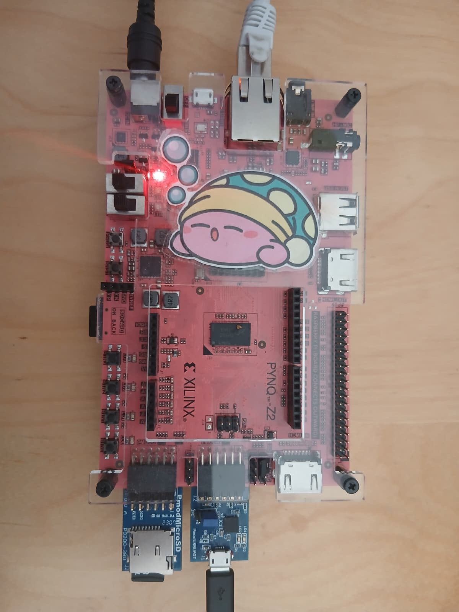
    
** How do We Measure Resource Usage? :B_frame:
:PROPERTIES:
:BEAMER_env: frame
:END:
*** Column 1 :BMCOL:
:PROPERTIES:
:BEAMER_col: 0.6
:END:
#+attr_org: :width 500
#+name: fig:pynq
#+attr_latex: :width 7.5cm :options angle=0 :placement [!htb]
#+caption: Zynq-7000 SoC
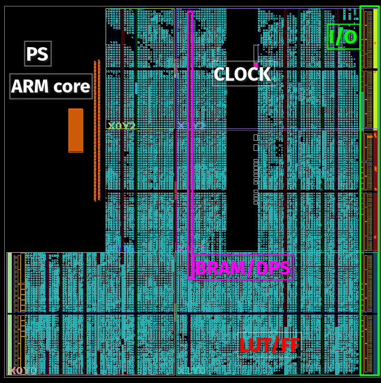
*** Column 2 :BMCOL:
:PROPERTIES:
:BEAMER_col: 0.4
:END:
\footnotesize The SoC (System on a chip) is mapped onto the FPGA’s programmable logic, utilizing the following hardware resources to implement the CVA6 design:

- \footnotesize Look Up Tables (*LUT*) for combinatorial logic.
- \footnotesize Flip Flops (*FF*) for state storage
- \footnotesize Block Random Access Memory (*BRAM*) for fast on-chip memory
- \footnotesize Digital Signal Processor (*DSP*) for high-performance math calculations
  
** How do We Measure Resource Usage? :B_frame:
:PROPERTIES:
:BEAMER_env: frame
:END:
#+attr_org: :width 500
#+name: fig:stages
#+attr_latex: :width \textwidth :options trim=0 0 230 0, clip :placement [H]
[[./figures/cva6_stages_annotated.pdf]]
   
** How do We Measure Resource Usage? :B_frame:
:PROPERTIES:
:BEAMER_env: frame
:END:
#+BEAMER: \framesubtitle{Initial LUT Usage Measurement}
#+attr_org: :width 500
#+name: fig:base_lut
#+attr_latex: :width 15.0cm :options angle=0 :placement [!htb]
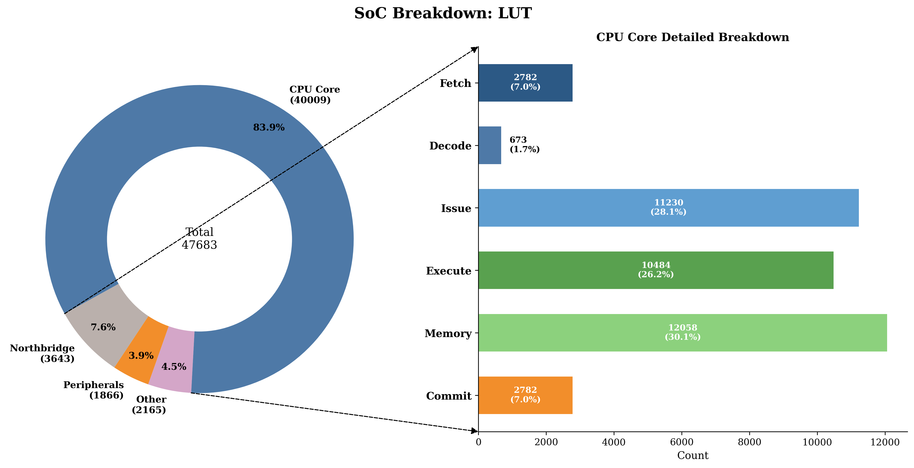
  
** How do We Measure Resource Usage? :B_frame:
:PROPERTIES:
:BEAMER_env: frame
:END:
#+BEAMER: \framesubtitle{Initial FF Usage Measurement}
#+attr_org: :width 500
#+name: fig:base_ff
#+attr_latex: :width 15.0cm :options angle=0 :placement [!htb]
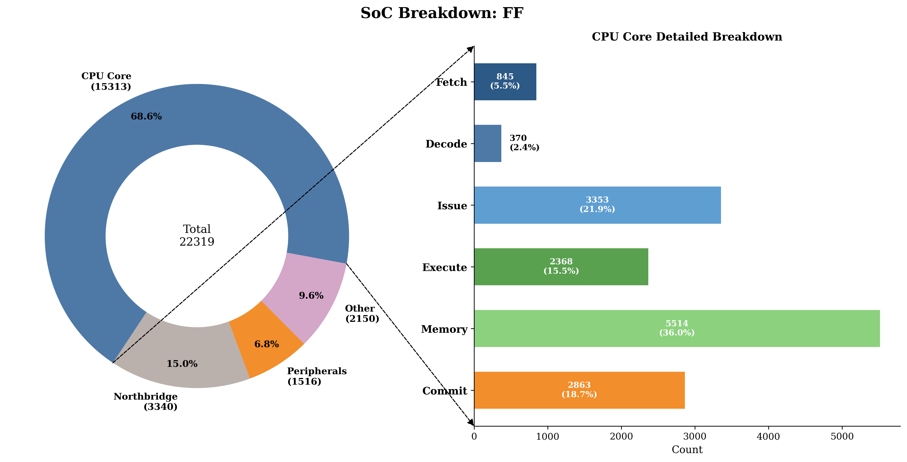
 
** How do We Measure Resource Usage? :B_frame:
:PROPERTIES:
:BEAMER_env: frame
:END:
#+BEAMER: \framesubtitle{Initial BRAM Usage Measurement}
#+attr_org: :width 500
#+name: fig:base_bram
#+attr_latex: :width 15.0cm :options angle=0 :placement [!htb]
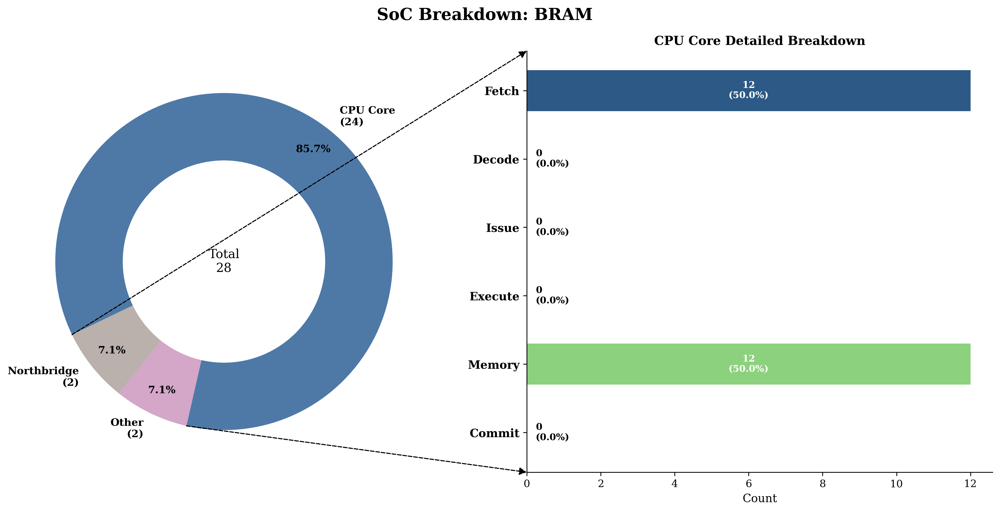

** How do We Measure Resource Usage? :B_frame:
:PROPERTIES:
:BEAMER_env: frame
:END:
#+BEAMER: \framesubtitle{Initial DSP Usage Measurement}
#+attr_org: :width 500
#+name: fig:base_dsp
#+attr_latex: :width 15.0cm :options angle=0 :placement [!htb]
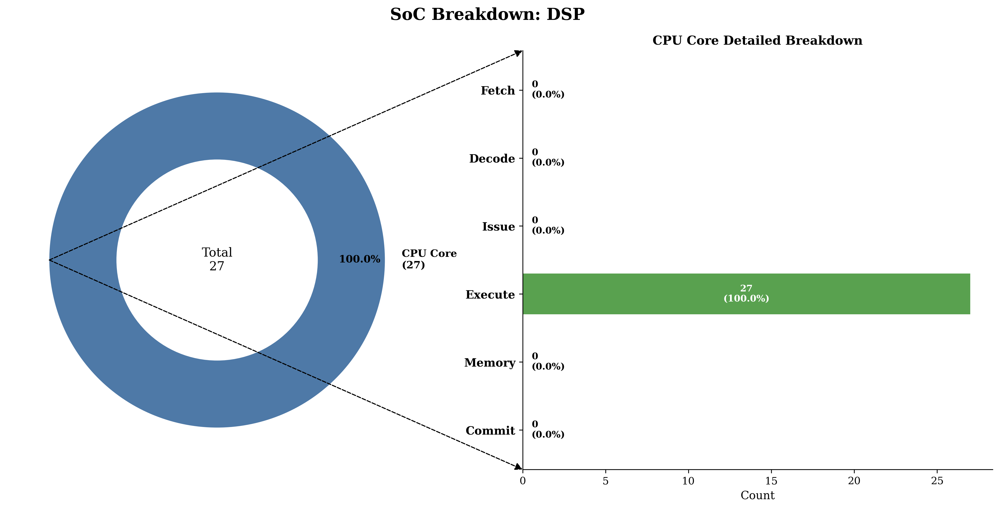
* Experiments
** Baseline Architecture :B_frame:
:PROPERTIES:
:BEAMER_env: frame
:END:
To study the effects of the micro-architectural parameters the following baseline parameters were used.
#+label: tab:baseline_parameters
#+attr_latex: :environment tabular :width \textwidth :align lll
|------------------------------------+---------------+------------|
| *Parameter*                          |          *Size* | *CVA6 Stage* |
|------------------------------------+---------------+------------|
| Data Cache                         | $4096[bytes]$ | Memory     |
|------------------------------------+---------------+------------|
| Data Cache Associativity           |             4 | Memory     |
|------------------------------------+---------------+------------|
| Data Cache Line Width              |           128 | Memory     |
|------------------------------------+---------------+------------|
| Instruction Cache                  | $4096[bytes]$ | Fetch      |
|------------------------------------+---------------+------------|
| Instruction Cache Associativity    |             4 | Fetch      |
|------------------------------------+---------------+------------|
| Instruction Cache Line Width       |           128 | Fetch      |
|------------------------------------+---------------+------------|
| Branch Target Buffer (BTB) Entries |            16 | Fetch      |
|------------------------------------+---------------+------------|
| Branch History Table (BHT) Entries |            16 | Fetch      |
|------------------------------------+---------------+------------|
| Retirement Width of the CPU        |             2 | Commit     |
|------------------------------------+---------------+------------|
** Parameter Sweeps :B_frame:
:PROPERTIES:
:BEAMER_env: frame
:END:
And the following parameters sweeps were proposed to study their effect on performance and resource utilization.

#+label: tab:baseline_parameters
#+attr_latex: :environment tabular :width \textwidth :align lll
|---------------------+--------------------------+----------------|
| *Sweep*               | *Range*                    | *CVA6 Stage*     |
|---------------------+--------------------------+----------------|
| Data Cache          | $128[bytes]\to256k[bytes]$ | Memory         |
|---------------------+--------------------------+----------------|
| Data / Instruction  | $1\to16$                   | Memory / Fetch |
| Cache Associativity |                          |                |
|---------------------+--------------------------+----------------|
| Instruction Cache   | $2k[bytes]\to256k[bytes]$  | Fetch          |
|---------------------+--------------------------+----------------|
| BTB Entries         | $8\to32k$                  | Fetch          |
|---------------------+--------------------------+----------------|
| BHT Entries         | $16\to16k$                 | Fetch          |
|---------------------+--------------------------+----------------|
** Automated Benchmarking Framework :B_frame:
:PROPERTIES:
:BEAMER_env: frame
:END:
# A script was written to automatically flash the bitstreams (Ethernet) and run the benchmarks (serial)
To automate design space exploration, we developed a framework which uses the ARM core and the CVA6 core, the full run of the benchmarks for all the parameter sweeps takes 21 hours.
#+attr_org: :width 500
#+name: fig:base_dsp
#+attr_latex: :width 8.0cm :options angle=0 :placement [!htb]
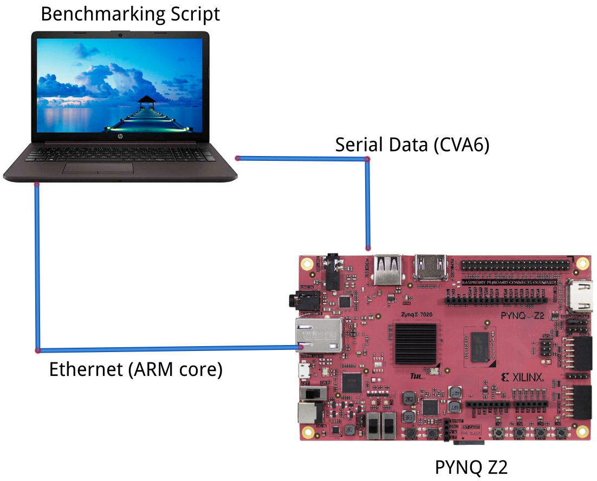

* Results
** Performance Dynamics :B_frame:
:PROPERTIES:
:BEAMER_env: frame
:END:
#+attr_org: :width 500
#+name: fig:base_bram
#+attr_latex: :width 15cm :options angle=0 :placement [!htb]
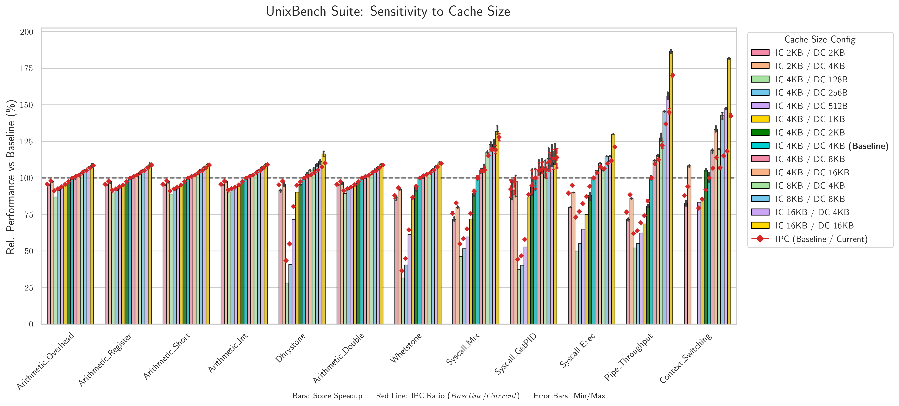
** Performance Dynamics :B_frame:
:PROPERTIES:
:BEAMER_env: frame
:END:
#+attr_org: :width 500
#+name: fig:base_bram
#+attr_latex: :width 14cm :options angle=0 :placement [!htb]
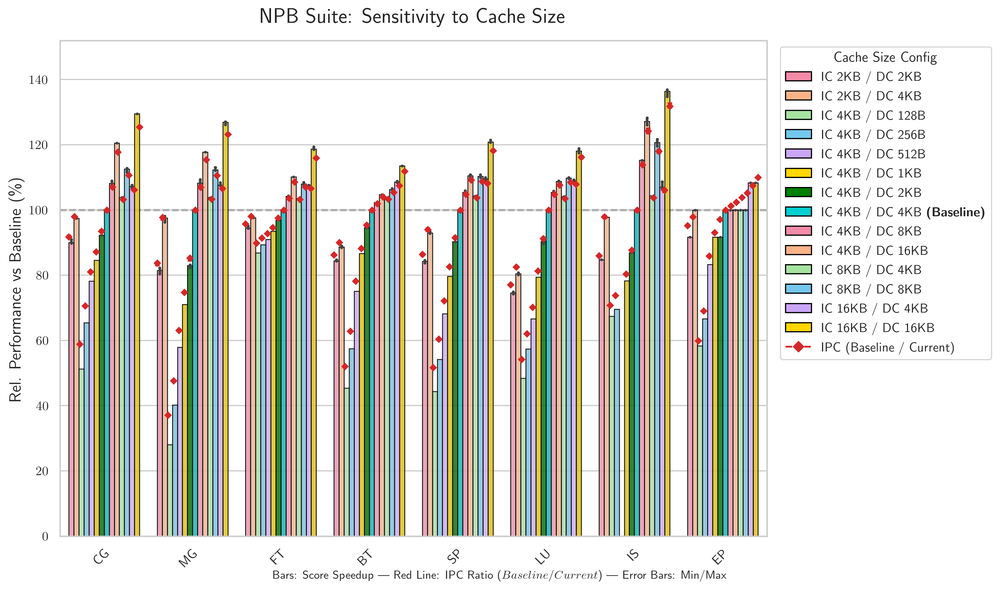

** Performance Dynamics :B_frame:
:PROPERTIES:
:BEAMER_env: frame
:END:
#+attr_org: :width 500
#+name: fig:base_bram
#+attr_latex: :width 15cm :options angle=0 :placement [!htb]
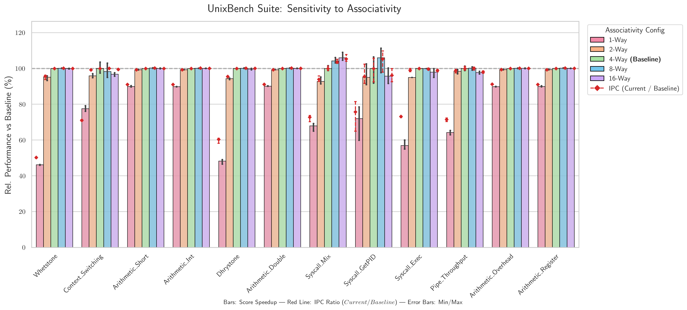

** Performance Dynamics :B_frame:
:PROPERTIES:
:BEAMER_env: frame
:END:
#+attr_org: :width 500
#+name: fig:base_bram
#+attr_latex: :width 15cm :options angle=0 :placement [!htb]
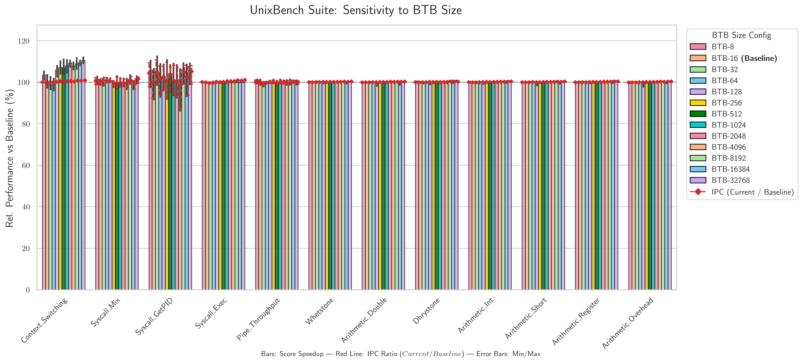

** Performance Dynamics :B_frame:
:PROPERTIES:
:BEAMER_env: frame
:END:
#+attr_org: :width 500
#+name: fig:base_bram
#+attr_latex: :width 15cm :options angle=0 :placement [!htb]
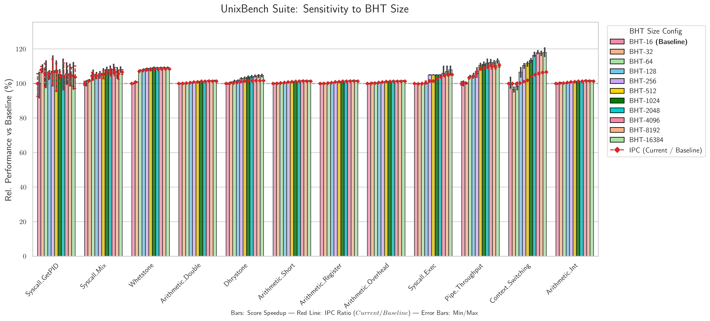

** Resource Usage Dynamics :B_frame:
:PROPERTIES:
:BEAMER_env: frame
:END:
#+attr_org: :width 500
#+name: fig:base_bram
#+attr_latex: :width 14cm :options angle=0 :placement [!htb]
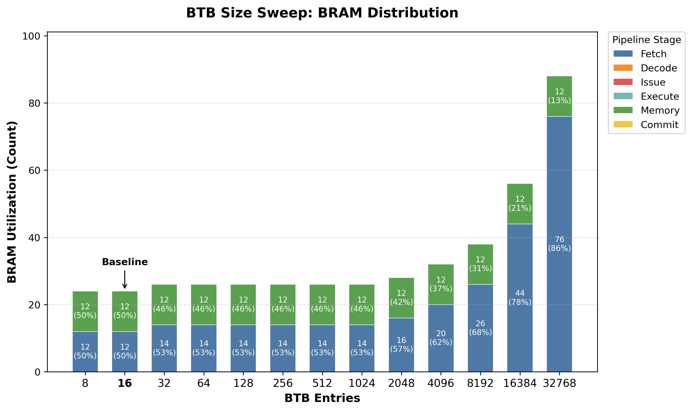

** Resource Usage Dynamics :B_frame:
:PROPERTIES:
:BEAMER_env: frame
:END:
#+attr_org: :width 500
#+name: fig:base_bram
#+attr_latex: :width 14cm :options angle=0 :placement [!htb]
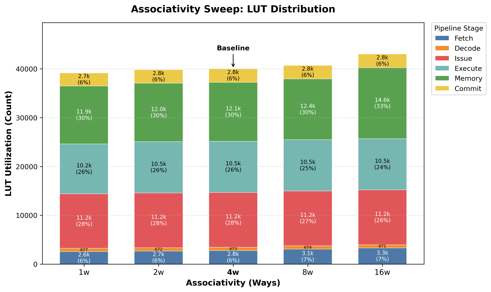

** Resource Usage Dynamics :B_frame:
:PROPERTIES:
:BEAMER_env: frame
:END:
#+attr_org: :width 500
#+name: fig:base_bram
#+attr_latex: :width 14cm :options angle=0 :placement [!htb]
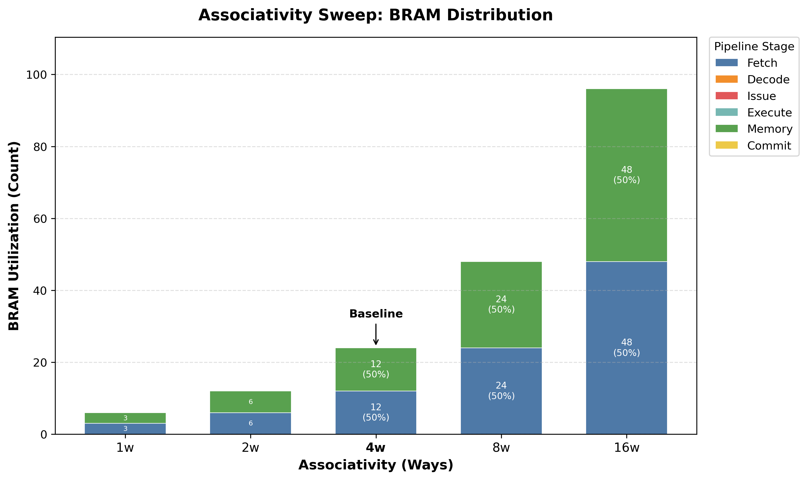

** Resource Usage Dynamics :B_frame:
:PROPERTIES:
:BEAMER_env: frame
:END:
#+attr_org: :width 500
#+name: fig:base_bram
#+attr_latex: :width 9cm :options angle=0 :placement [!htb]
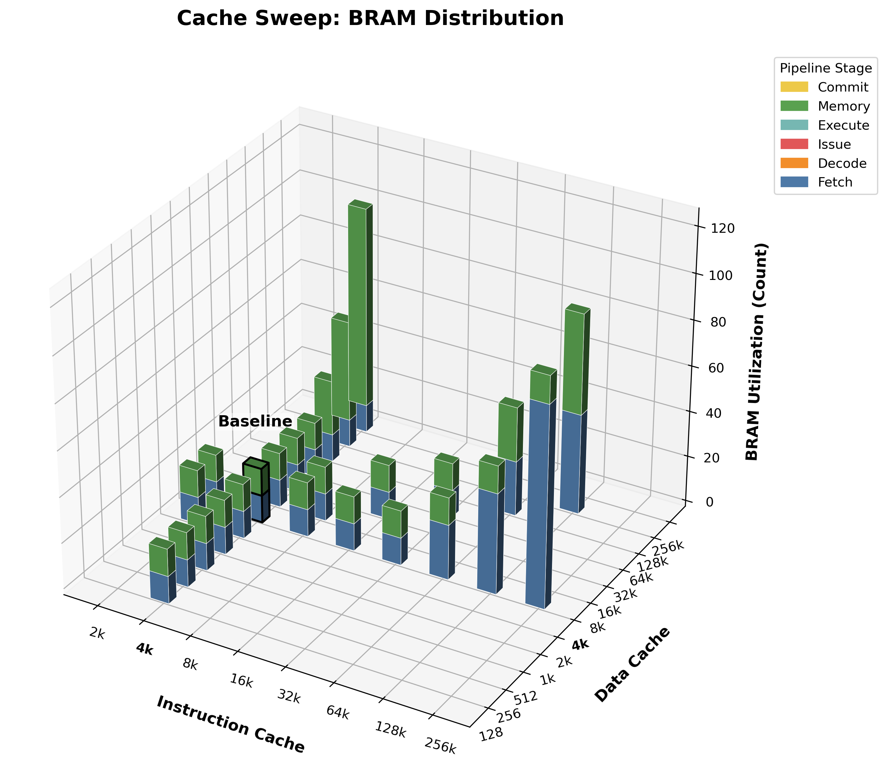

* Contributions    
** Contributions :B_frame:
:PROPERTIES:
:BEAMER_env: frame
:END:
- PR to the NPB repository
/https://github.com/benchmark-subsetting/NPB3.0-omp-C/pull/2/
#+attr_org: :width 500
#+name: fig:gitHub_repo
#+attr_latex: :width 10cm :options angle=0 :placement [!htb]
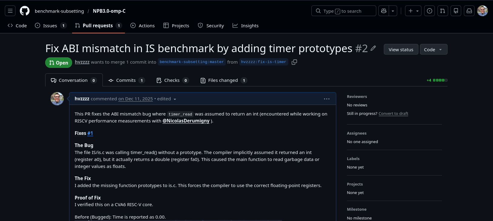
- Automated tool for benchmarking architectural changes on the PYNQ Z2
- Baseline performance / utilization measurements for CVA6 multi-core 
* Conclusion and Future work    
** Conclusion :B_frame:
:PROPERTIES:
:BEAMER_env: frame
:END:
- /Automated Benchmarking Established/: Successfully developed an automated evaluation tool for the PYNQ-Z2 , securing complete single-core performance and resource baselines.
 
- /Cache Size Trade-offs/: Larger instruction and data caches significantly accelerate workloads like context switching and system calls , though they require substantially more BRAM.

- /Inefficient Scaling Returns/: Scaling cache associativity and branch predictors (BTB/BHT) yields negligible performance improvements while heavily increasing LUT and BRAM consumption.

- /Prepared for Multi-Core Expansion/: The established baselines clear the path for the next project phase: developing the shared resource arbitrator and decoupling the core.

** Future Work :B_frame:
:PROPERTIES:
:BEAMER_env: frame
:END:

#+attr_org: :width 500
#+name: fig:roadmap
#+attr_latex: :width \textwidth :options trim=0 0 0 0, clip :placement [H]
#+results: roadmap_future
[[file:roadmap_future.pdf]]
  
*  :B_frame:
:PROPERTIES:
:BEAMER_env: frame
:END:
#+begin_export latex
\frametitle{}

\begin{huge}
\begin{center}

\textbf{\textcolor{ao-english}{Thank you!}}
\end{center}
\end{huge}

\begin{center}
\textbf{hanan.quispecondori@ip-paris.fr}

\hspace{2.5cm}

\scriptsize{\textcolor{ao-english}{This work is being supported by the \textbf{BENAGIL TEAM}}}
\end{center}

\begin{multicols}{2}

\begin{figure}
    \centering
    \includegraphics[width=5cm]{figures/inria_logo.png}
\end{figure}

\columnbreak

\begin{figure}
    \centering
    \includegraphics[width=1.5cm]{figures/logo_TSP.png}
\end{figure}

\end{multicols}
#+end_export
* Code :noexport:

#+name: roadmap
#+begin_src mermaid :file roadmap.pdf :args --scale 4 --pdfFit --viewportWidth 1600 --viewportHeight 600 --backgroundColor transparent :theme forest :eval never-export

block-beta
    columns 6
    
    %% ROW 1: HEADERS
    H1["Stage 1 (Baseline Measurements)"] 
    H2["Stage 2 (Microarchitectural Study)"] 
    H3["Stage 3 (Performance Framework Development)"] 
    H4["Stage 4 (Core Modification & Decoupling)"] 
    H5["Stage 5 (Arbitration Module Design)"] 
    H6["Stage 6 (System Integration & Evaluation)"]
    
    %% ROW 2
    C1_1["Deployment of CVA6 on the Pynq Z2"] 
    C2_1["Analysis of Data and Instruction cache sizes"] 
    C3_1["Automated framework for performance measurement"] 
    C4_1["Development of a modified CVA6 version"] 
    C5_1["Development of the shared resource arbitrator"] 
    C6_1["Evaluation of performance and FPGA utilization (FF/LUT/BRAM)"]
    
    %% ROW 3
    C1_2["Baseline SoC Utilization measurements (FF/LUT/BRAM)"] 
    C2_2["Study of Branch Predictor and TLB size influence"] 
    C3_2["Integration of NAS Parallel Benchmarks"] 
    C4_2["Implementation of an external module interface [optional]"] 
    C5_2["Implementation of pipeline stalling logic [optional]"] 
    C6_2["Evaluation of performance NPB and Unixbench"]
    
    %% ROW 4 (Using "space" for empty blocks so columns don't collapse)
    C1_3["Baseline NPB and Unixbench measurements"] 
    space 
    C3_3["Integration of UnixBench suite"] 
    C4_3["Enabling connection for FPU management [optional]"] 
    C5_3["Routing of results between multiple cores [optional]"] 
    space
    
    %% STYLES
    classDef head1 fill:#a9cc66,stroke:#333,stroke-width:1px,color:#000,font-weight:bold
    classDef box1 fill:#d6f57d,stroke:#e0e0e0,stroke-width:2px,color:#000
    classDef head2 fill:#8ef07a,stroke:#333,stroke-width:1px,color:#000,font-weight:bold
    classDef box2 fill:#bcfa96,stroke:#e0e0e0,stroke-width:2px,color:#000
    classDef head3 fill:#c7da73,stroke:#333,stroke-width:1px,color:#000,font-weight:bold
    classDef box3 fill:#f7f6ad,stroke:#e0e0e0,stroke-width:2px,color:#000
    classDef head4 fill:#74db69,stroke:#333,stroke-width:1px,color:#000,font-weight:bold
    classDef box4 fill:#90fa87,stroke:#e0e0e0,stroke-width:2px,color:#000
    classDef head5 fill:#55d992,stroke:#333,stroke-width:1px,color:#000,font-weight:bold
    classDef box5 fill:#7afaaa,stroke:#e0e0e0,stroke-width:2px,color:#000
    classDef head6 fill:#60d6c7,stroke:#333,stroke-width:1px,color:#000,font-weight:bold
    classDef box6 fill:#8bfaf1,stroke:#e0e0e0,stroke-width:2px,color:#000

    class H1 head1
    class C1_1,C1_2,C1_3 box1
    class H2 head2
    class C2_1,C2_2 box2
    class H3 head3
    class C3_1,C3_2,C3_3 box3
    class H4 head4
    class C4_1,C4_2,C4_3 box4
    class H5 head5
    class C5_1,C5_2,C5_3 box5
    class H6 head6
    class C6_1,C6_2 box6
#+end_src 

#+name: roadmap_future
#+begin_src mermaid :file roadmap_future.pdf :args --scale 4 --pdfFit --viewportWidth 1600 --viewportHeight 600 --backgroundColor transparent :theme forest :eval never-export
block-beta
    columns 3
    
    %% ROW 1: HEADERS
    H4["Stage 4 (Core Modification & Decoupling)"] 
    H5["Stage 5 (Arbitration Module Design)"] 
    H6["Stage 6 (System Integration & Evaluation)"]
    
    %% ROW 2
    C4_1["Development of a modified CVA6 version"] 
    C5_1["Development of the shared resource arbitrator"] 
    C6_1["Evaluation of performance and FPGA utilization (FF/LUT/BRAM)"]
    
    %% ROW 3
    C4_2["Implementation of an external module interface [optional]"] 
    C5_2["Implementation of pipeline stalling logic [optional]"] 
    C6_2["Evaluation of performance NPB and Unixbench"]
    
    %% ROW 4 (Using "space" for empty blocks so columns don't collapse)
    C4_3["Enabling connection for FPU management [optional]"] 
    C5_3["Routing of results between multiple cores [optional]"] 
    space
    
    %% STYLES
    classDef head1 fill:#a9cc66,stroke:#333,stroke-width:1px,color:#000,font-weight:bold
    classDef box1 fill:#d6f57d,stroke:#e0e0e0,stroke-width:2px,color:#000
    classDef head2 fill:#8ef07a,stroke:#333,stroke-width:1px,color:#000,font-weight:bold
    classDef box2 fill:#bcfa96,stroke:#e0e0e0,stroke-width:2px,color:#000
    classDef head3 fill:#c7da73,stroke:#333,stroke-width:1px,color:#000,font-weight:bold
    classDef box3 fill:#f7f6ad,stroke:#e0e0e0,stroke-width:2px,color:#000
    classDef head4 fill:#74db69,stroke:#333,stroke-width:1px,color:#000,font-weight:bold
    classDef box4 fill:#90fa87,stroke:#e0e0e0,stroke-width:2px,color:#000
    classDef head5 fill:#55d992,stroke:#333,stroke-width:1px,color:#000,font-weight:bold
    classDef box5 fill:#7afaaa,stroke:#e0e0e0,stroke-width:2px,color:#000
    classDef head6 fill:#60d6c7,stroke:#333,stroke-width:1px,color:#000,font-weight:bold
    classDef box6 fill:#8bfaf1,stroke:#e0e0e0,stroke-width:2px,color:#000

    class H4 head4
    class C4_1,C4_2,C4_3 box4
    class H5 head5
    class C5_1,C5_2,C5_3 box5
    class H6 head6
    class C6_1,C6_2 box6
#+end_src
