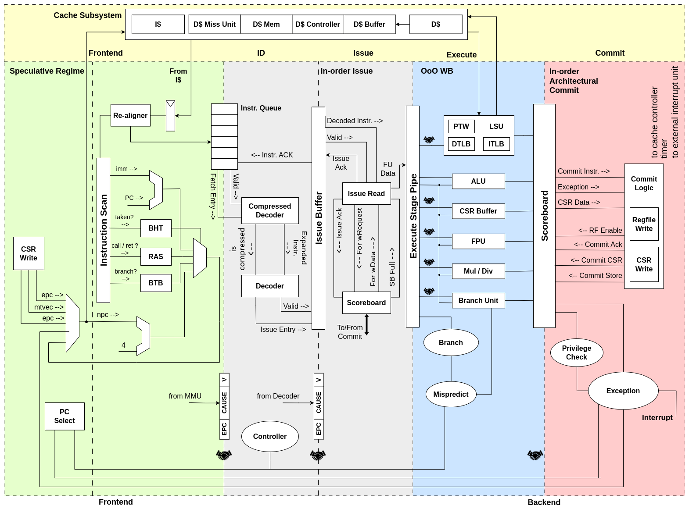
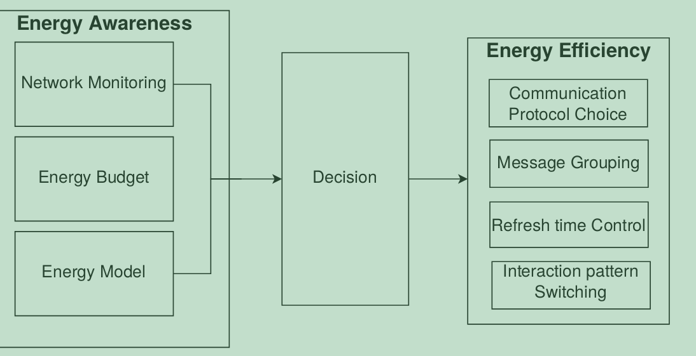
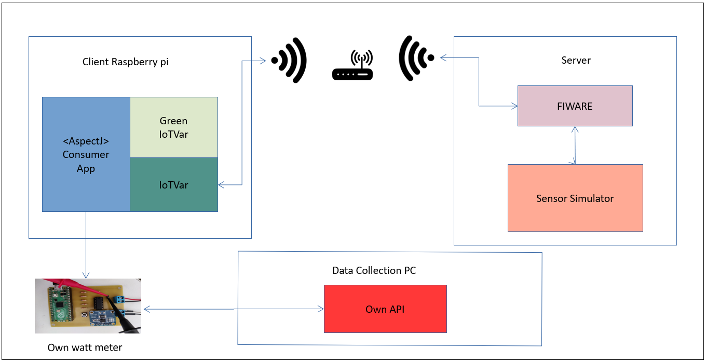
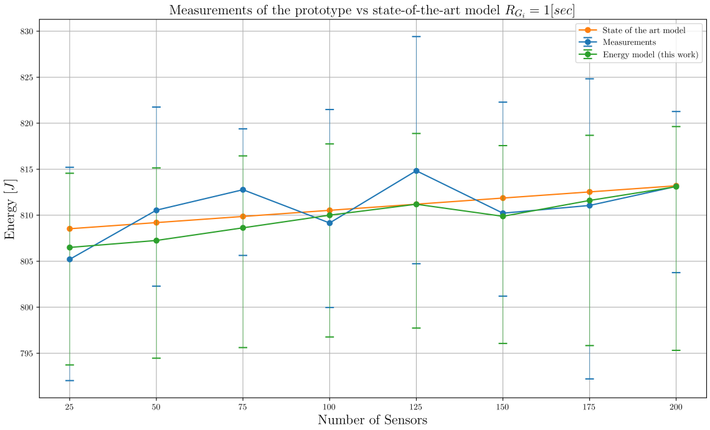
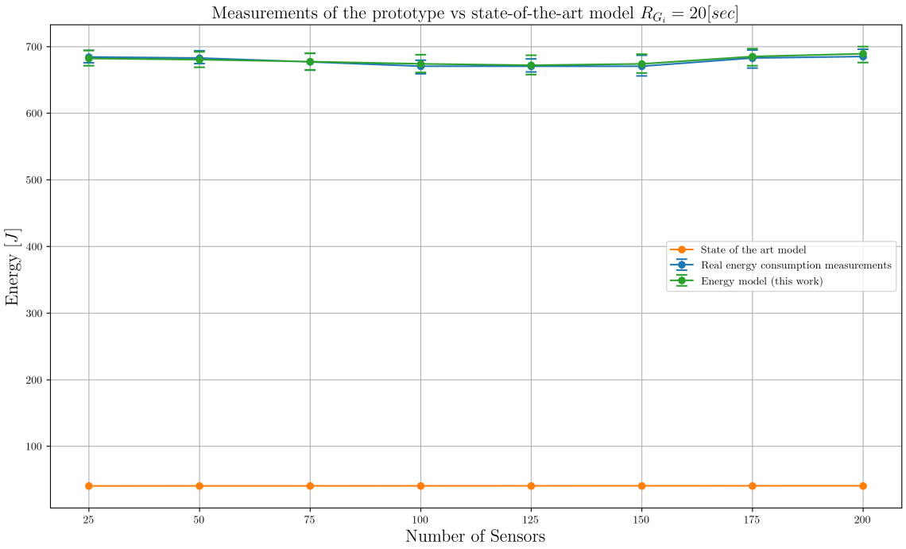

#+title:Customization of the CVA6 core
:properties:
#+language: en
#+exclude_tags: journal code noexport
#+date: March 9, 2026
#+BEAMER_HEADER: \title[PDS Research Project]{Customization of the CVA6 core}
#+latex_header: \usepackage[style=apa,backend=bibtex]{biblatex}
#+LATEX_HEADER: \definecolor{purple_plain}{RGB}{94,129,172}
#+LATEX_HEADER: \definecolor{grey}{RGB}{51, 63, 72}
#+LATEX_HEADER: \definecolor{DodgerBlue4}{RGB}{16, 78, 139}
#+LATEX_HEADER: \definecolor{PaleGreen1}{RGB}{154, 255, 154}
#+LATEX_HEADER: \definecolor{darkskyblue}{RGB}{0, 103, 165}
#+LATEX_HEADER: \definecolor{darkgreen}{RGB}{0,128,0}
#+LATEX_HEADER: \definecolor{amaranth}{rgb}{0.9, 0.17,0.31}
#+LATEX_HEADER: \definecolor{ao-english}{rgb}{0.0,0.5, 0.0}
#+LATEX_HEADER: \usepackage{amsmath,amsfonts,amssymb,amsthm,enumerate,multirow,array,graphicx,lscape,lastpage,mathabx,csquotes}
#+LATEX_HEADER: \usetheme{Madrid}
#+LATEX_HEADER: \usepackage{fontawesome}
#+LaTeX_HEADER: \hypersetup{linktoc = all, colorlinks = true, urlcolor = DodgerBlue4, citecolor = PaleGreen1, linkcolor = black}
#+LATEX_HEADER: \usefonttheme{professionalfonts}
#+LATEX_HEADER: \usepackage{tikz}
#+LATEX_HEADER: \usetikzlibrary{calc}
#+LATEX_HEADER: \usepackage{subfig}
#+LATEX_HEADER: \captionsetup[figure]{labelformat=empty}
#+LATEX_HEADER: \usecolortheme{seahorse}
#+LATEX_HEADER: \usepackage{appendixnumberbeamer}
#+LATEX_HEADER: \title[]{Customization of the CVA6 core}
#+LATEX_HEADER: \author[Hanan Quispe] % (optional)
#+LATEX_HEADER: {\textbf{Hanan Quispe}\inst{1}}
#+LATEX_HEADER: \institute[]
#+LATEX_HEADER: {\inst{1}%
#+LATEX_HEADER: 	Institut Polytechnique de Paris}
#+LATEX_HEADER: \titlegraphic {
#+LATEX_HEADER: \begin{tikzpicture}[overlay,remember picture]
#+LATEX_HEADER:     \node[left=0.7cm] at (current page.335){
#+LATEX_HEADER:         \includegraphics[width=1.8cm]{figures/logo_ip.png}};
#+LATEX_HEADER:     \node[right=0.7cm] at (current page.207){
#+LATEX_HEADER:         \includegraphics[width=1.5cm]{figures/logo_TSP.png}};
#+LATEX_HEADER: \end{tikzpicture}
#+LATEX_HEADER: }
#+OPTIONS: num:nil toc:nil todo:nil title:nil author:nil H:2
# #+REVEAL_TRANS: Slide
# #+REVEAL_INIT_OPTIONS: width:"100%", height:"100%", margin: 0.1, minScale:1, maxScale:1, slideNumber:true
# #+REVEAL_THEME: Serif
# #+BIND: org-beamer-frame-default-options "allowframebreaks"
#+LaTeX_CLASS: beamer
#+LaTeX_CLASS_OPTIONS: [bigger]
:end:
#+begin_export latex
\begin{frame}
    \titlepage
\end{frame}
\begin{frame}{Outline}
        \tableofcontents[hideallsubsections]
\end{frame}

\AtBeginSection[]
{
  \begin{frame}
    \frametitle{Outline}
    \tableofcontents[currentsection,hideallsubsections]
  \end{frame}
}
#+end_export
* Motivation
** The CVA6 Core :B_frame:
:PROPERTIES:
:BEAMER_env: frame
:END:
#+BEAMER: \framesubtitle{A 6-stage RISC-V Open-Source core}
*** Column 1 :BMCOL:
:PROPERTIES:
:BEAMER_col: 0.5
:END:

- \small Industry Standard: CVA6 is a single-issue, in-order design maintained by the OpenHW Foundation (with Thales).
- \small Versatility: Ideal for ISA extensions (Virtualization), prototyping, and integration into complex multi-core structures like OpenPiton.
- \small Local Implementation: Internal dual-core prototype developed by the Inria Benagil team for FPGA deployment.

*** Column 2 :BMCOL:
:PROPERTIES:
:BEAMER_col: 0.5
:END:

#+attr_org: :width 500
#+name: fig:openhw
#+attr_latex: :width 4.0cm :options angle=0 :placement [!htb]
[[./figures/openhw.png]]

#+attr_org: :width 500
#+name: fig:inria
#+attr_latex: :width 5.0cm :options angle=0 :placement [!htb]
[[./figures/inria_logo.png]]

# - context (background) 50%
#   - motivation (roadmap).
#   - CVA6.
#   - logical blocks (where are the cache (assoc), bht,btb, commit, tlb) explain.
** The CVA6 Core :B_frame:
:PROPERTIES:
:BEAMER_env: frame
:END:
#+BEAMER: \framesubtitle{Original Single Core Version}
#+attr_org: :width 500
#+name: fig:openhw
#+attr_latex: :width 12cm :height 7cm :options angle=0 :placement [!htb]

** The CVA6 Core :B_frame:
:PROPERTIES:
:BEAMER_env: frame
:END:
#+BEAMER: \framesubtitle{Benagil Team's Dual Core Version}
#+attr_org: :width 500
#+name: fig:openhw
#+attr_latex: :width \textwidth :options trim=0 0 50 0, clip :placement [H]
[[./figures/multicore_cva6.pdf]]

** Problem Statement :B_frame:
:PROPERTIES:
:BEAMER_env: frame
:END:
*** Problem :B_alertblock:
:PROPERTIES:
:BEAMER_env: alertblock
:END:

\small The dual-core system is limited by a 1-request-per-cycle bandwidth at the L1D cache.

*** Research Objectives :B_exampleblock:
:PROPERTIES:
:BEAMER_env: exampleblock
:END:

- \small \textbf{RQ1} How does the sharing of functional units (starting with the FPU) between two CVA6 cores affect the trade-off between hardware area efficiency and multi-core performance?

** Project Roadmap :B_frame:
:PROPERTIES:
:BEAMER_env: frame
:END:

#+attr_org: :width 500
#+name: fig:roadmap
#+latex: \vspace{-0.5cm}
#+attr_latex: :width \paperwidth :options trim=30 480 0 10, clip :placement [H]
#+results: roadmap
[[file:roadmap.pdf]]
* Performance Measurement
** How do We Measure Performance? :B_frame:
:PROPERTIES:
:BEAMER_env: frame
:END:
#+BEAMER: \framesubtitle{Experimental Setup}
\small We evaluate the performance for well known workloads: Unixbench and NAS parallel Benchmarks (NPB).

#+attr_org: :width 500
#+name: fig:pynq
#+attr_latex: :width 7.0cm :options angle=90 :placement [!htb]
#+caption: CVA6 /Single Core/ deployment on a PYNQ-Z2 FPGA with PMod Modules
[[./figures/pynq.jpeg]]

# - \small CVA6 /Single Core/ deployment.

** How do We Measure Performance? :B_frame:
:PROPERTIES:
:BEAMER_env: frame
:END:
#+BEAMER: \framesubtitle{What do we measure?}
*** Column 2 :BMCOL:
:PROPERTIES:
:BEAMER_col: 0.5
:END:

\small Experimental setup

#+attr_org: :width 500
#+name: fig:pynq
#+attr_latex: :width 5.0cm :options angle=90 :placement [!htb]
[[./figures/pynq.jpeg]]

- \small CVA6 /Single Core/ deployment on a PYNQ-Z2 FPGA with PMod Modules.

*** Column 1 :BMCOL:
:PROPERTIES:
:BEAMER_col: 0.5
:END:

\small Performance data:

- \small Hardware counters: PAPI (instructions per cycle /IPC score/)
- \small Benchmark scores.

- experimental setup (pynq)          
  - cross compilation of PAPI (not all counters all working).

* Results
** Performance Evaluation :B_frame:
:PROPERTIES:
:BEAMER_env: frame
:END:
- 2 slides scripts to evaluate performance 
- graphs about the data (important ones)
  - connect the sizes (cache, bht,...) to the results
* Contributions    
** Contributions :B_frame:
:PROPERTIES:
:BEAMER_env: frame
:END:
- contributions
  - PR the NAS repo
  - automated script for benchmarking
  - analices in the performance ?
* Conclusion and Future work    
** Conclusion :B_frame:
:PROPERTIES:
:BEAMER_env: frame
:END:
- Conclusion
** Future Work :B_frame:
:PROPERTIES:
:BEAMER_env: frame
:END:
- future work

* Contexto :B_frame:
:PROPERTIES:
:BEAMER_env: frame
:END:
#+BEAMER: \framesubtitle{Evaluación de la energía consumida por el middleware IoTvar}
- Para 2025, se esperan 100 mil millones de dispositivos IoT, con un impacto significativo en el consumo energético.
- Un /middleware/ consciente de la energía optimiza el consumo del hardware al gestionar eficientemente el software.
- *IoTvar* es un middleware de IoT que predice el consumo energético, pero solo para periodos de tiempo fijos.
** Column 1 :BMCOL:
:PROPERTIES:
:BEAMER_col: 0.5
:END:

#+attr_org: :width 500
#+name: fig:iot
#+attr_latex: :width 5.5cm :options angle=0 :placement [!htb]
#+caption: Plataforma IoT

** Column 2 :BMCOL:
:PROPERTIES:
:BEAMER_col: 0.5
:END:

#+attr_org: :width 500
#+name: fig:iotvar_energy
#+attr_latex: :width 5.5cm :options angle=0 :placement [!htb]
#+caption: IoTvar energy layer

* Problema y objetivos de la investigación :B_frame:
:PROPERTIES:
:BEAMER_env: frame
:END:
** Problema :B_alertblock:
:PROPERTIES:
:BEAMER_env: alertblock
:END:

\small El modelo energético del estado del arte para middleware de IoT tiene tiempo de ejecución fijo y requiere calibración manual, lo que limita su uso más allá de entornos experimentales controlados.

** Objetivos de la investigación :B_exampleblock:
:PROPERTIES:
:BEAMER_env: exampleblock
:END:

\small Nuestro objetivo es desarrollar un nuevo modelo energético para IoTvar que introduzca el tiempo como variable, permitiendo ajustar dinámicamente estrategias de consumo energético durante la ejecución.

- \small \textbf{RQ1} ¿Cómo mejora la inclusión del tiempo como variable en el modelo energético la precisión de las predicciones de consumo de energía para el middleware IoTVar que se ejecuta en dispositivos que funcionan con baterías?

* Propuesta: Un modelo basado en datos para estimar el consumo energético en el tiempo

** Un modelo basado en datos :B_frame:
:PROPERTIES:
:BEAMER_env: frame
:END:
#+BEAMER: \framesubtitle{Diseño del estudio: Setup de toma de Datos}

#+attr_org: :width 500
#+name: fig:hardware
#+attr_latex: :width 12cm :options angle=0 :placement [!htb]

** Un modelo basado en datos :B_frame:
:PROPERTIES:
:BEAMER_env: frame
:END:
#+BEAMER: \framesubtitle{Diseño del estudio: IoTvar y el consumo energético}

#+attr_org: :width 500
#+name: fig:process
#+attr_latex: :width 12cm :height 7cm :options angle=0 :placement [h]
[[./figures/3.pdf]]

** Un modelo basado en datos :B_frame:
:PROPERTIES:
:BEAMER_env: frame
:END:
#+BEAMER: \framesubtitle{Simultaneous quantile regression}

El modelo desarrollado tiene la siguiente estructura.

#+attr_org: :width 500
#+name: fig:process_2
#+attr_latex: :width 12.5cm :options angle=0 :placement [h]
[[./figures/4.pdf]]

* Resultados del estudio

** Resultados :B_frame:
:PROPERTIES:
:BEAMER_env: frame
:END:
#+BEAMER: \framesubtitle{Nuestro modelo vs el modelo del estado del arte}

\small Para comparar nuestro modelo se tomaron en cuenta dos casos. \\

*** Column 1 :BMCOL:
:PROPERTIES:
:BEAMER_col: 0.5
:END:

\small Caso 1: $R_{G_{i}}=1[sec]$

#+attr_org: :width 500
#+name: fig:results_1
#+attr_latex: :width 6.0cm :options angle=0 :placement [!htb]

*** Column 2 :BMCOL:
:PROPERTIES:
:BEAMER_col: 0.5
:END:

\small Caso 2: $R_{G_{i}}=60[sec]$

#+attr_org: :width 500
#+name: fig:results_2
#+attr_latex: :width 6.0cm :options angle=0 :placement [!htb]

** Resultados :B_frame:
:PROPERTIES:
:BEAMER_env: frame
:END:
#+BEAMER: \framesubtitle{Nuestro modelo vs el modelo del estado del arte}
- Caso 1: $R_{G_{i}}=1[sec]$
#+name: tab:metrics_results
#+attr_latex: :environment tabular :width \textwidth :align |p{6cm}|p{4cm}| :placement [!htb]
|-----------------+-------------------|
| Modelo          |              RMSE |
|-----------------+-------------------|
| Estado del arte |  2.27289223970008 |
| Nuestro trabajo | 2.346818068057912 |
|-----------------+-------------------|
- Caso 2: $R_{G_{i}}=60[sec]$
#+name: tab:metrics_results_20segs
#+attr_latex: :environment tabular :width \textwidth :align |p{6cm}|p{4cm}| :placement [!htb]
|-----------------+-------------------|
| Model           |              RMSE |
|-----------------+-------------------|
| Estado del arte | 637.3381020863869 |
| Nuestro trabajo | 2.760910100099958 |
|-----------------+-------------------|

** Resultados :B_frame:
:PROPERTIES:
:BEAMER_env: frame
:END:
#+BEAMER: \framesubtitle{RQ1}

\small \textbf{RQ1} ¿Cómo mejora la inclusión del tiempo como variable en el modelo energético la precisión de las predicciones de consumo de energía para el middleware IoTVar que se ejecuta en dispositivos que funcionan con baterías?

- \small La inclusión del tiempo como variable en el modelo energético tiene un impacto mínimo en la precisión de las predicciones.

#+attr_org: :width 500
#+name: fig:results_3
#+attr_latex: :width 12.0cm :options angle=0 :placement [!htb]
[[./figures/5.pdf]]

* Amenazas a la validez, conclusiones y trabajo futuro

** Amenazas a la validez, conclusiones y trabajo futuro
:PROPERTIES:
:BEAMER_OPT: allowframebreaks
:END:

*** Amenazas a la validez
- \small Precisión de las mediciones de consumo energético
- \small Tasas de refresco variables en el middleware IoTvar
- \small Limitaciones en los parámetros de IoTvar para monitoreo de energía
*** Conclusiones
- \small La inclusión del tiempo como variable en el modelo energético genera un modelo más general sin comprometer la precisión.
- \small Las variables de IoTvar permiten predecir el consumo energético en función del tiempo.
*** Trabajo Futuro
- \small Realizar experimentos ejecutando el middleware IoTvar en otras placas (Odroid, BananaPi, etc.).
- \small Automatizar el procedimiento para determinar la frecuencia de muestreo en diferentes dispositivos.
- \small Ejecutar los experimentos en condiciones de temperatura controlada.
- \small Evaluar la incorporación de variables físicas, como la temperatura, en la predicción del consumo energético.

*  :B_frame:
:PROPERTIES:
:BEAMER_env: frame
:END:
#+begin_export latex
\frametitle{}

\begin{huge}
\begin{center}

\textbf{\textcolor{ao-english}{Thank you!}}
\end{center}
\end{huge}

\begin{center}
\textbf{hananquispec@outlook.com}

\hspace{2.5cm}

\scriptsize{\textcolor{ao-english}{This work has been partially supported by the \textbf{STIC AmSud project}: ``GreenSE4IoT - Towards Energy-efficient Software for Distributed Systems'' [STIC-AMSUD 22-STIC-04].}}
\end{center}

\titlegraphic {
\begin{tikzpicture}[overlay,remember picture]
    \node[left=0.2cm] at (current page.335){
        \includegraphics[width=1.5cm]{figures/STICAmSud.png}
    };
    \node[right=0.2cm] at (current page.207){
        \includegraphics[width=1cm]{figures/logo_ENSIIE.png}
        \includegraphics[width=2cm]{figures/E4C_logo.png}
    };

\end{tikzpicture}
}

\begin{multicols}{2}

\begin{figure}
    \centering
    \includegraphics[scale=0.25]{figures/STICAmSud.png}
\end{figure}

\columnbreak

\begin{figure}
    \centering
    \includegraphics[scale=0.1]{figures/listii.png}
\end{figure}

\end{multicols}
#+end_export
* Code :noexport:

#+name: roadmap
#+begin_src mermaid :file roadmap.pdf :args --scale 4 --pdfFit --viewportWidth 1600 --viewportHeight 600 --backgroundColor transparent :theme forest :eval never-export
%%{init: { 
  'theme': 'forest', 
  'themeVariables': { 
    'fontSize': '22px',
    'sectionFontSize': '24px',
    'fontFamily': 'arial'
  },
  'config': { 
    'timeline': { 
      'disableMultiline': false 
    } 
  } 
} }%%
timeline
    Stage 1 (Baseline Measurements) : Deployment of CVA6 on the Pynq Z2 : Baseline SoC Utilization measurements (FF/LUT/BRAM) : Baseline NPB and Unixbench measurements
    Stage 2 (Microarchitectural Study): Analysis of Data and Instruction cache sizes : Study of Branch Predictor and TLB size influence
    Stage 3 (Performance Framework Development) : Automated framework for performance measurement : Integration of NAS Parallel Benchmarks : Integration of UnixBench suite
    Stage 4 (Core Modification & Decoupling): Development of a modified CVA6 version : Implementation of an external module interface : Enabling connection for FPU management
    Stage 5 (Arbitration Module Design): Development of the shared resource arbitrator : Implementation of pipeline stalling logic : Routing of results between multiple cores
    Stage 6 (System Integration & Evaluation): Evaluation of performance and FPGA area (FF/LUT/BRAM) : Evaluation of performance NPB and Unixbench
#+end_src
