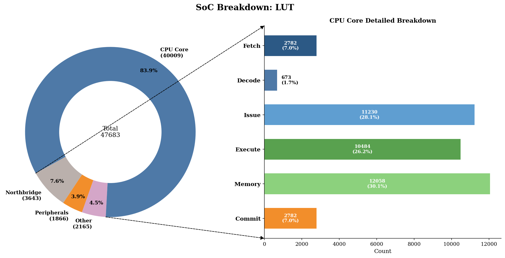
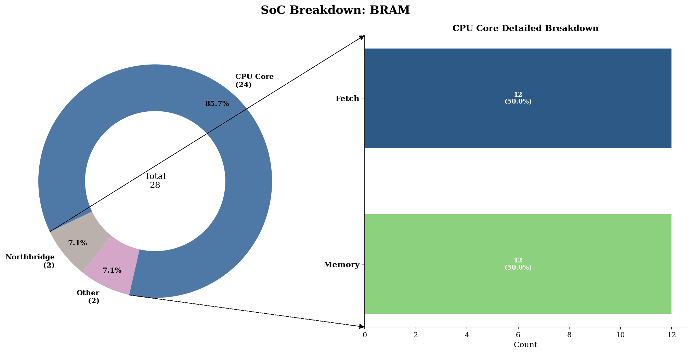
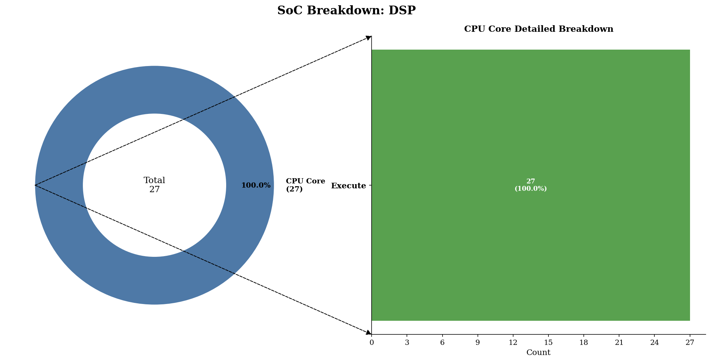
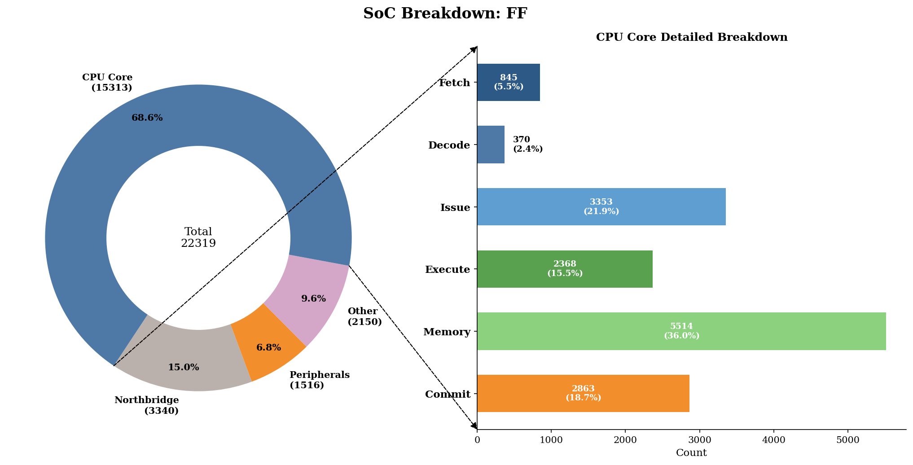

:properties:
#+options: toc:nil author:nil date:nil
#+language: en
#+exclude_tags: journal code noexport
#+latex_class: sigplan
#+latex_compiler: pdflatex
:end:
#+latex: \input{title}
#+begin_abstract
  This study investigates the performance and resource trade-offs of hardware sharing in the CVA6 RISC-V core, specifically targeting the Floating Point Unit (FPU). The research followed a three stage methodology: an initial microarchitectural design space exploration on a single core configuration to establish a baseline using UnixBench and NAS Parallel Benchmarks, the design of a custom arbitrator for shared FPU access, and a final evaluation of system performance. Critically, the hardware impact is assessed through resource utilization measuring FF, LUT, BRAM, and DSP. This approach quantifies the logic to performance trade-off, providing actionable insights for ASIC-targeted research within the OpenHW and PULP ecosystems.
#+end_abstract
* Introduction

The optimization of performance, power, and area (PPA) through the sharing of underutilized execution units is a foundational strategy in multicore architecture.[[cite:&rodrigues_does_2015]] establish a critical baseline for this approach by examining the sharing of floating-point (FP) datapaths between pairs of cores, an architecture similar to AMD’s Bulldozer. Their findings highlight a distinct trade-off: while sharing can yield significant power savings, it may result in performance losses of up to 28%, though these losses can be halved by maintaining individual reservation stations while sharing only the execution units. This focus on efficiency is echoed in the RISC-V domain by [[cite:&islam_efficient_2021]], who demonstrate that sharing functional units in a five-stage scalar pipeline can reduce FPGA resource utilization—specifically saving up to 23.5% in LUT usage and 75% in DSP usage—with average performance drops ranging from 2.9% to 22.3%. Furthering the case for low-power applications, the Florian project [[cite:&park_florian_2023]] and subsequent studies on IoT endnodes [[cite:&park_designing_2024]]  argue that dedicated FPUs are often "overkill" for lightweight cores, proposing an external shared FPU that can achieve energy savings of nearly 80% in quad-core configurations. Complementing these architectural shifts, [[cite:&kumar_32-bit_2025]]  explore switchable FPUs compliant with IEEE 754-2008, emphasizing that dynamic switching between integer and floating-point operations can significantly enhance computational efficiency and reduce execution latency.

However, scaling these resource-sharing techniques to an application-class core like the CVA6 [[cite:&sa_cva6_2023]] introduces a level of complexity not addressed in simpler designs. The CVA6 is a significantly more complex core than what previous shared-FPU studies have utilized.It features a 6-stage, single-issue, out-of-order execution pipeline with an integrated FPU. Sharing its FPU between two cores raises sophisticated architectural questions, particularly regarding how to handle the scoreboard interaction, writeback arbitration, and pipeline stalls that do not arise with simpler in-order cores. Because CVA6 serves as the reference core for the OpenHW Group and is widely utilized in European research SoCs like the PULP ecosystem, this research is of high practical relevance.

* Microarchitectural Design Space Exploration
Microarchitectural design space exploration necessitated a evaluation of both performance and resource utilization. To assess performance, we utilized standard workloads, specifically UnixBench and the NAS Parallel Benchmarks (NPB). Resource utilization was quantified using Vivado’s post-implementation utilization reports.

** Experimental Setup

#+attr_org: :width 400
#+name: fig:setup
#+attr_latex: :width 6.5cm :options angle=0 :placement [!htb]
#+caption: CVA6 /Single Core/ deployment on a PYNQ-Z2 FPGA with PMod Modules
[[../presentation/figures/pynq.jpeg]]

Experiments were conducted on a PYNQ-Z2 FPGA, supplemented by two PMOD modules providing a microSD interface and a UART port for serial communication.

In addition to the setup described in figure [[fig:setup]] for automation purposes an additional Ethernet connection was used, resulting in the final experimental setup.

#+attr_org: :width 400
#+name: fig:setup_complete
#+attr_latex: :width 8.5cm :options angle=0 :placement [!htb]
#+caption: Experimental Setup
[[../presentation/figures/bench.png]]
** Resource Utilization Measurement
The first part of this project consisted in evaluating the resource usage due to different parameters of the CVA6 architecture. For evaluation purposes a baseline configuration is given with the following parameters.

#+caption: Baseline Bitstream Configuration
#+label: tab:baseline_parameters
#+attr_latex: :environment tabular* :width \columnwidth :align @{\extracolsep{\fill}}ll
|---------------------------------+---------------|
| *Parameter*                       |          *Size* |
|---------------------------------+---------------|
| Data Cache                      | $4096[bytes]$ |
| Data Cache Associativity        |             4 |
| Data Cache Line Width           |           128 |
| Instruction Cache               | $4096[bytes]$ |
| Instruction Cache Associativity |             4 |
| Instruction Cache Line Width    |           128 |
| BTB Entries                     |            16 |
| BHT Entries                     |            16 |
|---------------------------------+---------------|

The CVA6 architecture was then implemented in a Pynq-Z2 FPGA. The resources of the FPGA can be mainly separated into 4 groups which are:

 - Flip Flops (*FF*)
 - Look up Tables (*LUT*)
 - Digital Signal Processor (*DSP*)
 - Block RAM (*BRAM*)
   
To start let's see the resource usage of the baseline bitstream.

#+attr_org: :width 800
#+name: fig:base_lut
#+caption: Baseline LUT Usage
#+attr_latex: :width 8.5cm :options angle=0
#+results: baseline_lut

Figure [[fig:base_lut]] illustrates that the baseline bitstream nearly saturates the Pynq-Z2's logic resources, with the CPU Core (83.9%) driven primarily by the heavy combinatorial requirements of the Memory (30.1%), Issue (28.1%), and Execute (26.2%) stages. Even with a lean 4KB cache, the 4-way associativity and 128-bit lines necessitate complex tag matching logic in the Memory stage, while the dual issue retirement width forces the scoreboard in the Issue stage to manage simultaneous instruction hazards, significantly increasing the LUT count. While the area efficient 16-entry branch predictor keeps the Fetch stage (7.0%) minimal, the overall total of 47,683 LUTs confirms that this CVA6 configuration is pushing the absolute limits of the Zynq-7020 hardware, leaving almost no room for additional logic without scaling back core features.

#+attr_org: :width 800
#+name: fig:base_bram
#+caption: Baseline BRAM Usage
#+attr_latex: :width 8.5cm :options angle=0
#+results: baseline_bram

Figure [[fig:base_bram]] shows a total of 28 blocks, with the CPU Core claiming 85.7% (24 blocks) and the remaining 14.3% split equally between the Northbridge and "Other" logic. Within the core, resources are distributed in a perfectly symmetrical 50/50 split between the Fetch (12 blocks) and Memory (12 blocks) stages, while the Decode, Issue, Execute, and Commit stages utilize zero BRAM. This distribution reflects your 4KB cache configurations; the wide 128-bit lines and 4-way associativity require these blocks for both data and tag storage in the Instruction and Data caches. Notably, your 16-entry branch predictor is small enough to be synthesized into LUTs rather than BRAM, contributing to a very low overall memory footprint that leaves 80% of the Zynq-7020’s BRAM available for future expansion.

#+attr_org: :width 800
#+name: fig:base_dsp
#+caption: Baseline DSP Usage
#+attr_latex: :width 8.5cm :options angle=0
#+results: baseline_dsp

Figure [[fig:base_dsp]] shows that 100.0% of the 27 utilized DSP slices are concentrated within the CPU Core, specifically dedicated to the Execute (100.0%) stage. This absolute concentration is expected, as DSP slices are the specialized hardware primitives used to implement the high speed multipliers, dividers, and the Floating Point Unit (FPU) within the CVA6 pipeline.

#+attr_org: :width 800
#+name: fig:base_ff
#+caption: Baseline FF Usage
#+attr_latex: :width 8.5cm :options angle=0
#+results: baseline_ff

Figure [[fig:base_ff]] reveals a total of 22.319 Flip-Flops, where the CPU Core accounts for 68.6% (15,313 FF) of the state-holding elements, a lower share than its LUT dominance which indicates that components like the Northbridge (15.0%) require significant buffering for the AXI interconnect. Inside the core, the Memory stage (36.0%) is the largest consumer, housing the wide 128-bit registers needed to pipeline data from the caches and MMU. The Issue (21.9%) and Commit (18.7%) stages also show high utilization, representing the physical storage for the scoreboard's dependency tracking and the Reorder Buffer (ROB) required to maintain state for dual-issue retirement. This distribution highlights that while the logic is concentrated in execution, the "memory" of the processor—its pipeline registers and buffers—is distributed across the stages responsible for managing data flow and instruction order.

For visualization purposes the following fields have been included in the /other/ category:
 - SPI Controller: The interface used for the SD Card or Flash memory.
 - UART: The serial interface used for the console/terminal.
 - CLINT (Core Local Interruptor): The timer module responsible for generating software and timer interrupts.
 - BootROM: The small Read-Only Memory containing the very first instructions the CPU executes upon reset.
 - Memory Interconnect: The AXI adapters and shims that handle width or clock conversion between the CPU and the main memory bus.
 - Glue Logic: The calculated remainder (SoC Total − Everything Else). This represents the top-level wires, clock buffers, and reset synchronizers that connect all these modules together.

Also the calculation of the 6 stages involved the following modules from the utilization reports obtained from Vivado.

#+caption: Utilization Report Modules
#+label: tab:usage_params
#+attr_latex: :environment tabular* :width \columnwidth :align @{\extracolsep{\fill}}ll
|---------+-------------------------------------------------|
| *Stage*   | *Modules*                                         |
|---------+-------------------------------------------------|
| Fetch   | \texttt{i\_frontend} + \texttt{i\_cva6\_icache} |
| Decode  | \texttt{id\_stage\_i}                           |
| Issue   | \texttt{issue\_stage\_i}                        |
| Execute | \texttt{ex\_stage\_i}                           |
| Memory  | \texttt{lsu\_i + i\_wt\_dcache}                 |
| Commit  | \texttt{i\_scoreboard}                          |
|---------+-------------------------------------------------|

** Performance measurement

Performance measurement is based on the work by [[cite:&domingos_supporting_2023]] as their work enabled hardware performance counter usage. For our setup the following counters are available:

- Number of Instructions
- Number of cycles

Those two counters enabled us to use the instruction per cycle (/IPC/) metric.

#+name: eq:ipc
      #+begin_equation
#+begin_split
$IPC = \frac{\text{Number of Instructions}}{\text{Number of cycles}}$
#+end_split
#+end_equation

Additionally Unixbench and NBP benchmark scores are reported too.   
- NPB: *Mop/s (Millions of Operations per Second)*
- Unixbench: *Loops per second (lps), KB/sec, and operations per second*

Moreover, each benchmark was executed 5 times to ensure statistical significance in the measurements.
** Parameter Sweeps

The following baseline parameters were established to evaluate the impact of microarchitectural configurations on performance and resource utilization.

#+label: tab:baseline_parameters
#+attr_latex: :environment tabular* :width \columnwidth :align @{\extracolsep{\fill}}lll
#+caption: Baseline Parameters
|-----------------------+---------------+------------|
| *Parameter*             |          *Size* | *CVA6 Stage* |
|-----------------------+---------------+------------|
| Data Cache            | $4096[bytes]$ | Memory     |
|-----------------------+---------------+------------|
| Data Cache            |             4 | Memory     |
| Associativity         |               |            |
|-----------------------+---------------+------------|
| Data Cache Line Width |           128 | Memory     |
|-----------------------+---------------+------------|
| Instruction Cache     | $4096[bytes]$ | Fetch      |
|-----------------------+---------------+------------|
| Instruction Cache     |             4 | Fetch      |
| Associativity         |               |            |
|-----------------------+---------------+------------|
| Instruction Cache     |           128 | Fetch      |
| Line Width            |               |            |
|-----------------------+---------------+------------|
| Branch Target Buffer  |            16 | Fetch      |
| (BTB) Entries         |               |            |
|-----------------------+---------------+------------|
| Branch History Table  |            16 | Fetch      |
| (BHT) Entries         |               |            |
|-----------------------+---------------+------------|
| Retirement Width      |             2 | Commit     |
| of the CPU            |               |            |
|-----------------------+---------------+------------|

And the following parameters sweeps were proposed to study their effect on performance and resource utilization.

#+label: tab:baseline_parameters
#+attr_latex: :environment tabular* :width \columnwidth :align @{\extracolsep{\fill}}lll
#+caption: Parameter Sweeps
|---------------------+--------------------------+--------|
| *Sweep*               | *Range*                    | *CVA6*   |
|                     |                          | *Stage*  |
|---------------------+--------------------------+--------|
| Data Cache          | $128\to256k[bytes]$ | Memory |
|---------------------+--------------------------+--------|
| Data / Instruction  | $1\to16$                   | Memory |
| Cache Associativity |                          | Fetch  |
|---------------------+--------------------------+--------|
| Instruction Cache   | $2k\to256k[bytes]$  | Fetch  |
|---------------------+--------------------------+--------|
| BTB Entries         | $8\to32k$                  | Fetch  |
|---------------------+--------------------------+--------|
| BHT Entries         | $16\to16k$                 | Fetch  |
|---------------------+--------------------------+--------|

Next, we show the results of the parameter sweeps.

#+attr_org: :width 500
#+name: fig:cache_unix
#+caption: Cache size Sweep Unixbench
#+attr_latex: :width 8.5cm :options angle=0 :placement [!htb]
[[../presentation/figures/cache_size_unixbench.png]]

Figure [[fig:cache_unix]] highlights that OS-intensive tasks, particularly Pipe Throughput and Context Switching, are the primary beneficiaries of larger caches, achieving nearly 190% of baseline performance at the 16KB/16KB level. In contrast, standard arithmetic tests show more linear, modest improvements, suggesting that the "heavy lifting" of system calls and process state management is where the 4KB baseline most acutely fails the CVA6 core. Since your earlier BRAM analysis showed substantial headroom on the Pynq-Z2, these results suggest that doubling or tripling your cache size would provide a massive ROI for system responsiveness without saturating the FPGA’s remaining memory blocks.

#+attr_org: :width 500
#+name: fig:cache_npb
#+caption: Cache size Sweep NPB
#+attr_latex: :width 8.5cm :options angle=0 :placement [!htb]
[[../presentation/figures/cache_size_npb.png]]

Figure [[fig:cache_npb]] demonstrates that scientific workloads like MG and CG are severely bottlenecked by small caches, with performance plummeting by over 70% when the data cache is reduced to sub-kilobyte levels. Scaling to a 16KB/16KB (yellow bars) configuration yields significant speedups—up to 135% for memory-intensive kernels—while EP remains predictably insensitive due to its low data-sharing requirements. The tight correlation between IPC (red diamonds) and overall score confirms that the dual-issue CVA6 pipeline is frequently stalled by memory latency in your 4KB baseline, making cache expansion the most effective lever for boosting performance in compute-heavy simulations.

#+attr_org: :width 500
#+name: fig:cache_usage
#+caption: Cache size Sweep Utilization
#+attr_latex: :width 8.5cm :options angle=0 :placement [!htb]
[[../presentation/figures/sweep_cache_BRAM_3d.png]]

Figure [[fig:cache_usage]] maps out the entire design space for cache scaling, showing how the Fetch (blue) and Memory (green) stacks grow proportionally as Instruction and Data cache capacities are increased. The plot highlights the "resource cliffs" inherent to the Zynq-7020; while the 4k/4k baseline is conservative, moving toward the 256k/256k corner of the graph would completely saturate the hardware’s 140 available BRAM blocks. This visualization is critical for identifying which configurations allow for performance gains without preventing the inclusion of other logic-heavy features.

#+attr_org: :width 500
#+name: fig:assoc_bram
#+caption: Associativity Sweep Utilization
#+attr_latex: :width 8.5cm :options angle=0 :placement [!htb]
[[../presentation/figures/sweep_assoc_BRAM.png]]

The Associativity Sweep: BRAM Distribution plot reveals a strictly linear scaling between cache associativity and memory resources; doubling the "ways" from your 4-way baseline to 8 or 16 ways directly doubles the BRAM count to 48 and 96 blocks, respectively. The perfectly symmetrical distribution between the Fetch (blue) and Memory (green) stages indicates that increasing associativity impacts the Instruction and Data caches identically. While 16-way associativity provides better hit rates, it consumes nearly 70% of the Pynq-Z2's 140 BRAMs just for the caches, suggesting that the 4-way or 8-way configuration is likely the "sweet spot" for balancing performance against the remaining FPGA resource budget.

** Contributions
- PR to the NPB repository
  
   https://github.com/benchmark-subsetting/NPB3.0-omp-C/pull/2
   
   #+attr_org: :width 500
#+name: fig:gitHub_repo
#+attr_latex: :width 8.5cm :options angle=0 :placement [!htb]
[[../presentation/figures/github.png]]

- Automated tool for benchmarking architectural changes on the PYNQ Z2
- Baseline performance / utilization measurements for CVA6 multi-core 
  
bibliographystyle:IEEEtranN
bibliography:~/Documents/org/zotero.bib
* code :noexport:
#+name: baseline_lut
#+begin_src jupyter-python :results raw drawer
import pandas as pd
import matplotlib.pyplot as plt
from matplotlib.patches import ConnectionPatch
import numpy as np
import os

# -----------------------------------------------------------------------------
# 1. CONFIGURATION
# -----------------------------------------------------------------------------
STAGES_CSV = "../results/cva6_experiments_stages_summary_final.csv"
UNCORE_CSV = "../results/cva6_uncore_breakdown.csv"

# Disable LaTeX to avoid errors, use standard Serif font
plt.rc('text', usetex=False)
plt.rc('font', family='serif')

plt.rcParams['figure.dpi'] = 150 # Lower DPI for screen display

# Baseline Config
BASELINE = {
    'IC_num': 4096, 'ICw_num': 4,
    'DC_num': 4096, 'DCw_num': 4,
    'BTB_num': 16,  'BHT_num': 16,  'RAS_num': 2
}

# -----------------------------------------------------------------------------
# 2. DATA LOADING
# -----------------------------------------------------------------------------
def parse_size(val):
    if isinstance(val, str):
        val = val.lower()
        if 'k' in val: return int(float(val.replace('k', '')) * 1024)
        if 'w' in val: return int(val.replace('w', ''))
        return int(val)
    return val

def load_row(csv_path):
    if not os.path.exists(csv_path): return None
    df = pd.read_csv(csv_path)
    
    mask = pd.Series([True] * len(df))
    for key, val in BASELINE.items():
        if key in df.columns:
            col_vals = df[key].apply(parse_size)
            mask &= (col_vals == val)
        elif key[:-4] in df.columns: 
             col_vals = df[key[:-4]].apply(parse_size)
             mask &= (col_vals == val)
             
    filtered = df[mask]
    return filtered.iloc[0] if not filtered.empty else df.iloc[0]

row_stages = load_row(STAGES_CSV)
row_uncore = load_row(UNCORE_CSV)

if row_stages is None or row_uncore is None:
    print("Error: Data files not found.")
    exit()

# -----------------------------------------------------------------------------
# 3. PLOTTING LOGIC (LUT ONLY)
# -----------------------------------------------------------------------------
metric = 'LUT' # <--- TEST ONLY LUT

# Colors
colors_stages = ['#2c5985', '#4e79a7', '#5f9ed1', '#59a14f', '#8cd17d', '#f28e2b'] 
colors_uncore = ['#bab0ac', '#f28e2b', '#d4a6c8'] # Grey (NB), Orange (Peri), Purple (Other)
color_core_wedge = '#4e79a7'

map_stages = [
    ("Fetch", "S1_Fetch_{m}"),
    ("Decode", "S2_Decode_{m}"),
    ("Issue", "S3_Issue_Net_{m}"),
    ("Execute", "S4_Execute_Net_{m}"),
    ("Memory", "S5_Memory_Total_{m}"),
    ("Commit", "S6_Commit_{m}"),
]

soc_total = float(row_stages[f'SoC_Total_{metric}'])

if soc_total > 0:
    # --- 1. AGGREGATE DATA ---
    val_nb = float(row_uncore.get(f"Northbridge_{metric}", 0))
    val_periph = float(row_uncore.get(f"Peripherals_Subsystem_{metric}", 0))
    
    # "Other" Uncore (Includes SPI)
    val_other = (
        float(row_uncore.get(f"SPI_Controller_{metric}", 0)) +
        float(row_uncore.get(f"UART_{metric}", 0)) +
        float(row_uncore.get(f"Memory_Interconnect_{metric}", 0)) +
        float(row_uncore.get(f"CLINT_{metric}", 0)) +
        float(row_uncore.get(f"BootROM_{metric}", 0)) +
        (soc_total - float(row_uncore.get(f"Uncore_Total_{metric}", 0)) - float(row_stages.get(f"Sum_Stages_{metric}", 0)))
    )
    val_other = max(0, val_other)

    # CPU Core Breakdown
    core_vals = []
    core_labels = []
    core_total = 0
    for name, col_fmt in map_stages:
        v = float(row_stages.get(col_fmt.format(m=metric), 0))
        # Add to list (Reverse order for Bar chart: Fetch at Top)
        core_vals.insert(0, v)
        core_labels.insert(0, name)
        core_total += v

    curr_colors_stages = colors_stages[::-1]

    # --- 2. PIE CHART DATA ---
    pie_values = [val_nb, val_periph, val_other, core_total]
    pie_labels_raw = ["Northbridge", "Peripherals", "Other", "CPU Core"]
    pie_colors = colors_uncore + [color_core_wedge]
    
    # Filter zeros
    pie_data = []
    for v, l, c in zip(pie_values, pie_labels_raw, pie_colors):
        if v > 0.5: 
            pie_data.append((v, l, c))
            
    p_vals = [x[0] for x in pie_data]
    p_labels = [f"{x[1]}\n({int(x[0])})" for x in pie_data]
    p_colors = [x[2] for x in pie_data]

    # --- 3. PLOT SETUP ---
    fig = plt.figure(figsize=(14, 7))
    ax1 = fig.add_subplot(121) # Pie Left
    ax2 = fig.add_subplot(122) # Bar Right

    fig.suptitle(f"SoC Breakdown: {metric}", fontsize=16, fontweight='bold')

    # --- 4. DRAW PIE (Left) ---
    frac_core = core_total / sum(p_vals)
    angle_start = -(frac_core * 360) / 2
    
    wedges, texts, autotexts = ax1.pie(
        p_vals, labels=p_labels, colors=p_colors, autopct='%1.1f%%',
        startangle=angle_start, pctdistance=0.85, labeldistance=1.1,
        textprops={'fontsize': 10, 'weight': 'bold'}
    )
    
    centre_circle = plt.Circle((0,0), 0.60, fc='white')
    ax1.add_artist(centre_circle)
    ax1.text(0, 0, f"Total\n{int(soc_total)}", ha='center', va='center', fontsize=12)

    # --- 5. DRAW BAR (Right) ---
    y_pos = np.arange(len(core_vals))
    
    bars = ax2.barh(y_pos, core_vals, align='center', color=curr_colors_stages, height=0.6)
    
    ax2.set_yticks(y_pos)
    ax2.set_yticklabels(core_labels, fontsize=11, fontweight='bold')
    ax2.set_xlabel('Count', fontsize=11)
    ax2.set_title("CPU Core Detailed Breakdown", fontsize=12, fontweight='bold')
    
    max_bar = max(core_vals) if core_vals else 1
    for i, bar in enumerate(bars):
        width = bar.get_width()
        pct_of_core = (width / core_total) * 100 if core_total > 0 else 0
        
        label_text = f"{int(width)}\n({pct_of_core:.1f}%)"
        if width < (max_bar * 0.15):
            x_pos = width + (max_bar * 0.02)
            align = 'left'
            color = 'black'
        else:
            x_pos = width / 2
            align = 'center'
            color = 'white'
            
        ax2.text(x_pos, bar.get_y() + bar.get_height()/2, label_text,
                 ha=align, va='center', color=color, fontsize=9, fontweight='bold')

    ax2.spines['top'].set_visible(False)
    ax2.spines['right'].set_visible(False)

    # --- 6. DRAW CONNECTIONS ---
    wedge = wedges[-1] # CPU Core is last
    theta1, theta2 = wedge.theta1, wedge.theta2
    center, r = wedge.center, wedge.r
    
    x1 = r * np.cos(np.deg2rad(theta1))
    y1 = r * np.sin(np.deg2rad(theta1))
    x2 = r * np.cos(np.deg2rad(theta2))
    y2 = r * np.sin(np.deg2rad(theta2))
    
    con1 = ConnectionPatch(xyA=(x2, y2), xyB=(0, 1), 
                           coordsA="data", coordsB="axes fraction",
                           axesA=ax1, axesB=ax2,
                           color="black", linestyle="--", linewidth=1,
                           arrowstyle="-|>", mutation_scale=15)
                           
    con2 = ConnectionPatch(xyA=(x1, y1), xyB=(0, 0), 
                           coordsA="data", coordsB="axes fraction",
                           axesA=ax1, axesB=ax2,
                           color="black", linestyle="--", linewidth=1,
                           arrowstyle="-|>", mutation_scale=15)
    
    fig.add_artist(con1)
    fig.add_artist(con2)

    plt.tight_layout()
    plt.subplots_adjust(wspace=0.15);
    # plt.show();
#+end_src

#+name: baseline_bram
#+begin_src jupyter-python :results raw drawer
import pandas as pd
import matplotlib.pyplot as plt
from matplotlib.patches import ConnectionPatch
import numpy as np
import os

# -----------------------------------------------------------------------------
# 1. CONFIGURATION
# -----------------------------------------------------------------------------
STAGES_CSV = "../results/cva6_experiments_stages_summary_final.csv"
UNCORE_CSV = "../results/cva6_uncore_breakdown.csv"

# Disable LaTeX
plt.rc('text', usetex=False)
plt.rc('font', family='serif')

plt.rcParams['figure.dpi'] = 150

# Baseline Config
BASELINE = {
    'IC_num': 4096, 'ICw_num': 4,
    'DC_num': 4096, 'DCw_num': 4,
    'BTB_num': 16,  'BHT_num': 16,  'RAS_num': 2
}

# -----------------------------------------------------------------------------
# 2. DATA LOADING
# -----------------------------------------------------------------------------
def parse_size(val):
    if isinstance(val, str):
        val = val.lower()
        if 'k' in val: return int(float(val.replace('k', '')) * 1024)
        if 'w' in val: return int(val.replace('w', ''))
        return int(val)
    return val

def load_row(csv_path):
    if not os.path.exists(csv_path): return None
    df = pd.read_csv(csv_path)
    
    mask = pd.Series([True] * len(df))
    for key, val in BASELINE.items():
        if key in df.columns:
            col_vals = df[key].apply(parse_size)
            mask &= (col_vals == val)
        elif key[:-4] in df.columns: 
             col_vals = df[key[:-4]].apply(parse_size)
             mask &= (col_vals == val)
             
    filtered = df[mask]
    return filtered.iloc[0] if not filtered.empty else df.iloc[0]

row_stages = load_row(STAGES_CSV)
row_uncore = load_row(UNCORE_CSV)

if row_stages is None or row_uncore is None:
    print("Error: Data files not found.")
    exit()

# -----------------------------------------------------------------------------
# 3. PLOTTING LOGIC (BRAM ONLY)
# -----------------------------------------------------------------------------
metric = 'BRAM' # <--- BRAM

# Colors
colors_stages = ['#2c5985', '#4e79a7', '#5f9ed1', '#59a14f', '#8cd17d', '#f28e2b'] 
colors_uncore = ['#bab0ac', '#f28e2b', '#d4a6c8'] # Grey (NB), Orange (Peri), Purple (Other)
color_core_wedge = '#4e79a7'

map_stages = [
    ("Fetch", "S1_Fetch_{m}"),
    ("Decode", "S2_Decode_{m}"),
    ("Issue", "S3_Issue_Net_{m}"),
    ("Execute", "S4_Execute_Net_{m}"),
    ("Memory", "S5_Memory_Total_{m}"),
    ("Commit", "S6_Commit_{m}"),
]

soc_total = float(row_stages[f'SoC_Total_{metric}'])

if soc_total > 0:
    # --- 1. AGGREGATE DATA ---
    val_nb = float(row_uncore.get(f"Northbridge_{metric}", 0))
    val_periph = float(row_uncore.get(f"Peripherals_Subsystem_{metric}", 0))
    
    # "Other" Uncore (Includes SPI)
    # BRAM Note: Usually only BootROM (2) + Northbridge (2). 
    # SPI/UART/CLINT usually have 0 BRAM.
    val_other = (
        float(row_uncore.get(f"SPI_Controller_{metric}", 0)) +
        float(row_uncore.get(f"UART_{metric}", 0)) +
        float(row_uncore.get(f"Memory_Interconnect_{metric}", 0)) +
        float(row_uncore.get(f"CLINT_{metric}", 0)) +
        float(row_uncore.get(f"BootROM_{metric}", 0)) +
        (soc_total - float(row_uncore.get(f"Uncore_Total_{metric}", 0)) - float(row_stages.get(f"Sum_Stages_{metric}", 0)))
    )
    val_other = max(0, val_other)

    # CPU Core Breakdown
    core_vals = []
    core_labels = []
    core_colors = []
    core_total = 0
    
    # We iterate backwards (Commit -> Fetch) so we can insert at 0 to have Fetch at Top
    for i, (name, col_fmt) in enumerate(map_stages):
        v = float(row_stages.get(col_fmt.format(m=metric), 0))
        
        # Optimization: For BRAM, stages like Decode/Issue often have 0.
        # We KEEP them in the list with 0 width to maintain color consistency
        # OR we filter them out to make the chart cleaner.
        # Let's filter out strict zeros to make the bar chart cleaner.
        if v > 0:
            core_vals.insert(0, v)
            core_labels.insert(0, name)
            core_colors.insert(0, colors_stages[i])
            core_total += v

    # --- 2. PIE CHART DATA ---
    pie_values = [val_nb, val_periph, val_other, core_total]
    pie_labels_raw = ["Northbridge", "Peripherals", "Other", "CPU Core"]
    pie_colors = colors_uncore + [color_core_wedge]
    
    pie_data = []
    for v, l, c in zip(pie_values, pie_labels_raw, pie_colors):
        if v > 0.5: 
            pie_data.append((v, l, c))
            
    p_vals = [x[0] for x in pie_data]
    p_labels = [f"{x[1]}\n({int(x[0])})" for x in pie_data]
    p_colors = [x[2] for x in pie_data]

    # --- 3. PLOT SETUP ---
    fig = plt.figure(figsize=(14, 7))
    ax1 = fig.add_subplot(121) # Pie Left
    ax2 = fig.add_subplot(122) # Bar Right

    fig.suptitle(f"SoC Breakdown: {metric}", fontsize=16, fontweight='bold')

    # --- 4. DRAW PIE (Left) ---
    frac_core = core_total / sum(p_vals)
    angle_start = -(frac_core * 360) / 2
    
    wedges, texts, autotexts = ax1.pie(
        p_vals, labels=p_labels, colors=p_colors, autopct='%1.1f%%',
        startangle=angle_start, pctdistance=0.85, labeldistance=1.1,
        textprops={'fontsize': 10, 'weight': 'bold'}
    )
    
    centre_circle = plt.Circle((0,0), 0.60, fc='white')
    ax1.add_artist(centre_circle)
    ax1.text(0, 0, f"Total\n{int(soc_total)}", ha='center', va='center', fontsize=12)

    # --- 5. DRAW BAR (Right) ---
    y_pos = np.arange(len(core_vals))
    
    bars = ax2.barh(y_pos, core_vals, align='center', color=core_colors, height=0.6)
    
    ax2.set_yticks(y_pos)
    ax2.set_yticklabels(core_labels, fontsize=11, fontweight='bold')
    ax2.set_xlabel('Count', fontsize=11)
    ax2.set_title("CPU Core Detailed Breakdown", fontsize=12, fontweight='bold')
    
    # Force integer X-axis for BRAM since counts are small (2, 4, 12)
    from matplotlib.ticker import MaxNLocator
    ax2.xaxis.set_major_locator(MaxNLocator(integer=True))
    
    max_bar = max(core_vals) if core_vals else 1
    for i, bar in enumerate(bars):
        width = bar.get_width()
        pct_of_core = (width / core_total) * 100 if core_total > 0 else 0
        
        label_text = f"{int(width)}\n({pct_of_core:.1f}%)"
        if width < (max_bar * 0.15):
            x_pos = width + (max_bar * 0.02)
            align = 'left'
            color = 'black'
        else:
            x_pos = width / 2
            align = 'center'
            color = 'white'
            
        ax2.text(x_pos, bar.get_y() + bar.get_height()/2, label_text,
                 ha=align, va='center', color=color, fontsize=9, fontweight='bold')

    ax2.spines['top'].set_visible(False)
    ax2.spines['right'].set_visible(False)

    # --- 6. DRAW CONNECTIONS ---
    wedge = wedges[-1] # CPU Core is last
    theta1, theta2 = wedge.theta1, wedge.theta2
    center, r = wedge.center, wedge.r
    
    x1 = r * np.cos(np.deg2rad(theta1))
    y1 = r * np.sin(np.deg2rad(theta1))
    x2 = r * np.cos(np.deg2rad(theta2))
    y2 = r * np.sin(np.deg2rad(theta2))
    
    con1 = ConnectionPatch(xyA=(x2, y2), xyB=(0, 1), 
                           coordsA="data", coordsB="axes fraction",
                           axesA=ax1, axesB=ax2,
                           color="black", linestyle="--", linewidth=1,
                           arrowstyle="-|>", mutation_scale=15)
                           
    con2 = ConnectionPatch(xyA=(x1, y1), xyB=(0, 0), 
                           coordsA="data", coordsB="axes fraction",
                           axesA=ax1, axesB=ax2,
                           color="black", linestyle="--", linewidth=1,
                           arrowstyle="-|>", mutation_scale=15)
    
    fig.add_artist(con1)
    fig.add_artist(con2)

    plt.tight_layout()
    plt.subplots_adjust(wspace=0.15)
    
    # print("Displaying BRAM Plot...")
    plt.show()
#+end_src

#+name: baseline_dsp
#+begin_src jupyter-python :results raw drawer
import pandas as pd
import matplotlib.pyplot as plt
from matplotlib.patches import ConnectionPatch
import numpy as np
import os

# -----------------------------------------------------------------------------
# 1. CONFIGURATION
# -----------------------------------------------------------------------------
STAGES_CSV = "../results/cva6_experiments_stages_summary_final.csv"
UNCORE_CSV = "../results/cva6_uncore_breakdown.csv"

# Disable LaTeX
plt.rc('text', usetex=False)
plt.rc('font', family='serif')

plt.rcParams['figure.dpi'] = 150

# Baseline Config
BASELINE = {
    'IC_num': 4096, 'ICw_num': 4,
    'DC_num': 4096, 'DCw_num': 4,
    'BTB_num': 16,  'BHT_num': 16,  'RAS_num': 2
}

# -----------------------------------------------------------------------------
# 2. DATA LOADING
# -----------------------------------------------------------------------------
def parse_size(val):
    if isinstance(val, str):
        val = val.lower()
        if 'k' in val: return int(float(val.replace('k', '')) * 1024)
        if 'w' in val: return int(val.replace('w', ''))
        return int(val)
    return val

def load_row(csv_path):
    if not os.path.exists(csv_path): return None
    df = pd.read_csv(csv_path)
    
    mask = pd.Series([True] * len(df))
    for key, val in BASELINE.items():
        if key in df.columns:
            col_vals = df[key].apply(parse_size)
            mask &= (col_vals == val)
        elif key[:-4] in df.columns: 
             col_vals = df[key[:-4]].apply(parse_size)
             mask &= (col_vals == val)
             
    filtered = df[mask]
    return filtered.iloc[0] if not filtered.empty else df.iloc[0]

row_stages = load_row(STAGES_CSV)
row_uncore = load_row(UNCORE_CSV)

if row_stages is None or row_uncore is None:
    print("Error: Data files not found.")
    exit()

# -----------------------------------------------------------------------------
# 3. PLOTTING LOGIC (DSP ONLY)
# -----------------------------------------------------------------------------
metric = 'DSP' # <--- DSP

# Colors
colors_stages = ['#2c5985', '#4e79a7', '#5f9ed1', '#59a14f', '#8cd17d', '#f28e2b'] 
colors_uncore = ['#bab0ac', '#f28e2b', '#d4a6c8'] # Grey (NB), Orange (Peri), Purple (Other)
color_core_wedge = '#4e79a7'

map_stages = [
    ("Fetch", "S1_Fetch_{m}"),
    ("Decode", "S2_Decode_{m}"),
    ("Issue", "S3_Issue_Net_{m}"),
    ("Execute", "S4_Execute_Net_{m}"),
    ("Memory", "S5_Memory_Total_{m}"),
    ("Commit", "S6_Commit_{m}"),
]

soc_total = float(row_stages[f'SoC_Total_{metric}'])

if soc_total > 0:
    # --- 1. AGGREGATE DATA ---
    val_nb = float(row_uncore.get(f"Northbridge_{metric}", 0))
    val_periph = float(row_uncore.get(f"Peripherals_Subsystem_{metric}", 0))
    
    # "Other" Uncore (Includes SPI)
    val_other = (
        float(row_uncore.get(f"SPI_Controller_{metric}", 0)) +
        float(row_uncore.get(f"UART_{metric}", 0)) +
        float(row_uncore.get(f"Memory_Interconnect_{metric}", 0)) +
        float(row_uncore.get(f"CLINT_{metric}", 0)) +
        float(row_uncore.get(f"BootROM_{metric}", 0)) +
        (soc_total - float(row_uncore.get(f"Uncore_Total_{metric}", 0)) - float(row_stages.get(f"Sum_Stages_{metric}", 0)))
    )
    val_other = max(0, val_other)

    # CPU Core Breakdown
    core_vals = []
    core_labels = []
    core_colors = []
    core_total = 0
    
    # We iterate backwards to maintain bar order (Fetch on top)
    # Note: colors_stages logic must match the iteration index
    for i, (name, col_fmt) in enumerate(map_stages):
        v = float(row_stages.get(col_fmt.format(m=metric), 0))
        
        # Filter strictly > 0 for cleaner bar chart
        if v > 0:
            core_vals.insert(0, v)
            core_labels.insert(0, name)
            core_colors.insert(0, colors_stages[i])
            core_total += v

    # --- 2. PIE CHART DATA ---
    pie_values = [val_nb, val_periph, val_other, core_total]
    pie_labels_raw = ["Northbridge", "Peripherals", "Other", "CPU Core"]
    pie_colors = colors_uncore + [color_core_wedge]
    
    pie_data = []
    for v, l, c in zip(pie_values, pie_labels_raw, pie_colors):
        if v > 0.5: 
            pie_data.append((v, l, c))
            
    p_vals = [x[0] for x in pie_data]
    p_labels = [f"{x[1]}\n({int(x[0])})" for x in pie_data]
    p_colors = [x[2] for x in pie_data]

    # --- 3. PLOT SETUP ---
    fig = plt.figure(figsize=(14, 7))
    ax1 = fig.add_subplot(121) # Pie Left
    ax2 = fig.add_subplot(122) # Bar Right

    fig.suptitle(f"SoC Breakdown: {metric}", fontsize=16, fontweight='bold')

    # --- 4. DRAW PIE (Left) ---
    frac_core = core_total / sum(p_vals)
    angle_start = -(frac_core * 360) / 2
    
    wedges, texts, autotexts = ax1.pie(
        p_vals, labels=p_labels, colors=p_colors, autopct='%1.1f%%',
        startangle=angle_start, pctdistance=0.85, labeldistance=1.1,
        textprops={'fontsize': 10, 'weight': 'bold'}
    )
    
    centre_circle = plt.Circle((0,0), 0.60, fc='white')
    ax1.add_artist(centre_circle)
    ax1.text(0, 0, f"Total\n{int(soc_total)}", ha='center', va='center', fontsize=12)

    # --- 5. DRAW BAR (Right) ---
    y_pos = np.arange(len(core_vals))
    
    bars = ax2.barh(y_pos, core_vals, align='center', color=core_colors, height=0.6)
    
    ax2.set_yticks(y_pos)
    ax2.set_yticklabels(core_labels, fontsize=11, fontweight='bold')
    ax2.set_xlabel('Count', fontsize=11)
    ax2.set_title("CPU Core Detailed Breakdown", fontsize=12, fontweight='bold')
    
    # Force Integer X-axis
    from matplotlib.ticker import MaxNLocator
    ax2.xaxis.set_major_locator(MaxNLocator(integer=True))
    
    max_bar = max(core_vals) if core_vals else 1
    for i, bar in enumerate(bars):
        width = bar.get_width()
        pct_of_core = (width / core_total) * 100 if core_total > 0 else 0
        
        label_text = f"{int(width)}\n({pct_of_core:.1f}%)"
        if width < (max_bar * 0.15):
            x_pos = width + (max_bar * 0.02)
            align = 'left'
            color = 'black'
        else:
            x_pos = width / 2
            align = 'center'
            color = 'white'
            
        ax2.text(x_pos, bar.get_y() + bar.get_height()/2, label_text,
                 ha=align, va='center', color=color, fontsize=9, fontweight='bold')

    ax2.spines['top'].set_visible(False)
    ax2.spines['right'].set_visible(False)

    # --- 6. DRAW CONNECTIONS ---
    wedge = wedges[-1] # CPU Core is last
    theta1, theta2 = wedge.theta1, wedge.theta2
    
    x1 = wedge.r * np.cos(np.deg2rad(theta1))
    y1 = wedge.r * np.sin(np.deg2rad(theta1))
    x2 = wedge.r * np.cos(np.deg2rad(theta2))
    y2 = wedge.r * np.sin(np.deg2rad(theta2))
    
    con1 = ConnectionPatch(xyA=(x2, y2), xyB=(0, 1), 
                           coordsA="data", coordsB="axes fraction",
                           axesA=ax1, axesB=ax2,
                           color="black", linestyle="--", linewidth=1,
                           arrowstyle="-|>", mutation_scale=15)
                           
    con2 = ConnectionPatch(xyA=(x1, y1), xyB=(0, 0), 
                           coordsA="data", coordsB="axes fraction",
                           axesA=ax1, axesB=ax2,
                           color="black", linestyle="--", linewidth=1,
                           arrowstyle="-|>", mutation_scale=15)
    
    fig.add_artist(con1)
    fig.add_artist(con2)

    plt.tight_layout()
    plt.subplots_adjust(wspace=0.15)
    
    # print("Displaying DSP Plot...")
    plt.show()
#+end_src

#+name: baseline_ff
#+begin_src jupyter-python :results raw drawer
import pandas as pd
import matplotlib.pyplot as plt
from matplotlib.patches import ConnectionPatch
import numpy as np
import os

# -----------------------------------------------------------------------------
# 1. CONFIGURATION
# -----------------------------------------------------------------------------
STAGES_CSV = "../results/cva6_experiments_stages_summary_final.csv"
UNCORE_CSV = "../results/cva6_uncore_breakdown.csv"

# Disable LaTeX
plt.rc('text', usetex=False)
plt.rc('font', family='serif')

plt.rcParams['figure.dpi'] = 150

# Baseline Config
BASELINE = {
    'IC_num': 4096, 'ICw_num': 4,
    'DC_num': 4096, 'DCw_num': 4,
    'BTB_num': 16,  'BHT_num': 16,  'RAS_num': 2
}

# -----------------------------------------------------------------------------
# 2. DATA LOADING
# -----------------------------------------------------------------------------
def parse_size(val):
    if isinstance(val, str):
        val = val.lower()
        if 'k' in val: return int(float(val.replace('k', '')) * 1024)
        if 'w' in val: return int(val.replace('w', ''))
        return int(val)
    return val

def load_row(csv_path):
    if not os.path.exists(csv_path): return None
    df = pd.read_csv(csv_path)
    
    mask = pd.Series([True] * len(df))
    for key, val in BASELINE.items():
        if key in df.columns:
            col_vals = df[key].apply(parse_size)
            mask &= (col_vals == val)
        elif key[:-4] in df.columns: 
             col_vals = df[key[:-4]].apply(parse_size)
             mask &= (col_vals == val)
             
    filtered = df[mask]
    return filtered.iloc[0] if not filtered.empty else df.iloc[0]

row_stages = load_row(STAGES_CSV)
row_uncore = load_row(UNCORE_CSV)

if row_stages is None or row_uncore is None:
    print("Error: Data files not found.")
    exit()

# -----------------------------------------------------------------------------
# 3. PLOTTING LOGIC (FF ONLY)
# -----------------------------------------------------------------------------
metric = 'FF' # <--- FF

# Colors
colors_stages = ['#2c5985', '#4e79a7', '#5f9ed1', '#59a14f', '#8cd17d', '#f28e2b'] 
colors_uncore = ['#bab0ac', '#f28e2b', '#d4a6c8'] # Grey (NB), Orange (Peri), Purple (Other)
color_core_wedge = '#4e79a7'

map_stages = [
    ("Fetch", "S1_Fetch_{m}"),
    ("Decode", "S2_Decode_{m}"),
    ("Issue", "S3_Issue_Net_{m}"),
    ("Execute", "S4_Execute_Net_{m}"),
    ("Memory", "S5_Memory_Total_{m}"),
    ("Commit", "S6_Commit_{m}"),
]

soc_total = float(row_stages[f'SoC_Total_{metric}'])

if soc_total > 0:
    # --- 1. AGGREGATE DATA ---
    val_nb = float(row_uncore.get(f"Northbridge_{metric}", 0))
    val_periph = float(row_uncore.get(f"Peripherals_Subsystem_{metric}", 0))
    
    # "Other" Uncore (Includes SPI)
    val_other = (
        float(row_uncore.get(f"SPI_Controller_{metric}", 0)) +
        float(row_uncore.get(f"UART_{metric}", 0)) +
        float(row_uncore.get(f"Memory_Interconnect_{metric}", 0)) +
        float(row_uncore.get(f"CLINT_{metric}", 0)) +
        float(row_uncore.get(f"BootROM_{metric}", 0)) +
        (soc_total - float(row_uncore.get(f"Uncore_Total_{metric}", 0)) - float(row_stages.get(f"Sum_Stages_{metric}", 0)))
    )
    val_other = max(0, val_other)

    # CPU Core Breakdown
    core_vals = []
    core_labels = []
    core_colors = []
    core_total = 0
    
    # Iterate backwards (Commit -> Fetch) for correct vertical stacking order (Fetch at Top)
    for i, (name, col_fmt) in enumerate(map_stages):
        v = float(row_stages.get(col_fmt.format(m=metric), 0))
        
        # Keep all stages even if small for consistency, unless 0
        core_vals.insert(0, v)
        core_labels.insert(0, name)
        core_colors.insert(0, colors_stages[i])
        core_total += v

    # --- 2. PIE CHART DATA ---
    pie_values = [val_nb, val_periph, val_other, core_total]
    pie_labels_raw = ["Northbridge", "Peripherals", "Other", "CPU Core"]
    pie_colors = colors_uncore + [color_core_wedge]
    
    pie_data = []
    for v, l, c in zip(pie_values, pie_labels_raw, pie_colors):
        if v > 0.5: 
            pie_data.append((v, l, c))
            
    p_vals = [x[0] for x in pie_data]
    p_labels = [f"{x[1]}\n({int(x[0])})" for x in pie_data]
    p_colors = [x[2] for x in pie_data]

    # --- 3. PLOT SETUP ---
    fig = plt.figure(figsize=(14, 7))
    ax1 = fig.add_subplot(121) # Pie Left
    ax2 = fig.add_subplot(122) # Bar Right

    fig.suptitle(f"SoC Breakdown: {metric}", fontsize=16, fontweight='bold')

    # --- 4. DRAW PIE (Left) ---
    frac_core = core_total / sum(p_vals)
    angle_start = -(frac_core * 360) / 2
    
    wedges, texts, autotexts = ax1.pie(
        p_vals, labels=p_labels, colors=p_colors, autopct='%1.1f%%',
        startangle=angle_start, pctdistance=0.85, labeldistance=1.1,
        textprops={'fontsize': 10, 'weight': 'bold'}
    )
    
    centre_circle = plt.Circle((0,0), 0.60, fc='white')
    ax1.add_artist(centre_circle)
    ax1.text(0, 0, f"Total\n{int(soc_total)}", ha='center', va='center', fontsize=12)

    # --- 5. DRAW BAR (Right) ---
    y_pos = np.arange(len(core_vals))
    
    bars = ax2.barh(y_pos, core_vals, align='center', color=core_colors, height=0.6)
    
    ax2.set_yticks(y_pos)
    ax2.set_yticklabels(core_labels, fontsize=11, fontweight='bold')
    ax2.set_xlabel('Count', fontsize=11)
    ax2.set_title("CPU Core Detailed Breakdown", fontsize=12, fontweight='bold')
    
    max_bar = max(core_vals) if core_vals else 1
    for i, bar in enumerate(bars):
        width = bar.get_width()
        pct_of_core = (width / core_total) * 100 if core_total > 0 else 0
        
        label_text = f"{int(width)}\n({pct_of_core:.1f}%)"
        if width < (max_bar * 0.15):
            x_pos = width + (max_bar * 0.02)
            align = 'left'
            color = 'black'
        else:
            x_pos = width / 2
            align = 'center'
            color = 'white'
            
        ax2.text(x_pos, bar.get_y() + bar.get_height()/2, label_text,
                 ha=align, va='center', color=color, fontsize=9, fontweight='bold')

    ax2.spines['top'].set_visible(False)
    ax2.spines['right'].set_visible(False)

    # --- 6. DRAW CONNECTIONS ---
    wedge = wedges[-1] # CPU Core is last
    theta1, theta2 = wedge.theta1, wedge.theta2
    
    x1 = wedge.r * np.cos(np.deg2rad(theta1))
    y1 = wedge.r * np.sin(np.deg2rad(theta1))
    x2 = wedge.r * np.cos(np.deg2rad(theta2))
    y2 = wedge.r * np.sin(np.deg2rad(theta2))
    
    con1 = ConnectionPatch(xyA=(x2, y2), xyB=(0, 1), 
                           coordsA="data", coordsB="axes fraction",
                           axesA=ax1, axesB=ax2,
                           color="black", linestyle="--", linewidth=1,
                           arrowstyle="-|>", mutation_scale=15)
                           
    con2 = ConnectionPatch(xyA=(x1, y1), xyB=(0, 0), 
                           coordsA="data", coordsB="axes fraction",
                           axesA=ax1, axesB=ax2,
                           color="black", linestyle="--", linewidth=1,
                           arrowstyle="-|>", mutation_scale=15)
    
    fig.add_artist(con1)
    fig.add_artist(con2)

    plt.tight_layout()
    plt.subplots_adjust(wspace=0.15)
    
    # print("Displaying FF Plot...")
    plt.show()
#+end_src
