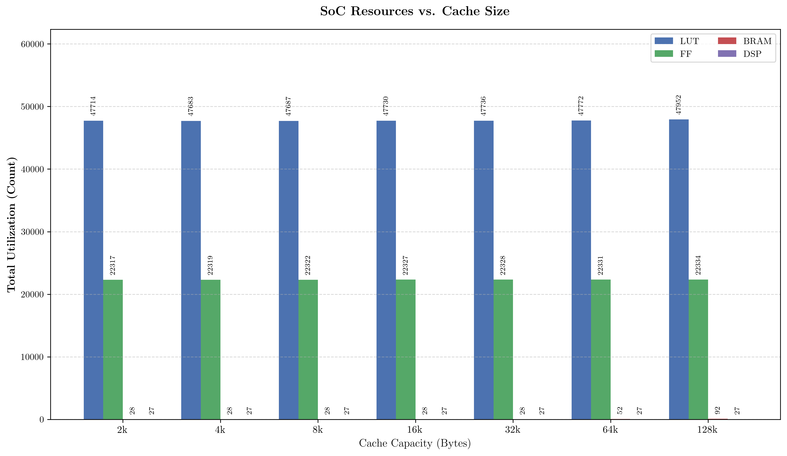
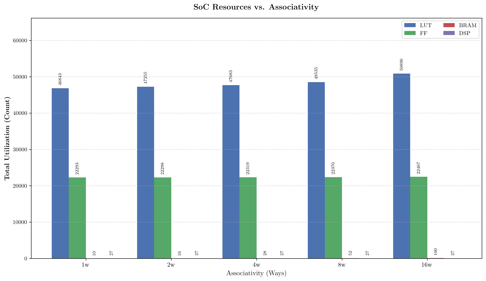
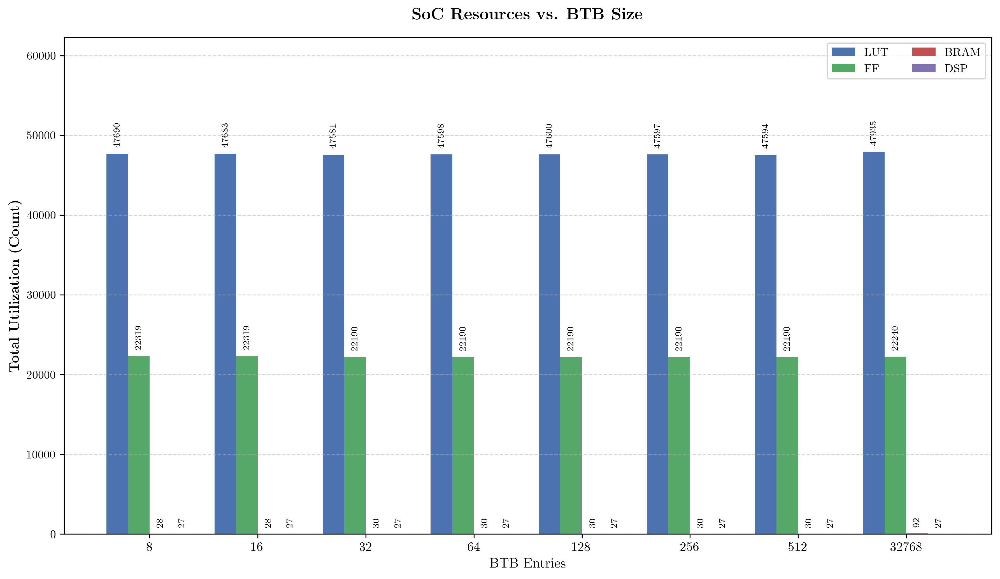
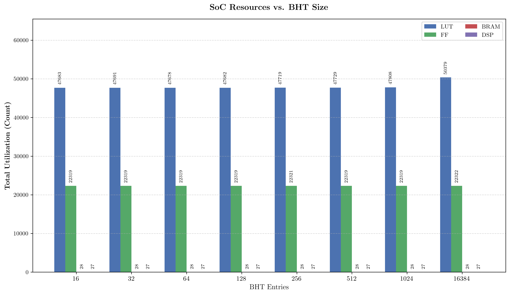

#+title: Plots
#+OPTIONS: tags:t
#+EXPORT_EXCLUDE_TAGS: noexport
* Benchmarks
** Individual benchmarks

#+begin_src jupyter-python :results output drawer :exports results
import pandas as pd
import seaborn as sns
import matplotlib.pyplot as plt
import os
import re
import warnings

# --- 1. Global Setup ---
RESULTS_DIR = "/home/han4n/cva6_experiments/results"
PLOTS_DIR = os.path.join(RESULTS_DIR, "individual_benchmark_profiles")
os.makedirs(PLOTS_DIR, exist_ok=True)

# LaTeX & Style Settings
plt.rc('text', usetex=True)
plt.rc('font', family='serif')
plt.rcParams['figure.dpi'] = 300
warnings.filterwarnings("ignore")

# --- 2. Helper Functions ---
def prettify_config(conf):
    """Translates internal config names to descriptive publication labels."""
    if conf == "Ref": return "Baseline"

    # Cache: "IC/DC 16k" -> "16KB L1 Cache"
    m = re.search(r'IC/DC (\d+)k', str(conf), re.IGNORECASE)
    if m: return f"{m.group(1)}KB L1 Cache"

    # Associativity: "2w" -> "2-Way Assoc"
    m = re.search(r'^(\d+)w$', str(conf), re.IGNORECASE)
    if m: return f"{m.group(1)}-Way Assoc"

    # BTB: "BTB32" -> "32-Entry BTB"
    m = re.search(r'BTB(\d+)', str(conf), re.IGNORECASE)
    if m: return f"{m.group(1)}-Entry BTB"

    # BHT: "BHT32" -> "32-Entry BHT"
    m = re.search(r'BHT(\d+)', str(conf), re.IGNORECASE)
    if m: return f"{m.group(1)}-Entry BHT"

    return conf

def get_sort_value(config_str):
    m = re.search(r'(\d+)', str(config_str))
    if m: return int(m.group(1))
    return 0

def format_y_label(unit_str):
    """Converts raw unit strings into descriptive 'Quantity [Unit]' format."""
    unit_str = str(unit_str).strip()

    if unit_str == 'lps':
        return r"Throughput [Loops/s]"
    elif unit_str == 'Mop/s':
        return r"Throughput [Mop/s]"
    elif unit_str == 'KBps':
        return r"Data Rate [KB/s]"
    elif unit_str == 'MWIPS':
        return r"Processing Speed [MWIPS]"
    else:
        # Fallback for unknown units
        return fr"{Score [{unit_str}]}"

# --- 3. Data Loading & Merging ---
sources = [
    {"name": "Baseline",      "file": "baseline_results.csv",                  "color": "gray"},
    {"name": "Cache Size",    "file": "cache_sweep_benchmark_results.csv",     "color": "dodgerblue"},
    {"name": "Associativity", "file": "associativity_sweep_benchmark_results.csv", "color": "forestgreen"},
    {"name": "BTB Size",      "file": "btb_sweep_benchmark_results.csv",       "color": "darkorange"},
    {"name": "BHT Size",      "file": "bht_sweep_benchmark_results.csv",       "color": "purple"},
]

df_master = pd.DataFrame()
for src in sources:
    file_path = os.path.join(RESULTS_DIR, src["file"])
    if os.path.exists(file_path):
        temp_df = pd.read_csv(file_path)
        temp_df['sweep_type'] = src["name"]
        if src["name"] == "Baseline":
            temp_df['config'] = "Ref"
        df_master = pd.concat([df_master, temp_df], ignore_index=True)

# Identify all benchmarks
benchmarks = df_master['name'].unique()
palette = {src["name"]: src["color"] for src in sources}

print(f"Generating publication-ready images for {len(benchmarks)} benchmarks...")

# --- 4. Main Generation Loop ---
for bench in benchmarks:
    subset = df_master[df_master['name'] == bench].copy()
    if subset.empty: continue

    # A. Sorting Logic
    subset['sweep_type'] = pd.Categorical(
        subset['sweep_type'],
        categories=["Baseline", "Cache Size", "Associativity", "BTB Size", "BHT Size"],
        ordered=True
    )
    subset['sort_val'] = subset.apply(
        lambda row: -1 if row['sweep_type'] == 'Baseline' else get_sort_value(row['config']),
        axis=1
    )
    subset = subset.sort_values(by=['sweep_type', 'sort_val'])

    # B. Apply Descriptive Labels
    subset['pretty_config'] = subset['config'].apply(prettify_config)

    # C. Dynamic Zoom Calculation
    min_score = subset['score'].min()
    max_score = subset['score'].max()
    diff = max_score - min_score
    if diff == 0: diff = max_score * 0.01
    y_min = max(0, min_score - (diff * 0.5))
    y_max = max_score + (diff * 0.5)

    # D. Plotting
    fig, ax1 = plt.subplots(figsize=(11, 7))
    sns.set_theme(style="whitegrid")

    # Bar Chart (Score)
    sns.barplot(
        data=subset, x="pretty_config", y="score", hue="sweep_type",
        palette=palette, dodge=False, ax=ax1, alpha=0.85
    )
    ax1.set_ylim(y_min, y_max)

    # --- UPDATED Y-AXIS LABEL ---
    raw_unit = subset['units'].iloc[0]
    descriptive_label = format_y_label(raw_unit)
    ax1.set_ylabel(descriptive_label, fontsize=12)

    ax1.set_xlabel("")
    ax1.tick_params(axis='x', rotation=70, labelsize=10)

    # Line Chart (IPC)
    ax2 = ax1.twinx()
    sns.pointplot(
        data=subset, x="pretty_config", y="ipc", color="red",
        markers="o", scale=0.7, ax=ax2, linestyles="-"
    )

    # --- UPDATED SECONDARY Y-AXIS LABEL ---
    ax2.set_ylabel(r"Efficiency [IPC]", color="red", fontsize=12)
    ax2.tick_params(axis='y', labelcolor="red")

    # Baseline Reference Line
    base_rows = subset[subset['sweep_type'] == "Baseline"]
    if not base_rows.empty:
        base_val = base_rows['score'].values[0]
        baseline_text = (
            "Baseline Config:\n"
            r"$\bullet$ 4KB L1 Cache" "\n"
            r"$\bullet$ 4-Way Assoc" "\n"
            r"$\bullet$ 16-Entry BTB" "\n"
            r"$\bullet$ 16-Entry BHT"
        )
        ax1.axhline(base_val, color='black', linestyle='--', linewidth=1.5, alpha=0.6, label=baseline_text)

    # --- UPDATED DESCRIPTIVE TITLE ---
    # Using 'Sensitivity Analysis' describes the plot's purpose better than just 'Profile'
    plt.title(f"Microarchitectural Sensitivity Analysis: {bench}", fontsize=16, pad=15)

    # Legend Construction
    handles, labels = ax1.get_legend_handles_labels()
    unique_labels = []
    unique_handles = []
    seen = set()
    base_h, base_l = None, None

    for h, l in zip(handles, labels):
        if "Baseline Config" in l:
            base_h, base_l = h, l
        elif l not in seen:
            seen.add(l)
            unique_labels.append(l)
            unique_handles.append(h)

    if base_h:
        unique_handles.append(base_h)
        unique_labels.append(base_l)

    ax1.legend(
        unique_handles, unique_labels,
        title="Parameters", bbox_to_anchor=(1.12, 1), loc='upper left'
    )

    # E. Explanatory Text Below X-Axis
    plt.figtext(
        0.5, 0.02,
        "Hardware Configuration.",
        ha="center", fontsize=10, style='italic'
    )

    # F. Save
    plt.tight_layout()
    plt.subplots_adjust(bottom=0.2)

    save_path = os.path.join(PLOTS_DIR, f"benchmark_{bench}.png")
    plt.savefig(save_path, bbox_inches='tight')
    plt.close()

print(f"Success! All images saved to: {PLOTS_DIR}")
#+end_src

#+RESULTS:
:results:
#+begin_exampleGenerating publication-ready images for 20 benchmarks...
Success! All images saved to: /home/han4n/cva6_experiments/results/individual_benchmark_profiles
#+end_example
:end:
** Speedup Plots
*** IPC
#+begin_src jupyter-python :results output drawer :exports results
import pandas as pd
import seaborn as sns
import matplotlib.pyplot as plt
import os
import re
import warnings

# --- 1. Global Setup ---
RESULTS_DIR = "/home/han4n/cva6_experiments/results"
PLOTS_DIR = os.path.join(RESULTS_DIR, "speedup_plots")
os.makedirs(PLOTS_DIR, exist_ok=True)

# LaTeX & Style
plt.rc('text', usetex=True)
plt.rc('font', family='serif')
plt.rcParams['figure.dpi'] = 300
warnings.filterwarnings("ignore")

# --- 2. Helper Functions ---
def prettify_config(conf):
    """Translates config names to clean labels."""
    if conf == "Ref": return "Baseline"
    m = re.search(r'IC/DC (\d+)k', str(conf), re.IGNORECASE)
    if m: return f"{m.group(1)}KB"
    m = re.search(r'^(\d+)w$', str(conf), re.IGNORECASE)
    if m: return f"{m.group(1)}-Way"
    m = re.search(r'BTB(\d+)', str(conf), re.IGNORECASE)
    if m: return f"BTB-{m.group(1)}"
    m = re.search(r'BHT(\d+)', str(conf), re.IGNORECASE)
    if m: return f"BHT-{m.group(1)}"
    return conf

def get_sort_value(config_str):
    m = re.search(r'(\d+)', str(config_str))
    if m: return int(m.group(1))
    return 0

# --- 3. Load & Process Data ---
sweeps = [
    {"name": "Cache Size Sweep",    "file": "cache_sweep_benchmark_results.csv",     "palette": "Blues_d"},
    {"name": "Associativity Sweep", "file": "associativity_sweep_benchmark_results.csv", "palette": "Greens_d"},
    {"name": "BTB Size Sweep",      "file": "btb_sweep_benchmark_results.csv",       "palette": "Oranges_d"},
    {"name": "BHT Size Sweep",      "file": "bht_sweep_benchmark_results.csv",       "palette": "Purples_d"},
]

baseline_df = pd.read_csv(os.path.join(RESULTS_DIR, "baseline_results.csv"))
base_clean = baseline_df[['suite', 'name', 'score', 'ipc']].rename(
    columns={'score': 'base_score', 'ipc': 'base_ipc'}
)

print("Generating Zoomed Combined Speedup Plots...")

for sweep in sweeps:
    file_path = os.path.join(RESULTS_DIR, sweep["file"])
    if not os.path.exists(file_path):
        continue

    df = pd.read_csv(file_path)
    df_merged = pd.merge(df, base_clean, on=['suite', 'name'], how='inner')

    # Calculate Speedups
    df_merged['Performance Speedup'] = df_merged['score'] / df_merged['base_score']
    df_merged['IPC Speedup'] = df_merged['ipc'] / df_merged['base_ipc']

    df_merged['Config Label'] = df_merged['config'].apply(prettify_config)
    df_merged['sort_val'] = df_merged['config'].apply(get_sort_value)
    df_merged = df_merged.sort_values(by=['sort_val'])

    # --- PLOTTING ---
    for suite in df_merged['suite'].unique():
        subset = df_merged[df_merged['suite'] == suite]
        if subset.empty: continue

        plt.figure(figsize=(14, 7))
        sns.set_theme(style="whitegrid")

        # 1. BARS = Performance Speedup
        bar_plot = sns.barplot(
            data=subset,
            x="name",
            y="Performance Speedup",
            hue="Config Label",
            palette=sweep["palette"],
            edgecolor="black",
            linewidth=0.5,
            alpha=0.8
        )

        # 2. MARKERS = IPC Speedup
        sns.stripplot(
            data=subset,
            x="name",
            y="IPC Speedup",
            hue="Config Label",
            palette=['black'] * len(subset['Config Label'].unique()),
            dodge=True,
            marker='D',
            size=5,
            jitter=False,
            legend=False
        )

        # Reference Line
        plt.axhline(1.0, color='red', linestyle='--', linewidth=1.5, zorder=0)

        # --- DYNAMIC Y-AXIS ZOOM ---
        # Gather all Y-values (Bars + Dots) to find the active range
        all_y = pd.concat([subset['Performance Speedup'], subset['IPC Speedup']])
        y_min = all_y.min()
        y_max = all_y.max()

        # Calculate spread and apply padding
        spread = y_max - y_min
        if spread == 0: spread = 0.05
        padding = spread * 0.20 # 20% breathing room

        # Set limits
        plt.ylim(y_min - padding, y_max + padding)

        # Labels & Layout
        plt.title(f"{sweep['name']} ({suite}): Performance vs. Efficiency", fontsize=16, pad=15)
        plt.ylabel(r"Speedup Factor (Baseline = 1.0)", fontsize=12)
        plt.xlabel("Hardware Configuration", fontsize=10, style='italic', color='#444444')

        plt.xticks(rotation=70, ha='right', rotation_mode='anchor', fontsize=10)

        # Custom Legend
        handles, labels = bar_plot.get_legend_handles_labels()
        from matplotlib.lines import Line2D
        diamond_proxy = Line2D([0], [0], color='w', marker='D', markerfacecolor='black', markersize=6, label='IPC Speedup (Efficiency)')
        handles.append(diamond_proxy)
        labels.append("IPC Speedup (Efficiency)")

        plt.legend(
            handles, labels,
            title="Configuration",
            bbox_to_anchor=(1.01, 1),
            loc='upper left'
        )

        plt.tight_layout()

        filename = f"{sweep['name'].replace(' ', '_')}_{suite}.png".lower()
        plt.savefig(os.path.join(PLOTS_DIR, filename), bbox_inches='tight')
        plt.close()

print(f"Done! plots saved to: {PLOTS_DIR}")
#+end_src

#+RESULTS:
:results:
#+begin_exampleGenerating Zoomed Combined Speedup Plots...
Done! plots saved to: /home/han4n/cva6_experiments/results/speedup_plots
#+end_example
:end:
*** Counter Cycles
#+begin_src jupyter-python :results output drawer :exports results
import pandas as pd
import seaborn as sns
import matplotlib.pyplot as plt
import os
import re
import warnings

# --- 1. Setup ---
RESULTS_DIR = "/home/han4n/cva6_experiments/results"
PLOTS_DIR = os.path.join(RESULTS_DIR, "speedup_plot_cycles")
os.makedirs(PLOTS_DIR, exist_ok=True)

# LaTeX & Style
plt.rc('text', usetex=True)
plt.rc('font', family='serif')
plt.rcParams['figure.dpi'] = 300
warnings.filterwarnings("ignore")

# --- 2. Helper Functions ---
def prettify_config(conf):
    if conf == "Ref": return "Baseline"
    m = re.search(r'IC/DC (\d+)k', str(conf), re.IGNORECASE)
    if m: return f"{m.group(1)}KB"
    m = re.search(r'^(\d+)w$', str(conf), re.IGNORECASE)
    if m: return f"{m.group(1)}-Way"
    m = re.search(r'BTB(\d+)', str(conf), re.IGNORECASE)
    if m: return f"BTB-{m.group(1)}"
    m = re.search(r'BHT(\d+)', str(conf), re.IGNORECASE)
    if m: return f"BHT-{m.group(1)}"
    return conf

def get_sort_value(config_str):
    m = re.search(r'(\d+)', str(config_str))
    if m: return int(m.group(1))
    return 0

# --- 3. BLUE-START RAINBOW PALETTE ---
# Blue -> Purple -> Crimson -> Red -> Orange -> Gold -> Green -> Cyan
# This follows the spectral cycle but shifts the starting point to Blue.
RAINBOW_COLORS = [
    "#f38ba8", # Blue
    "#fab387", # Purple
    "#a6e3a1", # Crimson (Bridge Purple->Red)
    "#74c7ec", # Red
    "#fab387", # Orange
    "#FFD700", # Gold
    "#008000", # Green
    "#00CED1", # Dark Turquoise (Cyan)
]

def get_rainbow_palette(n_colors):
    if n_colors > len(RAINBOW_COLORS):
        return RAINBOW_COLORS * (n_colors // len(RAINBOW_COLORS) + 1)
    return RAINBOW_COLORS[:n_colors]

# --- 4. Configuration ---
sweeps = [
    {"name": "Cache Size",    "file": "cache_sweep_benchmark_results.csv"},
    {"name": "Associativity", "file": "associativity_sweep_benchmark_results.csv"},
    {"name": "BTB Size",      "file": "btb_sweep_benchmark_results.csv"},
    {"name": "BHT Size",      "file": "bht_sweep_benchmark_results.csv"},
]

# Load Baseline
baseline_df = pd.read_csv(os.path.join(RESULTS_DIR, "baseline_results.csv"))
base_clean = baseline_df[['suite', 'name', 'score', 'cycles']].rename(
    columns={'score': 'base_score', 'cycles': 'base_cycles'}
)

print("Generating Blue-Start Rainbow Plots...")

for sweep in sweeps:
    file_path = os.path.join(RESULTS_DIR, sweep["file"])
    if not os.path.exists(file_path):
        continue

    df = pd.read_csv(file_path)
    df_merged = pd.merge(df, base_clean, on=['suite', 'name'], how='inner')

    # Calculate Metrics
    df_merged['Performance Speedup'] = df_merged['score'] / df_merged['base_score']
    df_merged['Cycle Speedup'] = df_merged['base_cycles'] / df_merged['cycles']

    df_merged['Config Label'] = df_merged['config'].apply(prettify_config)
    df_merged['sort_val'] = df_merged['config'].apply(get_sort_value)
    df_merged = df_merged.sort_values(by=['sort_val'])

    # --- PLOTTING ---
    for suite in df_merged['suite'].unique():
        subset = df_merged[df_merged['suite'] == suite]
        if subset.empty: continue

        n_configs = len(subset['Config Label'].unique())
        current_palette = get_rainbow_palette(n_configs)
        n_benchmarks = len(subset['name'].unique())

        fig_width = max(12, n_benchmarks * 1.3)

        plt.figure(figsize=(fig_width, 7))
        sns.set_theme(style="whitegrid")

        # 1. BARS = Performance Speedup
        bar_plot = sns.barplot(
            data=subset,
            x="name",
            y="Performance Speedup",
            hue="Config Label",
            palette=current_palette,
            edgecolor="black",
            linewidth=0.6,
            alpha=0.9
        )

        # 2. DIAMONDS = Cycle Speedup
        sns.stripplot(
            data=subset,
            x="name",
            y="Cycle Speedup",
            hue="Config Label",
            palette=['#222222'] * n_configs,
            dodge=True,
            marker='D',
            size=5,
            jitter=False,
            legend=False
        )

        # Reference Line
        plt.axhline(1.0, color='#333333', linestyle='--', linewidth=1.5, zorder=0)

        # Zoom
        all_y = pd.concat([subset['Performance Speedup'], subset['Cycle Speedup']])
        y_min, y_max = all_y.min(), all_y.max()
        padding = (y_max - y_min) * 0.15
        if padding == 0: padding = 0.05
        plt.ylim(y_min - padding, y_max + padding)

        # Labels
        plt.title(f"{suite} Suite: Sensitivity to {sweep['name']}", fontsize=18, pad=15)
        plt.ylabel(r"Speedup (Baseline = 1.0)", fontsize=14)
        plt.xlabel("")
        plt.xticks(rotation=45, ha='right', rotation_mode='anchor', fontsize=11)

        # Legend
        handles, labels = bar_plot.get_legend_handles_labels()
        from matplotlib.lines import Line2D
        diamond_proxy = Line2D([0], [0], color='w', marker='D', markerfacecolor='#222222', markersize=6, label='Cycle Speedup (Time)')
        handles.append(diamond_proxy)
        labels.append("Cycle Speedup (Time)")

        plt.legend(
            handles, labels,
            title=f"{sweep['name']} Config",
            bbox_to_anchor=(1.01, 1),
            loc='upper left',
            frameon=True
        )

        plt.tight_layout()

        filename = f"counter_cycle_{sweep['name'].replace(' ', '_')}_{suite}.png".lower()
        plt.savefig(os.path.join(PLOTS_DIR, filename), bbox_inches='tight')
        plt.close()

print(f"Done! Blue-Start Rainbow plots saved to: {PLOTS_DIR}")
#+end_src

#+RESULTS:
:results:
#+begin_exampleGenerating Blue-Start Rainbow Plots...
Done! Blue-Start Rainbow plots saved to: /home/han4n/cva6_experiments/results/speedup_plot_cycles
#+end_example
:end:
* Utilization
#+begin_src jupyter-python :results output drawer :exports results
import pandas as pd
import matplotlib.pyplot as plt
import numpy as np
import re

# -----------------------------------------------------------------------------
# 1. PLOT STYLING & CONFIGURATION
# -----------------------------------------------------------------------------
# Enable LaTeX rendering and set font
try:
    plt.rc('text', usetex=True)
    plt.rc('font', family='serif')
except:
    print("Warning: LaTeX not found. Using standard fonts.")

plt.rcParams['figure.dpi'] = 300
INPUT_CSV = "cva6_experiments_stages_summary.csv"

# Baseline Configuration
BASELINE = {
    'IC_num': 4096,  'ICw_num': 4,
    'DC_num': 4096,  'DCw_num': 4,
    'BTB_num': 16,   'BHT_num': 16,   'RAS_num': 2
}

# -----------------------------------------------------------------------------
# 2. DATA LOADING
# -----------------------------------------------------------------------------
def parse_size(val):
    if isinstance(val, str):
        val = val.lower()
        if 'k' in val: return int(float(val.replace('k', '')) * 1024)
        if 'w' in val: return int(val.replace('w', ''))
        return int(val)
    return val

try:
    df = pd.read_csv(INPUT_CSV)
    for col in ['IC', 'ICw', 'DC', 'DCw', 'BTB', 'BHT', 'RAS']:
        if col in df.columns:
            df[f'{col}_num'] = df[col].apply(parse_size)
except FileNotFoundError:
    print(f"Error: {INPUT_CSV} not found.")
    exit()

# -----------------------------------------------------------------------------
# 3. PLOTTING FUNCTION
# -----------------------------------------------------------------------------
def plot_sweep_soc(df_filtered, x_col, x_label, title, filename):
    if df_filtered.empty:
        print(f"Skipping {title} (no data)")
        return

    df_plot = df_filtered.sort_values(f'{x_col}_num')
    labels = df_plot[x_col].astype(str).tolist()

    # Data
    luts = df_plot['SoC_Total_LUT'].tolist()
    ffs = df_plot['SoC_Total_FF'].tolist()
    brams = df_plot['SoC_Total_BRAM'].tolist()
    dsps = df_plot['SoC_Total_DSP'].tolist()

    x = np.arange(len(labels))
    width = 0.2

    fig, ax = plt.subplots(figsize=(12, 7))

    # Bars
    rects1 = ax.bar(x - 1.5*width, luts, width, label='LUT', color='#4c72b0')
    rects2 = ax.bar(x - 0.5*width, ffs, width, label='FF', color='#55a868')
    rects3 = ax.bar(x + 0.5*width, brams, width, label='BRAM', color='#c44e52')
    rects4 = ax.bar(x + 1.5*width, dsps, width, label='DSP', color='#8172b2')

    # Styling
    ax.set_xlabel(x_label, fontsize=12)
    ax.set_ylabel(r'\textbf{Total Utilization (Count)}', fontsize=12)
    ax.set_title(rf'\textbf{{{title}}}', fontsize=14, pad=15)
    ax.set_xticks(x)
    ax.set_xticklabels(labels, fontsize=11)
    ax.grid(axis='y', linestyle='--', alpha=0.5, zorder=0)

    # 1. Dynamic Y-Limit: Increase by 30% to make room for the legend on top
    max_val = max(max(luts), max(ffs), max(brams), max(dsps))
    ax.set_ylim(0, max_val * 1.3)

    # 2. Legend: Placed in the empty upper-right space
    ax.legend(loc='upper right', frameon=True, fontsize=10, ncol=2)

    # 3. Bar Labels: Rotated 90 degrees to fit without crossing borders
    def add_labels(rects):
        for rect in rects:
            height = rect.get_height()
            ax.annotate(f'{int(height)}',
                        xy=(rect.get_x() + rect.get_width() / 2, height),
                        xytext=(0, 5),  # 5 points vertical offset
                        textcoords="offset points",
                        ha='center', va='bottom', rotation=90, fontsize=8)

    add_labels(rects1)
    add_labels(rects2)
    add_labels(rects3)
    add_labels(rects4)

    plt.tight_layout()
    # plt.savefig(filename, bbox_inches='tight') # Ensures nothing is cropped
    plt.show()
    print(f"Generated {filename}")
    # plt.close()

# -----------------------------------------------------------------------------
# 4. GENERATE PLOTS
# -----------------------------------------------------------------------------
# Sweep 1: Cache Size
s1 = df[(df['ICw_num'] == BASELINE['ICw_num']) & (df['DCw_num'] == BASELINE['DCw_num']) &
        (df['BTB_num'] == BASELINE['BTB_num']) & (df['BHT_num'] == BASELINE['BHT_num'])].copy()
plot_sweep_soc(s1, 'IC', r'Cache Capacity (Bytes)', 'SoC Resources vs. Cache Size', 'plot_cache.png')

# Sweep 2: Associativity
s2 = df[(df['IC_num'] == BASELINE['IC_num']) & (df['DC_num'] == BASELINE['DC_num']) &
        (df['BTB_num'] == BASELINE['BTB_num']) & (df['BHT_num'] == BASELINE['BHT_num'])].copy()
plot_sweep_soc(s2, 'ICw', r'Associativity (Ways)', 'SoC Resources vs. Associativity', 'plot_assoc.png')

# Sweep 3: BTB
s3 = df[(df['IC_num'] == BASELINE['IC_num']) & (df['ICw_num'] == BASELINE['ICw_num']) &
        (df['DC_num'] == BASELINE['DC_num']) & (df['BHT_num'] == BASELINE['BHT_num'])].copy()
plot_sweep_soc(s3, 'BTB', r'BTB Entries', 'SoC Resources vs. BTB Size', 'plot_btb.png')

# Sweep 4: BHT
s4 = df[(df['IC_num'] == BASELINE['IC_num']) & (df['ICw_num'] == BASELINE['ICw_num']) &
        (df['DC_num'] == BASELINE['DC_num']) & (df['BTB_num'] == BASELINE['BTB_num'])].copy()
plot_sweep_soc(s4, 'BHT', r'BHT Entries', 'SoC Resources vs. BHT Size', 'plot_bht.png')
#+end_src

#+RESULTS:
:results:
#+begin_example
#+end_example

#+begin_example
Generated plot_cache.png
#+end_example

#+begin_example
Generated plot_assoc.png
#+end_example

#+begin_example
Generated plot_btb.png
#+end_example

#+begin_example
Generated plot_bht.png
#+end_example
:end:

#+begin_src jupyter-python :results output drawer :exports results
import pandas as pd
import matplotlib.pyplot as plt
import matplotlib.colors as mcolors
import numpy as np
import os

# -----------------------------------------------------------------------------
# 1. CONFIGURATION
# -----------------------------------------------------------------------------
INPUT_CSV = "cva6_experiments_stages_summary.csv"
OUTPUT_DIR = "utilization_plots"

if not os.path.exists(OUTPUT_DIR):
    os.makedirs(OUTPUT_DIR)

# Enable LaTeX styling
try:
    plt.rc('text', usetex=True)
    plt.rc('font', family='serif')
except:
    print("Warning: LaTeX not found. Using standard fonts.")

plt.rcParams['figure.dpi'] = 300

# Baseline for filtering
BASELINE = {
    'IC_num': 4096,  'ICw_num': 4,
    'DC_num': 4096,  'DCw_num': 4,
    'BTB_num': 16,   'BHT_num': 16,   'RAS_num': 2
}

# -----------------------------------------------------------------------------
# 2. HELPER FUNCTIONS
# -----------------------------------------------------------------------------
def parse_size(val):
    if isinstance(val, str):
        val = val.lower()
        if 'k' in val: return int(float(val.replace('k', '')) * 1024)
        if 'w' in val: return int(val.replace('w', ''))
        return int(val)
    return val

def get_text_color(hex_color):
    """Returns 'black' or 'white' based on background brightness."""
    rgb = mcolors.hex2color(hex_color)
    brightness = (0.299 * rgb[0] + 0.587 * rgb[1] + 0.114 * rgb[2])
    return 'black' if brightness > 0.55 else 'white'

# -----------------------------------------------------------------------------
# 3. DATA LOADING
# -----------------------------------------------------------------------------
try:
    df = pd.read_csv(INPUT_CSV)
    for col in ['IC', 'ICw', 'DC', 'DCw', 'BTB', 'BHT', 'RAS']:
        if col in df.columns:
            df[f'{col}_num'] = df[col].apply(parse_size)
except FileNotFoundError:
    print(f"Error: {INPUT_CSV} not found.")
    exit()

# -----------------------------------------------------------------------------
# 4. PLOTTING FUNCTION
# -----------------------------------------------------------------------------
def plot_split_metric(df_filtered, x_col, x_label, title_prefix, filename_prefix):
    if df_filtered.empty:
        return

    df_plot = df_filtered.sort_values(f'{x_col}_num')
    labels = df_plot[x_col].astype(str).tolist()
    x = np.arange(len(labels))
    width = 0.65

    metrics = ['LUT', 'FF', 'BRAM', 'DSP']

    stages = [
        ('S1_Fetch', 'Fetch', '#4e79a7'),        # Blue
        ('S2_Decode', 'Decode', '#f28e2b'),      # Orange
        ('S3_Issue_Net', 'Issue', '#e15759'),    # Red
        ('S4_Execute_Net', 'Execute', '#76b7b2'),# Cyan/Teal
        ('S5_Memory_Total', 'Memory', '#59a14f'),# Green
        ('S6_Commit', 'Commit', '#edc948')       # Yellow
    ]

    for metric in metrics:
        fig, ax = plt.subplots(figsize=(10, 6))

        bottoms = np.zeros(len(df_plot))
        stage_cols = [f"{s[0]}_{metric}" for s in stages]
        totals = df_plot[stage_cols].sum(axis=1).tolist()

        for s_code, s_name, s_color in stages:
            col_name = f"{s_code}_{metric}"
            values = df_plot[col_name].fillna(0).tolist()

            bars = ax.bar(x, values, width, bottom=bottoms, label=s_name,
                          color=s_color, edgecolor='white', linewidth=0.5)

            text_color = get_text_color(s_color)

            # --- ROBUST LABELING ---
            for i, rect in enumerate(bars):
                height = rect.get_height()
                total = totals[i]
                pct = (height / total * 100) if total > 0 else 0

                # Format Count
                val_str = f"{int(height)}" if height < 1000 else f"{height/1000:.1f}k"
                if metric == 'DSP': val_str = f"{int(height)}"

                label_text = ""
                font_size = 7

                # Case 1: Large Segment (> 5%) -> Show "Count (Pct%)"
                if pct > 5:
                    label_text = rf"\textbf{{{val_str}}} ({int(pct)}\%)"
                    font_size = 8

                # Case 2: Small Segment (1% - 5%) -> Show "Count" only
                elif pct > 1.0:
                    label_text = rf"\textbf{{{val_str}}}"
                    font_size = 6

                if label_text:
                    ax.annotate(label_text,
                                xy=(rect.get_x() + rect.get_width() / 2, bottoms[i] + height / 2),
                                xytext=(0, 0),
                                textcoords="offset points",
                                ha='center', va='center',
                                color=text_color, fontsize=font_size)

            bottoms += values

        # Styling
        ax.set_ylabel(rf'\textbf{{{metric} Utilization (Count)}}', fontsize=12)
        ax.set_xlabel(rf'\textbf{{{x_label}}}', fontsize=12)
        ax.set_title(rf'\textbf{{{title_prefix}: {metric} Distribution}}', fontsize=14, pad=15)

        ax.set_xticks(x)
        ax.set_xticklabels(labels, rotation=0, fontsize=11)
        ax.grid(axis='y', linestyle='--', alpha=0.4)

        if max(totals) > 0:
            ax.set_ylim(0, max(totals) * 1.1)

        ax.legend(bbox_to_anchor=(1.02, 1), loc='upper left',
                  borderaxespad=0., frameon=True, fontsize=10, title="Pipeline Stage")

        plt.tight_layout()

        save_path = os.path.join(OUTPUT_DIR, f"{filename_prefix}_{metric}.png")
        plt.savefig(save_path, bbox_inches='tight')
        print(f"Generated: {save_path}")
        plt.close()

# -----------------------------------------------------------------------------
# 5. EXECUTE SWEEPS
# -----------------------------------------------------------------------------
s1 = df[
    (df['ICw_num'] == BASELINE['ICw_num']) &
    (df['DCw_num'] == BASELINE['DCw_num']) &
    (df['BTB_num'] == BASELINE['BTB_num']) &
    (df['BHT_num'] == BASELINE['BHT_num'])
].copy()
plot_split_metric(s1, 'IC', 'Cache Capacity (Bytes)', 'Cache Size Sweep', 'sweep_cache')

s2 = df[
    (df['IC_num'] == BASELINE['IC_num']) &
    (df['DC_num'] == BASELINE['DC_num']) &
    (df['BTB_num'] == BASELINE['BTB_num']) &
    (df['BHT_num'] == BASELINE['BHT_num'])
].copy()
plot_split_metric(s2, 'ICw', 'Associativity (Ways)', 'Associativity Sweep', 'sweep_assoc')

s3 = df[
    (df['IC_num'] == BASELINE['IC_num']) &
    (df['ICw_num'] == BASELINE['ICw_num']) &
    (df['DC_num'] == BASELINE['DC_num']) &
    (df['DCw_num'] == BASELINE['DCw_num']) &
    (df['BHT_num'] == BASELINE['BHT_num'])
].copy()
plot_split_metric(s3, 'BTB', 'BTB Entries', 'BTB Size Sweep', 'sweep_btb')

s4 = df[
    (df['IC_num'] == BASELINE['IC_num']) &
    (df['ICw_num'] == BASELINE['ICw_num']) &
    (df['DC_num'] == BASELINE['DC_num']) &
    (df['DCw_num'] == BASELINE['DCw_num']) &
    (df['BTB_num'] == BASELINE['BTB_num'])
].copy()
plot_split_metric(s4, 'BHT', 'BHT Entries', 'BHT Size Sweep', 'sweep_bht')
#+end_src

#+RESULTS:
:results:
#+begin_exampleGenerated: utilization_plots/sweep_cache_LUT.png
Generated: utilization_plots/sweep_cache_FF.png
Generated: utilization_plots/sweep_cache_BRAM.png
Generated: utilization_plots/sweep_cache_DSP.png
Generated: utilization_plots/sweep_assoc_LUT.png
Generated: utilization_plots/sweep_assoc_FF.png
Generated: utilization_plots/sweep_assoc_BRAM.png
Generated: utilization_plots/sweep_assoc_DSP.png
Generated: utilization_plots/sweep_btb_LUT.png
Generated: utilization_plots/sweep_btb_FF.png
Generated: utilization_plots/sweep_btb_BRAM.png
Generated: utilization_plots/sweep_btb_DSP.png
Generated: utilization_plots/sweep_bht_LUT.png
Generated: utilization_plots/sweep_bht_FF.png
Generated: utilization_plots/sweep_bht_BRAM.png
Generated: utilization_plots/sweep_bht_DSP.png
#+end_example
:end:
* Benchmarks Automatic

#+begin_src jupyter-python :results output drawer :exports results
import pandas as pd
import seaborn as sns
import matplotlib.pyplot as plt
import os
import re
import warnings

# --- 1. Global Setup ---
RESULTS_DIR = "/home/han4n/cva6_experiments/results" # Ensure your .csv files are here
PLOTS_DIR = os.path.join(RESULTS_DIR, "individual_benchmark_profiles_auto")
os.makedirs(PLOTS_DIR, exist_ok=True)

# LaTeX & Style Settings
plt.rc('text', usetex=True)
plt.rc('font', family='serif')
plt.rcParams['figure.dpi'] = 300
warnings.filterwarnings("ignore")

# --- 2. Helper Functions ---
def prettify_config(conf):
    """Translates internal config names to descriptive publication labels."""
    if conf == "Ref": return "Baseline"

    # Cache: "IC/DC 16k" -> "16KB L1 Cache"
    m = re.search(r'IC/DC (\d+)k', str(conf), re.IGNORECASE)
    if m: return f"{m.group(1)}KB L1 Cache"

    # Associativity: "2w" -> "2-Way Assoc"
    m = re.search(r'^(\d+)w$', str(conf), re.IGNORECASE)
    if m: return f"{m.group(1)}-Way Assoc"

    # BTB: "BTB32" -> "32-Entry BTB"
    m = re.search(r'BTB(\d+)', str(conf), re.IGNORECASE)
    if m: return f"{m.group(1)}-Entry BTB"

    # BHT: "BHT32" -> "32-Entry BHT"
    m = re.search(r'BHT(\d+)', str(conf), re.IGNORECASE)
    if m: return f"{m.group(1)}-Entry BHT"

    return conf

def get_sort_value(config_str):
    m = re.search(r'(\d+)', str(config_str))
    if m: return int(m.group(1))
    return 0

def format_y_label(unit_str):
    """Converts raw unit strings into descriptive 'Quantity [Unit]' format."""
    unit_str = str(unit_str).strip()
    if unit_str == 'lps':
        return r"Throughput [Loops/s]"
    elif unit_str == 'Mop/s':
        return r"Throughput [Mop/s]"
    elif unit_str == 'KBps':
        return r"Data Rate [KB/s]"
    elif unit_str == 'MWIPS':
        return r"Processing Speed [MWIPS]"
    else:
        return fr"Score [{unit_str}]"

# --- 3. Data Loading & Merging ---
# We define the source file and the label inside that file that corresponds to Baseline
sources = [
    {"name": "Cache Size",     "file": "sweep_cache.csv", "base_label": "IC/DC 4k", "color": "dodgerblue"},
    {"name": "Associativity",  "file": "sweep_assoc.csv", "base_label": "4w",       "color": "forestgreen"},
    {"name": "BTB Size",       "file": "sweep_btb.csv",   "base_label": "BTB16",    "color": "darkorange"},
    {"name": "BHT Size",       "file": "sweep_bht.csv",   "base_label": "BHT16",    "color": "purple"},
]

# Define Palette (ensure Baseline gray is present)
palette = {src["name"]: src["color"] for src in sources}
palette["Baseline"] = "gray"

df_master = pd.DataFrame()

print("Loading data...")
for src in sources:
    file_path = os.path.join(RESULTS_DIR, src["file"])
    
    if os.path.exists(file_path):
        temp_df = pd.read_csv(file_path)
        
        # Logic to identify and unify Baseline rows
        # 1. If config matches the 'base_label', mark it as Baseline/Ref
        # 2. Otherwise, mark it as the specific Sweep Type
        
        # Create masks
        is_baseline = temp_df['config'] == src['base_label']
        
        # Assign Sweep Type
        temp_df.loc[is_baseline, 'sweep_type'] = 'Baseline'
        temp_df.loc[~is_baseline, 'sweep_type'] = src['name']
        
        # Rename Config to "Ref" for baselines to ensure they merge cleanly
        temp_df.loc[is_baseline, 'config'] = 'Ref'
        
        df_master = pd.concat([df_master, temp_df], ignore_index=True)
    else:
        print(f"Warning: File not found {file_path}")

# Remove duplicate Baseline entries (since every file has them)
# We deduplicate based on Benchmark Name, Config (Ref), and Score
df_master = df_master.drop_duplicates(subset=['name', 'config', 'sweep_type', 'score'])

# Identify all benchmarks
benchmarks = df_master['name'].unique()

print(f"Generating publication-ready images for {len(benchmarks)} benchmarks...")

# --- 4. Main Generation Loop ---
for bench in benchmarks:
    subset = df_master[df_master['name'] == bench].copy()
    if subset.empty: continue

    # A. Sorting Logic
    subset['sweep_type'] = pd.Categorical(
        subset['sweep_type'],
        categories=["Baseline", "Cache Size", "Associativity", "BTB Size", "BHT Size"],
        ordered=True
    )
    
    # Custom sort: Baseline first (-1), then numerical order of parameters
    subset['sort_val'] = subset.apply(
        lambda row: -1 if row['sweep_type'] == 'Baseline' else get_sort_value(row['config']),
        axis=1
    )
    subset = subset.sort_values(by=['sweep_type', 'sort_val'])

    # B. Apply Descriptive Labels
    subset['pretty_config'] = subset['config'].apply(prettify_config)

    # C. Dynamic Zoom Calculation (Visual Polish)
    min_score = subset['score'].min()
    max_score = subset['score'].max()
    diff = max_score - min_score
    if diff == 0: diff = max_score * 0.01
    y_min = max(0, min_score - (diff * 0.5))
    y_max = max_score + (diff * 0.5)

    # D. Plotting
    fig, ax1 = plt.subplots(figsize=(11, 7))
    sns.set_theme(style="whitegrid")

    # Bar Chart (Score)
    sns.barplot(
        data=subset, x="pretty_config", y="score", hue="sweep_type",
        palette=palette, dodge=False, ax=ax1, alpha=0.85
    )
    ax1.set_ylim(y_min, y_max)

    # Y-Axis Label
    raw_unit = subset['units'].iloc[0]
    descriptive_label = format_y_label(raw_unit)
    ax1.set_ylabel(descriptive_label, fontsize=12)

    ax1.set_xlabel("")
    ax1.tick_params(axis='x', rotation=45, labelsize=10) # Reduced rotation slightly for readability

    # Line Chart (IPC)
    ax2 = ax1.twinx()
    sns.pointplot(
        data=subset, x="pretty_config", y="ipc", color="red",
        markers="o", scale=0.7, ax=ax2, linestyles="-"
    )

    # Secondary Y-Axis Label
    ax2.set_ylabel(r"Efficiency [IPC]", color="red", fontsize=12)
    ax2.tick_params(axis='y', labelcolor="red")

    # Baseline Reference Line
    base_rows = subset[subset['sweep_type'] == "Baseline"]
    if not base_rows.empty:
        base_val = base_rows['score'].values[0]
        baseline_text = (
            "Baseline Config:\n"
            r"$\bullet$ 4KB L1 Cache" "\n"
            r"$\bullet$ 4-Way Assoc" "\n"
            r"$\bullet$ 16-Entry BTB" "\n"
            r"$\bullet$ 16-Entry BHT"
        )
        ax1.axhline(base_val, color='black', linestyle='--', linewidth=1.5, alpha=0.6, label=baseline_text)

    # Title
    plt.title(f"Microarchitectural Sensitivity Analysis: {bench}", fontsize=16, pad=15)

    # Legend
    handles, labels = ax1.get_legend_handles_labels()
    unique_labels = []
    unique_handles = []
    seen = set()
    base_h, base_l = None, None

    for h, l in zip(handles, labels):
        if "Baseline Config" in l:
            base_h, base_l = h, l
        elif l not in seen:
            seen.add(l)
            unique_labels.append(l)
            unique_handles.append(h)

    if base_h:
        unique_handles.append(base_h)
        unique_labels.append(base_l)

    ax1.legend(
        unique_handles, unique_labels,
        title="Parameters", bbox_to_anchor=(1.12, 1), loc='upper left'
    )

    # Explanatory Text
    plt.figtext(
        0.5, 0.02,
        "Hardware Configuration.",
        ha="center", fontsize=10, style='italic'
    )

    # Save
    plt.tight_layout()
    plt.subplots_adjust(bottom=0.2)

    save_path = os.path.join(PLOTS_DIR, f"benchmark_{bench}.png")
    plt.savefig(save_path, bbox_inches='tight')
    plt.close()

print(f"Success! All images saved to: {PLOTS_DIR}")
#+end_src

#+RESULTS:
:results:
#+begin_exampleLoading data...
Generating publication-ready images for 20 benchmarks...
Success! All images saved to: /home/han4n/cva6_experiments/results/individual_benchmark_profiles_auto
#+end_example
:end:

** Counter Cycles
#+begin_src jupyter-python :results output drawer :exports results
import pandas as pd
import seaborn as sns
import matplotlib.pyplot as plt
import os
import re
import warnings

# --- 1. Setup ---
RESULTS_DIR = "/home/han4n/cva6_experiments/results"
PLOTS_DIR = os.path.join(RESULTS_DIR, "speedup_plot_cycles_auto")
os.makedirs(PLOTS_DIR, exist_ok=True)

# LaTeX & Style
plt.rc('text', usetex=True)
plt.rc('font', family='serif')
plt.rcParams['figure.dpi'] = 300
warnings.filterwarnings("ignore")

# --- 2. Helper Functions ---
def prettify_config(conf):
    conf = str(conf)
    if conf == "Ref": return "Baseline"
    
    # Cache
    m = re.search(r'IC/DC (\d+)k', conf, re.IGNORECASE)
    if m: return f"{m.group(1)}KB"
    
    # Associativity
    m = re.search(r'^(\d+)w$', conf, re.IGNORECASE)
    if m: return f"{m.group(1)}-Way"
    
    # BTB
    m = re.search(r'BTB(\d+)', conf, re.IGNORECASE)
    if m: return f"BTB-{m.group(1)}"
    
    # BHT
    m = re.search(r'BHT(\d+)', conf, re.IGNORECASE)
    if m: return f"BHT-{m.group(1)}"
    
    return conf

def get_sort_value(config_str):
    m = re.search(r'(\d+)', str(config_str))
    if m: return int(m.group(1))
    return 0

# --- 3. BLUE-START RAINBOW PALETTE ---
RAINBOW_COLORS = [
    "#f38ba8", "#fab387", "#a6e3a1", "#74c7ec", 
    "#fab387", "#FFD700", "#008000", "#00CED1"
]

def get_rainbow_palette(n_colors):
    if n_colors > len(RAINBOW_COLORS):
        return RAINBOW_COLORS * (n_colors // len(RAINBOW_COLORS) + 1)
    return RAINBOW_COLORS[:n_colors]

# --- 4. Configuration ---
sweeps = [
    {"name": "Cache Size",    "file": "sweep_cache.csv", "ref_cfg": "IC/DC 4k"},
    {"name": "Associativity", "file": "sweep_assoc.csv", "ref_cfg": "4w"},
    {"name": "BTB Size",      "file": "sweep_btb.csv",   "ref_cfg": "BTB16"},
    {"name": "BHT Size",      "file": "sweep_bht.csv",   "ref_cfg": "BHT16"},
]

print("Generating Percentage Relative Plots (With Baseline Labels)...")

for sweep in sweeps:
    file_path = os.path.join(RESULTS_DIR, sweep["file"])
    if not os.path.exists(file_path):
        print(f"Skipping {sweep['name']} (File not found)")
        continue

    # Load Data
    df = pd.read_csv(file_path)

    # --- EXTRACT BASELINE ---
    base_df = df[df['config'] == sweep['ref_cfg']].copy()
    base_clean = base_df[['suite', 'name', 'score', 'cycles']].rename(
        columns={'score': 'base_score', 'cycles': 'base_cycles'}
    )
    base_clean = base_clean.drop_duplicates(subset=['suite', 'name'])

    # --- MERGE & CALCULATE ---
    df_merged = pd.merge(df, base_clean, on=['suite', 'name'], how='inner')

    # Math: (Current / Baseline) * 100
    df_merged['Perf_Pct'] = (df_merged['score'] / df_merged['base_score']) * 100
    df_merged['Cycles_Pct'] = (df_merged['cycles'] / df_merged['base_cycles']) * 100

    # --- LABELING LOGIC ---
    # 1. Prettify all names (e.g. "4w" -> "4-Way")
    df_merged['Config Label'] = df_merged['config'].apply(prettify_config)
    
    # 2. Append "(Baseline)" specifically to the reference config
    # We locate rows where 'config' matches the sweep's reference string
    is_ref = df_merged['config'] == sweep['ref_cfg']
    df_merged.loc[is_ref, 'Config Label'] = df_merged.loc[is_ref, 'Config Label'] + r" \textbf{(Baseline)}"

    # Sort
    df_merged['sort_val'] = df_merged['config'].apply(get_sort_value)
    df_merged = df_merged.sort_values(by=['sort_val'])

    # --- PLOTTING ---
    for suite in df_merged['suite'].unique():
        subset = df_merged[df_merged['suite'] == suite]
        if subset.empty: continue

        n_configs = len(subset['Config Label'].unique())
        current_palette = get_rainbow_palette(n_configs)
        n_benchmarks = len(subset['name'].unique())

        fig_width = max(12, n_benchmarks * 1.3)

        plt.figure(figsize=(fig_width, 7))
        sns.set_theme(style="whitegrid")

        # 1. BARS
        bar_plot = sns.barplot(
            data=subset,
            x="name",
            y="Perf_Pct",
            hue="Config Label",
            palette=current_palette,
            edgecolor="black",
            linewidth=0.6,
            alpha=0.9
        )

        # 2. DIAMONDS
        sns.stripplot(
            data=subset,
            x="name",
            y="Cycles_Pct",
            hue="Config Label",
            palette=['#222222'] * n_configs,
            dodge=True,
            marker='D',
            size=5,
            jitter=False,
            legend=False,
            ax=bar_plot
        )

        plt.axhline(100.0, color='#333333', linestyle='--', linewidth=1.5, zorder=0)

        # Dynamic Zoom
        all_y = pd.concat([subset['Perf_Pct'], subset['Cycles_Pct']])
        y_max = all_y.max()
        plt.ylim(0, max(110, y_max + 10))

        # Labels
        plt.title(f"{suite} Suite: Sensitivity to {sweep['name']}", fontsize=18, pad=15)
        plt.ylabel(r"Speedup (\%)", fontsize=14)
        plt.xlabel("")
        plt.xticks(rotation=45, ha='right', rotation_mode='anchor', fontsize=11)

        # Legend
        handles, labels = bar_plot.get_legend_handles_labels()
        from matplotlib.lines import Line2D
        diamond_proxy = Line2D([0], [0], color='w', marker='D', markerfacecolor='#222222', markersize=6, label='Cycle Usage (\%)')
        handles.append(diamond_proxy)
        labels.append("Cycle Usage (\%)")

        plt.legend(
            handles, labels,
            title=f"{sweep['name']} Config",
            bbox_to_anchor=(1.01, 1),
            loc='upper left',
            frameon=True
        )

        plt.tight_layout()
        filename = f"{sweep['name'].replace(' ', '_')}_{suite}.png".lower()
        plt.savefig(os.path.join(PLOTS_DIR, filename), bbox_inches='tight')
        plt.close()

print(f"Done! Plots saved to: {PLOTS_DIR}")
#+end_src

#+RESULTS:
:results:
#+begin_exampleGenerating Percentage Relative Plots (With Baseline Labels)...
Done! Plots saved to: /home/han4n/cva6_experiments/results/speedup_plot_cycles_auto
#+end_example
:end:
* Benchmarks Total

#+begin_src jupyter-python :results output drawer :exports results
import pandas as pd
import seaborn as sns
import matplotlib.pyplot as plt
import os
import re
import warnings
import numpy as np

# --- 1. Global Setup ---
RESULTS_DIR = "/home/han4n/cva6_experiments/results" 
PLOTS_DIR = os.path.join(RESULTS_DIR, "individual_benchmark_ipc")
os.makedirs(PLOTS_DIR, exist_ok=True)

# LaTeX & Style Settings
plt.rc('text', usetex=True)
plt.rc('font', family='serif')
plt.rcParams['figure.dpi'] = 300
warnings.filterwarnings("ignore")

# --- 2. Helper Functions ---
def prettify_config(conf):
    """Translates internal config names to descriptive publication labels."""
    if conf == "Ref": return "Baseline"

    m = re.search(r'IC/DC (\d+)k', str(conf), re.IGNORECASE)
    if m: return f"{m.group(1)}KB L1 Cache"

    m = re.search(r'^(\d+)w$', str(conf), re.IGNORECASE)
    if m: return f"{m.group(1)}-Way Assoc"

    m = re.search(r'BTB(\d+)', str(conf), re.IGNORECASE)
    if m: return f"{m.group(1)}-Entry BTB"

    m = re.search(r'BHT(\d+)', str(conf), re.IGNORECASE)
    if m: return f"{m.group(1)}-Entry BHT"

    return conf

def get_sort_value(config_str):
    m = re.search(r'(\d+)', str(config_str))
    if m: return int(m.group(1))
    return 0

def format_y_label(unit_str):
    unit_str = str(unit_str).strip()
    if unit_str == 'lps': return r"Throughput [Loops/s]"
    elif unit_str == 'Mop/s': return r"Throughput [Mop/s]"
    elif unit_str == 'KBps': return r"Data Rate [KB/s]"
    elif unit_str == 'MWIPS': return r"Processing Speed [MWIPS]"
    else: return fr"Score [{unit_str}]"

# --- 3. Data Loading & Merging ---
sources = [
    {"name": "Cache Size",      "file": "sweep_cache_total.csv", "base_label": "IC/DC 4k", "color": "dodgerblue"},
    {"name": "Associativity",  "file": "sweep_assoc_total.csv", "base_label": "4w",        "color": "forestgreen"},
    {"name": "BTB Size",       "file": "sweep_btb_total.csv",   "base_label": "BTB16",     "color": "darkorange"},
    {"name": "BHT Size",       "file": "sweep_bht_total.csv",   "base_label": "BHT16",     "color": "purple"},
]

palette = {src["name"]: src["color"] for src in sources}
palette["Baseline"] = "gray"

df_master = pd.DataFrame()

print("Loading data...")
for src in sources:
    file_path = os.path.join(RESULTS_DIR, src["file"])
    
    if os.path.exists(file_path):
        temp_df = pd.read_csv(file_path)
        
        is_baseline = temp_df['config'] == src['base_label']
        temp_df.loc[is_baseline, 'sweep_type'] = 'Baseline'
        temp_df.loc[~is_baseline, 'sweep_type'] = src['name']
        temp_df.loc[is_baseline, 'config'] = 'Ref'
        
        df_master = pd.concat([df_master, temp_df], ignore_index=True)
    else:
        print(f"Warning: File not found {file_path}")

# Drop rows with zero scores or IPC
df_master = df_master[(df_master['score'] > 0) & (df_master['ipc'] > 0)]

benchmarks = df_master['name'].unique()

print(f"Generating publication-ready images for {len(benchmarks)} benchmarks...")

# --- 4. Main Generation Loop ---
for bench in benchmarks:
    subset = df_master[df_master['name'] == bench].copy()
    if subset.empty: continue

    # A. Sorting Logic
    subset['sweep_type'] = pd.Categorical(
        subset['sweep_type'],
        categories=["Baseline", "Cache Size", "Associativity", "BTB Size", "BHT Size"],
        ordered=True
    )
    
    subset['sort_val'] = subset.apply(
        lambda row: -1 if row['sweep_type'] == 'Baseline' else get_sort_value(row['config']),
        axis=1
    )
    subset = subset.sort_values(by=['sweep_type', 'sort_val'])

    # B. Apply Descriptive Labels
    subset['pretty_config'] = subset['config'].apply(prettify_config)

    # C. Aggregate Data (Added observed=True to fix the first error)
    agg_data = subset.groupby(['pretty_config', 'sweep_type'], observed=True, as_index=False).agg(
        score_mean=('score', 'mean'),
        score_min=('score', 'min'),
        score_max=('score', 'max'),
        ipc_mean=('ipc', 'mean'),
        ipc_min=('ipc', 'min'),
        ipc_max=('ipc', 'max'),
        units=('units', 'first')
    )
    
    # Re-apply sort after aggregation
    agg_data['sort_val'] = agg_data.apply(
        lambda row: -1 if row['sweep_type'] == 'Baseline' else get_sort_value(row['pretty_config']),
        axis=1
    )
    agg_data = agg_data.sort_values(by=['sweep_type', 'sort_val'])

    # D. Plotting
    fig, ax1 = plt.subplots(figsize=(14, 10))
    sns.set_theme(style="whitegrid")

    # 1. Bar Chart (Score)
    sns.barplot(
        data=agg_data, x="pretty_config", y="score_mean", hue="sweep_type",
        palette=palette, dodge=False, ax=ax1, alpha=0.85, 
        errorbar=None
    )
    
    # Custom Error Bars for Score (Fixed precision issue)
    for i, row in enumerate(agg_data.itertuples()):
        x_pos = i 
        y_mean = row.score_mean
        # Force non-negative differences using max(0, ...)
        err_low = max(0, row.score_mean - row.score_min)
        err_high = max(0, row.score_max - row.score_mean)
        
        ax1.errorbar(x_pos, y_mean, yerr=[[err_low], [err_high]],
                     fmt='none', ecolor='black', capsize=5, elinewidth=1.5)

    # Y-Axis Label
    raw_unit = agg_data['units'].iloc[0]
    ax1.set_ylabel(format_y_label(raw_unit), fontsize=12)
    ax1.set_xlabel("")
    ax1.tick_params(axis='x', rotation=45, labelsize=10)

    # 2. Line Chart (IPC)
    ax2 = ax1.twinx()
    
    sns.pointplot(
        data=agg_data, x="pretty_config", y="ipc_mean", color="red",
        markers="o", scale=0.7, ax=ax2, linestyles="-", errorbar=None
    )
    
    # Custom Error Bars for IPC (Fixed precision issue)
    for i, row in enumerate(agg_data.itertuples()):
        x_pos = i
        y_mean = row.ipc_mean
        # Force non-negative differences
        err_low = max(0, row.ipc_mean - row.ipc_min)
        err_high = max(0, row.ipc_max - row.ipc_mean)

        ax2.errorbar(x_pos, y_mean, yerr=[[err_low], [err_high]],
                     fmt='none', ecolor='red', capsize=5, elinewidth=1.5)

    ax2.set_ylabel(r"Efficiency [IPC]", color="red", fontsize=12)
    ax2.tick_params(axis='y', labelcolor="red")

    # Baseline Reference Line
    base_rows = agg_data[agg_data['sweep_type'] == "Baseline"]
    if not base_rows.empty:
        base_val = base_rows['score_mean'].values[0]
        baseline_text = (
            "Baseline Config:\n"
            r"$\bullet$ 4KB L1 Cache" "\n"
            r"$\bullet$ 4-Way Assoc" "\n"
            r"$\bullet$ 16-Entry BTB" "\n"
            r"$\bullet$ 16-Entry BHT"
        )
        ax1.axhline(base_val, color='black', linestyle='--', linewidth=1.5, alpha=0.6, label=baseline_text)

    # Title & Legend
    plt.title(f"Microarchitectural Sensitivity Analysis: {bench}", fontsize=16, pad=15)

    handles, labels = ax1.get_legend_handles_labels()
    unique_labels = []
    unique_handles = []
    seen = set()
    base_h, base_l = None, None

    for h, l in zip(handles, labels):
        if "Baseline Config" in l:
            base_h, base_l = h, l
        elif l not in seen and l != 'Error Bar':
            seen.add(l)
            unique_labels.append(l)
            unique_handles.append(h)

    if base_h:
        unique_handles.append(base_h)
        unique_labels.append(base_l)

    ax1.legend(
        unique_handles, unique_labels,
        title="Parameters", bbox_to_anchor=(1.12, 1), loc='upper left'
    )

    plt.figtext(
        0.5, 0.02,
        "Hardware Configuration. Error bars indicate Min/Max of multiple runs.",
        ha="center", fontsize=10, style='italic'
    )

    plt.tight_layout()
    plt.subplots_adjust(bottom=0.2)

    save_path = os.path.join(PLOTS_DIR, f"benchmark_{bench}_minmax.png")
    plt.savefig(save_path, bbox_inches='tight')
    plt.close()

print(f"Success! All images saved to: {PLOTS_DIR}")
#+end_src

#+RESULTS:
:results:
#+begin_exampleLoading data...
Generating publication-ready images for 20 benchmarks...
Success! All images saved to: /home/han4n/cva6_experiments/results/individual_benchmark_ipc
#+end_example
:end:

#+begin_src jupyter-python
import pandas as pd
import seaborn as sns
import matplotlib.pyplot as plt
import os
import re
import warnings

# --- 1. Global Setup ---
RESULTS_DIR = "/home/han4n/cva6_experiments/results" 
PLOTS_DIR = os.path.join(RESULTS_DIR, "individual_benchmark_cycles")
os.makedirs(PLOTS_DIR, exist_ok=True)

# LaTeX & Style Settings
plt.rc('text', usetex=True)
plt.rc('font', family='serif')
plt.rcParams['figure.dpi'] = 300
warnings.filterwarnings("ignore")

# --- 2. Helper Functions ---
def prettify_config(conf):
    if conf == "Ref": return "Baseline"
    m = re.search(r'IC/DC (\d+)k', str(conf), re.IGNORECASE)
    if m: return f"{m.group(1)}KB L1 Cache"
    m = re.search(r'^(\d+)w$', str(conf), re.IGNORECASE)
    if m: return f"{m.group(1)}-Way Assoc"
    m = re.search(r'BTB(\d+)', str(conf), re.IGNORECASE)
    if m: return f"{m.group(1)}-Entry BTB"
    m = re.search(r'BHT(\d+)', str(conf), re.IGNORECASE)
    if m: return f"{m.group(1)}-Entry BHT"
    return conf

def get_sort_value(config_str):
    m = re.search(r'(\d+)', str(config_str))
    if m: return int(m.group(1))
    return 0

def format_y_label(unit_str):
    unit_str = str(unit_str).strip()
    if unit_str == 'lps': return r"Throughput [Loops/s]"
    elif unit_str == 'Mop/s': return r"Throughput [Mop/s]"
    elif unit_str == 'KBps': return r"Data Rate [KB/s]"
    elif unit_str == 'MWIPS': return r"Processing Speed [MWIPS]"
    else: return fr"Score [{unit_str}]"

# --- 3. Data Loading ---
sources = [
    {"name": "Cache Size",      "file": "sweep_cache_total.csv", "base_label": "IC/DC 4k", "color": "dodgerblue"},
    {"name": "Associativity",  "file": "sweep_assoc_total.csv", "base_label": "4w",        "color": "forestgreen"},
    {"name": "BTB Size",       "file": "sweep_btb_total.csv",   "base_label": "BTB16",     "color": "darkorange"},
    {"name": "BHT Size",       "file": "sweep_bht_total.csv",   "base_label": "BHT16",     "color": "purple"},
]

palette = {src["name"]: src["color"] for src in sources}
palette["Baseline"] = "gray"

df_master = pd.DataFrame()

print("Loading data...")
for src in sources:
    file_path = os.path.join(RESULTS_DIR, src["file"])
    if os.path.exists(file_path):
        temp_df = pd.read_csv(file_path)
        is_baseline = temp_df['config'] == src['base_label']
        temp_df.loc[is_baseline, 'sweep_type'] = 'Baseline'
        temp_df.loc[~is_baseline, 'sweep_type'] = src['name']
        temp_df.loc[is_baseline, 'config'] = 'Ref'
        df_master = pd.concat([df_master, temp_df], ignore_index=True)

# Filter zeros and ensure 'cycles' column exists
df_master = df_master[df_master['score'] > 0]
if 'cycles' not in df_master.columns:
    print("Warning: 'cycles' column missing. Creating dummy column for testing.")
    df_master['cycles'] = 0

benchmarks = df_master['name'].unique()
print(f"Generating Cycles plots for {len(benchmarks)} benchmarks...")

# --- 4. Main Generation Loop ---
for bench in benchmarks:
    subset = df_master[df_master['name'] == bench].copy()
    if subset.empty: continue

    # A. Sorting Logic
    subset['sweep_type'] = pd.Categorical(
        subset['sweep_type'],
        categories=["Baseline", "Cache Size", "Associativity", "BTB Size", "BHT Size"],
        ordered=True
    )
    
    subset['sort_val'] = subset.apply(
        lambda row: -1 if row['sweep_type'] == 'Baseline' else get_sort_value(row['config']),
        axis=1
    )
    subset = subset.sort_values(by=['sweep_type', 'sort_val'])
    subset['pretty_config'] = subset['config'].apply(prettify_config)

    # B. Aggregation (Score + Cycles)
    # Note: observed=True prevents the ValueError for categorical data
    agg_data = subset.groupby(['pretty_config', 'sweep_type'], observed=True, as_index=False).agg(
        score_mean=('score', 'mean'),
        score_min=('score', 'min'),
        score_max=('score', 'max'),
        cyc_mean=('cycles', 'mean'),
        cyc_min=('cycles', 'min'),
        cyc_max=('cycles', 'max'),
        units=('units', 'first')
    )
    
    # Re-sort after aggregation
    agg_data['sort_val'] = agg_data.apply(
        lambda row: -1 if row['sweep_type'] == 'Baseline' else get_sort_value(row['pretty_config']),
        axis=1
    )
    agg_data = agg_data.sort_values(by=['sweep_type', 'sort_val'])

    # C. Plotting
    fig, ax1 = plt.subplots(figsize=(11, 7))
    sns.set_theme(style="whitegrid")

    # --- 1. Bar Chart (Score) ---
    sns.barplot(
        data=agg_data, x="pretty_config", y="score_mean", hue="sweep_type",
        palette=palette, dodge=False, ax=ax1, alpha=0.85, 
        errorbar=None
    )
    
    # Custom Error Bars for Score (using max(0, val) to prevent floating point crashes)
    for i, row in enumerate(agg_data.itertuples()):
        mean = row.score_mean
        err_low = max(0, mean - row.score_min)
        err_high = max(0, row.score_max - mean)
        
        ax1.errorbar(i, mean, yerr=[[err_low], [err_high]],
                     fmt='none', ecolor='black', capsize=5, elinewidth=1.5)

    # Left Y-Axis Label
    raw_unit = agg_data['units'].iloc[0]
    ax1.set_ylabel(format_y_label(raw_unit), fontsize=12)
    ax1.set_xlabel("")
    ax1.tick_params(axis='x', rotation=45, labelsize=10)

    # --- 2. Line Chart (Cycles) ---
    ax2 = ax1.twinx()
    
    cycle_color = "tab:pink"
    
    sns.pointplot(
        data=agg_data, x="pretty_config", y="cyc_mean", color=cycle_color,
        markers="^", scale=0.7, ax=ax2, linestyles="-", errorbar=None
    )
    
    # Custom Error Bars for Cycles
    for i, row in enumerate(agg_data.itertuples()):
        mean = row.cyc_mean
        err_low = max(0, mean - row.cyc_min)
        err_high = max(0, row.cyc_max - mean)

        ax2.errorbar(i, mean, yerr=[[err_low], [err_high]],
                     fmt='none', ecolor=cycle_color, capsize=5, elinewidth=1.5)

    # Right Y-Axis Label
    ax2.set_ylabel(r"Total Cycles", color=cycle_color, fontsize=12, fontweight='bold')
    ax2.tick_params(axis='y', labelcolor=cycle_color)

    # Baseline Reference (Score only)
    base_rows = agg_data[agg_data['sweep_type'] == "Baseline"]
    if not base_rows.empty:
        base_val = base_rows['score_mean'].values[0]
        ax1.axhline(base_val, color='black', linestyle='--', linewidth=1.5, alpha=0.6, label="Baseline Score")

    # Title
    plt.title(f"Performance Analysis (Score vs Cycles): {bench}", fontsize=16, pad=15)

    # Legend
    handles, labels = ax1.get_legend_handles_labels()
    unique_labels = []
    unique_handles = []
    seen = set()
    
    for h, l in zip(handles, labels):
        if l not in seen and l != 'Error Bar':
            seen.add(l)
            unique_labels.append(l)
            unique_handles.append(h)

    ax1.legend(
        unique_handles, unique_labels,
        title="Parameters", bbox_to_anchor=(1.12, 1), loc='upper left'
    )

    plt.figtext(
        0.5, 0.02,
        "Bars: Benchmark Score (Left) | Green Line: Total Cycles (Right)",
        ha="center", fontsize=10, style='italic'
    )

    plt.tight_layout()
    plt.subplots_adjust(bottom=0.2)

    save_path = os.path.join(PLOTS_DIR, f"benchmark_{bench}_cycles.png")
    plt.savefig(save_path, bbox_inches='tight')
    plt.close()

print(f"Success! Cycle plots saved to: {PLOTS_DIR}")
#+end_src

#+RESULTS:
:results:
#+begin_exampleLoading data...
Generating Cycles plots for 20 benchmarks...
Success! Cycle plots saved to: /home/han4n/cva6_experiments/results/individual_benchmark_cycles
#+end_example
:end:

#+begin_src jupyter-python
import pandas as pd
import seaborn as sns
import matplotlib.pyplot as plt
import os
import re
import warnings

# --- 1. Global Setup ---
RESULTS_DIR = "/home/han4n/cva6_experiments/results" 
PLOTS_DIR = os.path.join(RESULTS_DIR, "individual_benchmark_instructions")
os.makedirs(PLOTS_DIR, exist_ok=True)

# LaTeX & Style Settings
plt.rc('text', usetex=True)
plt.rc('font', family='serif')
plt.rcParams['figure.dpi'] = 300
warnings.filterwarnings("ignore")

# --- 2. Helper Functions ---
def prettify_config(conf):
    if conf == "Ref": return "Baseline"
    m = re.search(r'IC/DC (\d+)k', str(conf), re.IGNORECASE)
    if m: return f"{m.group(1)}KB L1 Cache"
    m = re.search(r'^(\d+)w$', str(conf), re.IGNORECASE)
    if m: return f"{m.group(1)}-Way Assoc"
    m = re.search(r'BTB(\d+)', str(conf), re.IGNORECASE)
    if m: return f"{m.group(1)}-Entry BTB"
    m = re.search(r'BHT(\d+)', str(conf), re.IGNORECASE)
    if m: return f"{m.group(1)}-Entry BHT"
    return conf

def get_sort_value(config_str):
    m = re.search(r'(\d+)', str(config_str))
    if m: return int(m.group(1))
    return 0

def format_y_label(unit_str):
    unit_str = str(unit_str).strip()
    if unit_str == 'lps': return r"Throughput [Loops/s]"
    elif unit_str == 'Mop/s': return r"Throughput [Mop/s]"
    elif unit_str == 'KBps': return r"Data Rate [KB/s]"
    elif unit_str == 'MWIPS': return r"Processing Speed [MWIPS]"
    else: return fr"Score [{unit_str}]"

# --- 3. Data Loading ---
sources = [
    {"name": "Cache Size",      "file": "sweep_cache_total.csv", "base_label": "IC/DC 4k", "color": "dodgerblue"},
    {"name": "Associativity",  "file": "sweep_assoc_total.csv", "base_label": "4w",        "color": "forestgreen"},
    {"name": "BTB Size",       "file": "sweep_btb_total.csv",   "base_label": "BTB16",     "color": "darkorange"},
    {"name": "BHT Size",       "file": "sweep_bht_total.csv",   "base_label": "BHT16",     "color": "purple"},
]

palette = {src["name"]: src["color"] for src in sources}
palette["Baseline"] = "gray"

df_master = pd.DataFrame()

print("Loading data...")
for src in sources:
    file_path = os.path.join(RESULTS_DIR, src["file"])
    if os.path.exists(file_path):
        temp_df = pd.read_csv(file_path)
        is_baseline = temp_df['config'] == src['base_label']
        temp_df.loc[is_baseline, 'sweep_type'] = 'Baseline'
        temp_df.loc[~is_baseline, 'sweep_type'] = src['name']
        temp_df.loc[is_baseline, 'config'] = 'Ref'
        df_master = pd.concat([df_master, temp_df], ignore_index=True)

# Filter zeros and ensure 'instructions' column exists
df_master = df_master[df_master['score'] > 0]
if 'instructions' not in df_master.columns:
    print("Warning: 'instructions' column missing. Creating dummy column for testing.")
    df_master['instructions'] = 0

benchmarks = df_master['name'].unique()
print(f"Generating Instructions plots for {len(benchmarks)} benchmarks...")

# --- 4. Main Generation Loop ---
for bench in benchmarks:
    subset = df_master[df_master['name'] == bench].copy()
    if subset.empty: continue

    # A. Sorting Logic
    subset['sweep_type'] = pd.Categorical(
        subset['sweep_type'],
        categories=["Baseline", "Cache Size", "Associativity", "BTB Size", "BHT Size"],
        ordered=True
    )
    
    subset['sort_val'] = subset.apply(
        lambda row: -1 if row['sweep_type'] == 'Baseline' else get_sort_value(row['config']),
        axis=1
    )
    subset = subset.sort_values(by=['sweep_type', 'sort_val'])
    subset['pretty_config'] = subset['config'].apply(prettify_config)

    # B. Aggregation (Score + Instructions)
    # Note: observed=True prevents the ValueError for categorical data
    agg_data = subset.groupby(['pretty_config', 'sweep_type'], observed=True, as_index=False).agg(
        score_mean=('score', 'mean'),
        score_min=('score', 'min'),
        score_max=('score', 'max'),
        inst_mean=('instructions', 'mean'),
        inst_min=('instructions', 'min'),
        inst_max=('instructions', 'max'),
        units=('units', 'first')
    )
    
    # Re-sort after aggregation
    agg_data['sort_val'] = agg_data.apply(
        lambda row: -1 if row['sweep_type'] == 'Baseline' else get_sort_value(row['pretty_config']),
        axis=1
    )
    agg_data = agg_data.sort_values(by=['sweep_type', 'sort_val'])

    # C. Plotting
    fig, ax1 = plt.subplots(figsize=(11, 7))
    sns.set_theme(style="whitegrid")

    # --- 1. Bar Chart (Score) ---
    sns.barplot(
        data=agg_data, x="pretty_config", y="score_mean", hue="sweep_type",
        palette=palette, dodge=False, ax=ax1, alpha=0.85, 
        errorbar=None
    )
    
    # Custom Error Bars for Score
    for i, row in enumerate(agg_data.itertuples()):
        mean = row.score_mean
        err_low = max(0, mean - row.score_min)
        err_high = max(0, row.score_max - mean)
        
        ax1.errorbar(i, mean, yerr=[[err_low], [err_high]],
                     fmt='none', ecolor='black', capsize=5, elinewidth=1.5)

    # Left Y-Axis Label
    raw_unit = agg_data['units'].iloc[0]
    ax1.set_ylabel(format_y_label(raw_unit), fontsize=12)
    ax1.set_xlabel("")
    ax1.tick_params(axis='x', rotation=45, labelsize=10)

    # --- 2. Line Chart (Instructions) ---
    ax2 = ax1.twinx()
    
    # Using BLUE for Instructions
    inst_color = "tab:blue"
    
    sns.pointplot(
        data=agg_data, x="pretty_config", y="inst_mean", color=inst_color,
        markers="s", scale=0.7, ax=ax2, linestyles="-", errorbar=None
    )
    
    # Custom Error Bars for Instructions
    for i, row in enumerate(agg_data.itertuples()):
        mean = row.inst_mean
        err_low = max(0, mean - row.inst_min)
        err_high = max(0, row.inst_max - mean)

        ax2.errorbar(i, mean, yerr=[[err_low], [err_high]],
                     fmt='none', ecolor=inst_color, capsize=5, elinewidth=1.5)

    # Right Y-Axis Label
    ax2.set_ylabel(r"Total Instructions", color=inst_color, fontsize=12, fontweight='bold')
    ax2.tick_params(axis='y', labelcolor=inst_color)

    # Baseline Reference (Score only)
    base_rows = agg_data[agg_data['sweep_type'] == "Baseline"]
    if not base_rows.empty:
        base_val = base_rows['score_mean'].values[0]
        ax1.axhline(base_val, color='black', linestyle='--', linewidth=1.5, alpha=0.6, label="Baseline Score")

    # Title
    plt.title(f"Performance Analysis (Score vs Instructions): {bench}", fontsize=16, pad=15)

    # Legend
    handles, labels = ax1.get_legend_handles_labels()
    unique_labels = []
    unique_handles = []
    seen = set()
    
    for h, l in zip(handles, labels):
        if l not in seen and l != 'Error Bar':
            seen.add(l)
            unique_labels.append(l)
            unique_handles.append(h)

    ax1.legend(
        unique_handles, unique_labels,
        title="Parameters", bbox_to_anchor=(1.12, 1), loc='upper left'
    )

    plt.figtext(
        0.5, 0.02,
        "Bars: Benchmark Score (Left) | Blue Line: Total Instructions (Right)",
        ha="center", fontsize=10, style='italic'
    )

    plt.tight_layout()
    plt.subplots_adjust(bottom=0.2)

    save_path = os.path.join(PLOTS_DIR, f"benchmark_{bench}_instructions.png")
    plt.savefig(save_path, bbox_inches='tight')
    plt.close()

print(f"Success! Instruction plots saved to: {PLOTS_DIR}")
#+end_src

#+RESULTS:
:results:
#+begin_exampleLoading data...
Generating Instructions plots for 20 benchmarks...
Success! Instruction plots saved to: /home/han4n/cva6_experiments/results/individual_benchmark_instructions
#+end_example
:end:

* Utilization Automatic

#+begin_src jupyter-python
import pandas as pd
import sys

# -----------------------------------------------------------------------------
# CONFIGURATION
# -----------------------------------------------------------------------------
INPUT_CSV = "cva6_experiments_stages_summary.csv"

# -----------------------------------------------------------------------------
# SCRIPT
# -----------------------------------------------------------------------------
try:
    df = pd.read_csv(INPUT_CSV)
except FileNotFoundError:
    print(f"Error: {INPUT_CSV} not found.")
    sys.exit(1)

# Columns representing the breakdown stages
stage_bram_cols = [
    'S1_Fetch_BRAM', 'S2_Decode_BRAM', 'S3_Issue_Net_BRAM', 
    'S4_Execute_Net_BRAM', 'S5_Memory_Total_BRAM', 'S6_Commit_BRAM'
]

# Filter for the two interesting cases
# Case A: Large IC, Small DC
case_a = df[(df['IC'] == '256k') & (df['DC'] == '4k')]

# Case B: Small IC, Large DC
case_b = df[(df['IC'] == '4k') & (df['DC'] == '256k')]

def print_distribution(row, name):
    print(f"\n{'='*40}")
    print(f"DISTRIBUTION FOR: {name}")
    print(f"{'='*40}")
    
    if row.empty:
        print("Configuration not found in CSV.")
        return

    # Extract values
    soc_total = row['SoC_Total_BRAM'].values[0]
    stages_sum = row[stage_bram_cols].sum(axis=1).values[0]
    unaccounted = soc_total - stages_sum
    
    # Print Table
    print(f"{'Location':<25} | {'BRAM Count':>10}")
    print("-" * 38)
    
    # Print Stages
    for col in stage_bram_cols:
        val = row[col].values[0]
        # Clean up name for display
        clean_name = col.replace('_BRAM', '')
        print(f"{clean_name:<25} | {val:>10}")
    
    print("-" * 38)
    print(f"{'Sum of Stages':<25} | {stages_sum:>10}")
    print(f"{'UNACCOUNTED (SoC - Sum)':<25} | {unaccounted:>10}  <-- LIKELY HERE")
    print("-" * 38)
    print(f"{'SoC Total Reported':<25} | {soc_total:>10}")

# Run analysis
print_distribution(case_a, "IC=256k (Big IC), DC=4k")
print_distribution(case_b, "IC=4k, DC=256k (Big DC)")
#+end_src

#+RESULTS:
:results:
#+begin_example
========================================
DISTRIBUTION FOR: IC=256k (Big IC), DC=4k
========================================
Location                  | BRAM Count
--------------------------------------
S1_Fetch                  |          0
S2_Decode                 |          0
S3_Issue_Net              |          0
S4_Execute_Net            |          0
S5_Memory_Total           |         12
S6_Commit                 |          0
--------------------------------------
Sum of Stages             |         12
UNACCOUNTED (SoC - Sum)   |         92  <-- LIKELY HERE
--------------------------------------
SoC Total Reported        |        104

========================================
DISTRIBUTION FOR: IC=4k, DC=256k (Big DC)
========================================
Location                  | BRAM Count
--------------------------------------
S1_Fetch                  |          0
S2_Decode                 |          0
S3_Issue_Net              |          0
S4_Execute_Net            |          0
S5_Memory_Total           |         88
S6_Commit                 |          0
--------------------------------------
Sum of Stages             |         88
UNACCOUNTED (SoC - Sum)   |         16  <-- LIKELY HERE
--------------------------------------
SoC Total Reported        |        104
#+end_example
:end:

#+begin_src jupyter-python
import pandas as pd
import matplotlib.pyplot as plt
import matplotlib.patches as mpatches
import matplotlib.colors as mcolors
import numpy as np
import os
from mpl_toolkits.mplot3d import Axes3D

# -----------------------------------------------------------------------------
# 1. CONFIGURATION
# -----------------------------------------------------------------------------
INPUT_CSV = "cva6_experiments_stages_summary_final.csv"
OUTPUT_DIR = "utilization_plots_auto_final"

if not os.path.exists(OUTPUT_DIR):
    os.makedirs(OUTPUT_DIR)

# Disable LaTeX to ensure stability
USE_LATEX = False
plt.rc('text', usetex=False)
plt.rcParams['figure.dpi'] = 300

# Baseline for filtering
BASELINE = {
    'IC_num': 4096,  'ICw_num': 4,
    'DC_num': 4096,  'DCw_num': 4,
    'BTB_num': 16,   'BHT_num': 16,   'RAS_num': 2
}

# -----------------------------------------------------------------------------
# 2. HELPER FUNCTIONS
# -----------------------------------------------------------------------------
def parse_size(val):
    if isinstance(val, str):
        val = val.lower()
        if 'k' in val: return int(float(val.replace('k', '')) * 1024)
        if 'w' in val: return int(val.replace('w', ''))
        return int(val)
    return val

def get_text_color(hex_color):
    rgb = mcolors.hex2color(hex_color)
    brightness = (0.299 * rgb[0] + 0.587 * rgb[1] + 0.114 * rgb[2])
    return 'black' if brightness > 0.55 else 'white'

def format_size_label(num_bytes):
    if num_bytes >= 1024:
        return f"{int(num_bytes/1024)}k"
    return str(num_bytes)

def bold_text(text):
    # Simple wrapper, no LaTeX needed for basic bolding in standard mpl if we use fontweight='bold'
    return str(text)

# -----------------------------------------------------------------------------
# 3. DATA LOADING
# -----------------------------------------------------------------------------
try:
    df = pd.read_csv(INPUT_CSV)
    for col in ['IC', 'ICw', 'DC', 'DCw', 'BTB', 'BHT', 'RAS']:
        if col in df.columns:
            df[f'{col}_num'] = df[col].apply(parse_size)
except FileNotFoundError:
    print(f"Error: {INPUT_CSV} not found.")
    exit()

# -----------------------------------------------------------------------------
# 4. PLOTTING FUNCTIONS
# -----------------------------------------------------------------------------

def plot_3d_stacked_cache_sweep(df_filtered, filename_prefix):
    """
    Generates a 3D Stacked Bar plot.
    Marks the Baseline configuration with thicker lines and clear text.
    """
    if df_filtered.empty:
        return

    metrics = ['LUT', 'FF', 'BRAM', 'DSP']

    stages = [
        ('S1_Fetch', 'Fetch', '#4e79a7'),        # Blue
        ('S2_Decode', 'Decode', '#f28e2b'),      # Orange
        ('S3_Issue_Net', 'Issue', '#e15759'),    # Red
        ('S4_Execute_Net', 'Execute', '#76b7b2'),# Cyan/Teal
        ('S5_Memory_Total', 'Memory', '#59a14f'),# Green
        ('S6_Commit', 'Commit', '#edc948')       # Yellow
    ]

    # Get unique sorted sizes for axes
    ic_sizes = sorted(df_filtered['IC_num'].unique())
    dc_sizes = sorted(df_filtered['DC_num'].unique())

    # Map sizes to integer indices
    ic_map = {val: i for i, val in enumerate(ic_sizes)}
    dc_map = {val: i for i, val in enumerate(dc_sizes)}

    ic_labels = [format_size_label(x) for x in ic_sizes]
    dc_labels = [format_size_label(x) for x in dc_sizes]

    for metric in metrics:
        fig = plt.figure(figsize=(12, 10))
        ax = fig.add_subplot(111, projection='3d')

        stage_cols = [f"{s[0]}_{metric}" for s in stages]
        max_height = df_filtered[stage_cols].sum(axis=1).max()

        for _, row in df_filtered.iterrows():
            ic_val = row['IC_num']
            dc_val = row['DC_num']
            
            x_idx = ic_map[ic_val]
            y_idx = dc_map[dc_val]
            
            # CHECK IF BASELINE
            is_baseline = (ic_val == BASELINE['IC_num'] and dc_val == BASELINE['DC_num'])
            
            # Set style based on baseline status
            if is_baseline:
                edge_color = 'black'
                line_width = 1.5  # Thicker line for baseline
            else:
                edge_color = 'white'
                line_width = 0.3  # Thinner line for others
            
            current_z = 0
            
            for stage_code, stage_name, stage_color in stages:
                col_name = f"{stage_code}_{metric}"
                height = row[col_name]
                
                if pd.notna(height) and height > 0:
                    ax.bar3d(x_idx - 0.2, y_idx - 0.2, current_z, 
                             0.4, 0.4, height, 
                             color=stage_color, shade=True,
                             edgecolor=edge_color, linewidth=line_width)
                    current_z += height
            
            # --- MARK BASELINE TEXT ---
            if is_baseline:
                # Add "Baseline" text above the bar
                # zdir='z' ensures text flows correctly in 3D space
                ax.text(x_idx, y_idx, current_z + (max_height * 0.15), 
                        "Baseline", 
                        color='black', fontsize=12, ha='center', va='bottom', fontweight='bold',
                        bbox=dict(facecolor='white', alpha=0.5, edgecolor='none', pad=1))

        # --- AXIS LABELS & STYLING ---
        ax.set_xticks(range(len(ic_sizes)))
        ax.set_xticklabels(ic_labels, rotation=-15, ha='left')
        
        ax.set_yticks(range(len(dc_sizes)))
        ax.set_yticklabels(dc_labels, rotation=15, ha='right')

        # Bold tick labels for baseline
        if BASELINE['IC_num'] in ic_map:
            try: ax.get_xticklabels()[ic_map[BASELINE['IC_num']]].set_fontweight('bold')
            except: pass
        if BASELINE['DC_num'] in dc_map:
            try: ax.get_yticklabels()[dc_map[BASELINE['DC_num']]].set_fontweight('bold')
            except: pass

        ax.set_xlabel('Instruction Cache', labelpad=15, fontsize=12, fontweight='bold')
        ax.set_ylabel('Data Cache', labelpad=15, fontsize=12, fontweight='bold')
        ax.set_zlabel(f'{metric} Utilization (Count)', labelpad=10, fontsize=12, fontweight='bold')
        
        ax.set_title(f'Cache Sweep: {metric} Distribution', fontsize=16, pad=20, fontweight='bold')
        
        # INCREASE Z-LIMIT to make sure text is "entire" (not cut off)
        if max_height > 0:
            ax.set_zlim(0, max_height * 1.25)

        legend_handles = [mpatches.Patch(color=color, label=name) for _, name, color in stages]
        ax.legend(handles=legend_handles[::-1], 
                  bbox_to_anchor=(1.05, 1), loc='upper left', 
                  title="Pipeline Stage", fontsize=10, frameon=True)

        ax.view_init(elev=30, azim=-60)
        
        save_path = os.path.join(OUTPUT_DIR, f"{filename_prefix}_{metric}_3d.png")
        plt.savefig(save_path, bbox_inches='tight')
        print(f"Generated: {save_path}")
        plt.close()

def plot_split_metric(df_filtered, x_col, x_label, title_prefix, filename_prefix):
    """
    Standard 2D Stacked Bar Plot.
    """
    if df_filtered.empty:
        return

    df_plot = df_filtered.sort_values(f'{x_col}_num')
    baseline_val = BASELINE.get(f'{x_col}_num')
    baseline_idx = None
    
    labels = []
    for i, (idx, row) in enumerate(df_plot.iterrows()):
        val = row[x_col]
        num_val = row[f'{x_col}_num']
        labels.append(str(val))
        if num_val == baseline_val:
            baseline_idx = i

    x = np.arange(len(labels))
    width = 0.65

    metrics = ['LUT', 'FF', 'BRAM', 'DSP']

    stages = [
        ('S1_Fetch', 'Fetch', '#4e79a7'),
        ('S2_Decode', 'Decode', '#f28e2b'),
        ('S3_Issue_Net', 'Issue', '#e15759'),
        ('S4_Execute_Net', 'Execute', '#76b7b2'),
        ('S5_Memory_Total', 'Memory', '#59a14f'),
        ('S6_Commit', 'Commit', '#edc948')
    ]

    for metric in metrics:
        fig, ax = plt.subplots(figsize=(10, 6))

        bottoms = np.zeros(len(df_plot))
        stage_cols = [f"{s[0]}_{metric}" for s in stages]
        totals = df_plot[stage_cols].sum(axis=1).tolist()

        for s_code, s_name, s_color in stages:
            col_name = f"{s_code}_{metric}"
            values = df_plot[col_name].fillna(0).tolist()

            bars = ax.bar(x, values, width, bottom=bottoms, label=s_name,
                          color=s_color, edgecolor='white', linewidth=0.5)

            text_color = get_text_color(s_color)

            for i, rect in enumerate(bars):
                height = rect.get_height()
                total = totals[i]
                pct = (height / total * 100) if total > 0 else 0

                val_str = f"{int(height)}" if height < 1000 else f"{height/1000:.1f}k"
                if metric == 'DSP': val_str = f"{int(height)}"

                label_text = ""
                font_size = 7
                if pct > 5 and height > 10: 
                    label_text = f"{val_str}\n({int(pct)}%)"
                    font_size = 8
                elif pct > 1.0:
                    label_text = f"{val_str}"
                    font_size = 6

                if label_text:
                    ax.annotate(label_text,
                                xy=(rect.get_x() + rect.get_width() / 2, bottoms[i] + height / 2),
                                xytext=(0, 0), textcoords="offset points",
                                ha='center', va='center',
                                color=text_color, fontsize=font_size)

            bottoms += values

        # --- MARK BASELINE ---
        if baseline_idx is not None:
            total_height = totals[baseline_idx]
            ax.annotate("Baseline", 
                        xy=(x[baseline_idx], total_height), 
                        xytext=(0, 25), textcoords="offset points",
                        ha='center', va='bottom', fontsize=10, fontweight='bold',
                        arrowprops=dict(arrowstyle='->', connectionstyle="arc3", color='black'))

        ax.set_ylabel(f'{metric} Utilization (Count)', fontsize=12, fontweight='bold')
        ax.set_xlabel(x_label, fontsize=12, fontweight='bold')
        ax.set_title(f'{title_prefix}: {metric} Distribution', fontsize=14, pad=15, fontweight='bold')
        
        ax.set_xticks(x)
        ax.set_xticklabels(labels, rotation=0, fontsize=11)
        
        if baseline_idx is not None:
            ax.get_xticklabels()[baseline_idx].set_fontweight('bold')

        ax.grid(axis='y', linestyle='--', alpha=0.4)

        if max(totals) > 0:
            ax.set_ylim(0, max(totals) * 1.15) 

        ax.legend(bbox_to_anchor=(1.02, 1), loc='upper left',
                  borderaxespad=0., frameon=True, fontsize=10, title="Pipeline Stage")

        plt.tight_layout()
        save_path = os.path.join(OUTPUT_DIR, f"{filename_prefix}_{metric}.png")
        plt.savefig(save_path, bbox_inches='tight')
        print(f"Generated: {save_path}")
        plt.close()

# -----------------------------------------------------------------------------
# 5. EXECUTE SWEEPS
# -----------------------------------------------------------------------------

# --- SWEEP 1: Cache Sizes (3D STACKED PLOT) ---
s1 = df[
    (df['ICw_num'] == BASELINE['ICw_num']) &
    (df['DCw_num'] == BASELINE['DCw_num']) &
    (df['BTB_num'] == BASELINE['BTB_num']) &
    (df['BHT_num'] == BASELINE['BHT_num'])
].copy()

plot_3d_stacked_cache_sweep(s1, 'sweep_cache')

# --- SWEEP 2: Associativity (Standard 2D) ---
s2 = df[
    (df['IC_num'] == BASELINE['IC_num']) &
    (df['DC_num'] == BASELINE['DC_num']) &
    (df['BTB_num'] == BASELINE['BTB_num']) &
    (df['BHT_num'] == BASELINE['BHT_num'])
].copy()
plot_split_metric(s2, 'ICw', 'Associativity (Ways)', 'Associativity Sweep', 'sweep_assoc')

# --- SWEEP 3: BTB Size (Standard 2D) ---
s3 = df[
    (df['IC_num'] == BASELINE['IC_num']) &
    (df['ICw_num'] == BASELINE['ICw_num']) &
    (df['DC_num'] == BASELINE['DC_num']) &
    (df['DCw_num'] == BASELINE['DCw_num']) &
    (df['BHT_num'] == BASELINE['BHT_num'])
].copy()
plot_split_metric(s3, 'BTB', 'BTB Entries', 'BTB Size Sweep', 'sweep_btb')

# --- SWEEP 4: BHT Size (Standard 2D) ---
s4 = df[
    (df['IC_num'] == BASELINE['IC_num']) &
    (df['ICw_num'] == BASELINE['ICw_num']) &
    (df['DC_num'] == BASELINE['DC_num']) &
    (df['DCw_num'] == BASELINE['DCw_num']) &
    (df['BTB_num'] == BASELINE['BTB_num'])
].copy()
plot_split_metric(s4, 'BHT', 'BHT Entries', 'BHT Size Sweep', 'sweep_bht')
#+end_src

#+RESULTS:
:results:
#+begin_exampleGenerated: utilization_plots_auto_final/sweep_cache_LUT_3d.png
Generated: utilization_plots_auto_final/sweep_cache_FF_3d.png
Generated: utilization_plots_auto_final/sweep_cache_BRAM_3d.png
Generated: utilization_plots_auto_final/sweep_cache_DSP_3d.png
Generated: utilization_plots_auto_final/sweep_assoc_LUT.png
Generated: utilization_plots_auto_final/sweep_assoc_FF.png
Generated: utilization_plots_auto_final/sweep_assoc_BRAM.png
Generated: utilization_plots_auto_final/sweep_assoc_DSP.png
Generated: utilization_plots_auto_final/sweep_btb_LUT.png
Generated: utilization_plots_auto_final/sweep_btb_FF.png
Generated: utilization_plots_auto_final/sweep_btb_BRAM.png
Generated: utilization_plots_auto_final/sweep_btb_DSP.png
Generated: utilization_plots_auto_final/sweep_bht_LUT.png
Generated: utilization_plots_auto_final/sweep_bht_FF.png
Generated: utilization_plots_auto_final/sweep_bht_BRAM.png
Generated: utilization_plots_auto_final/sweep_bht_DSP.png
#+end_example
:end:

* SoC resource usage
#+begin_src jupyter-python
import pandas as pd
import matplotlib.pyplot as plt
import numpy as np
import os

# -----------------------------------------------------------------------------
# 1. CONFIGURATION
# -----------------------------------------------------------------------------
# Save the csv content provided above to this file first
INPUT_CSV = "cva6_uncore_breakdown.csv" 
OUTPUT_DIR = "soc_architecture_plots"

if not os.path.exists(OUTPUT_DIR):
    os.makedirs(OUTPUT_DIR)

# Enable LaTeX styling
try:
    plt.rc('text', usetex=True)
    plt.rc('font', family='serif')
except:
    print("Warning: LaTeX not found. Using standard fonts.")

plt.rcParams['figure.dpi'] = 300

# -----------------------------------------------------------------------------
# 2. DATA LOADING
# -----------------------------------------------------------------------------
try:
    df = pd.read_csv(INPUT_CSV)
    
    # Helper for sorting: Convert '4k' -> 4096
    def parse_size(val):
        if isinstance(val, str):
            val = val.lower()
            if 'k' in val: return int(float(val.replace('k', '')) * 1024)
            return int(val)
        return val

    df['IC_num'] = df['IC'].apply(parse_size)
    df = df.sort_values('IC_num')
    
except FileNotFoundError:
    print(f"Error: {INPUT_CSV} not found. Please save your data to this file.")
    exit()

# -----------------------------------------------------------------------------
# 3. PLOT 1: PIE CHART (SoC BREAKDOWN)
# -----------------------------------------------------------------------------
def plot_soc_pie_breakdown(df, metric='LUT'):
    """
    Shows the distribution of resources for a Baseline config (IC=4k, DC=4k).
    Groups small peripherals into 'Other Uncore'.
    """
    # Select Baseline: 4k IC, 4k DC
    baseline = df[
        (df['IC'] == '4k') & (df['DC'] == '4k') & 
        (df['ICw'] == '4w') & (df['BTB'] == 16)
    ].iloc[0]

    # Components to plot
    labels = [
        'CPU Core', 
        'Northbridge', 
        'Peripherals (PLIC)', 
        'SPI Controller', 
        'Glue Logic/Other'
    ]
    
    # Map to CSV columns
    values = [
        baseline[f'CPU_Core_{metric}'],
        baseline[f'Northbridge_{metric}'],
        baseline[f'Peripherals_Subsystem_{metric}'],
        baseline[f'SPI_Controller_{metric}'],
    ]
    
    # Sum up smaller components for "Other"
    other_sum = (baseline[f'UART_{metric}'] + 
                 baseline[f'Memory_Interconnect_{metric}'] + 
                 baseline[f'CLINT_{metric}'] + 
                 baseline[f'BootROM_{metric}'] +
                 baseline[f'Glue_Logic_{metric}'])
    values.append(other_sum)

    # Colors (Blue for Core, Greys/Reds for Uncore)
    colors = ['#4e79a7', '#bab0ac', '#f28e2b', '#e15759', '#76b7b2']
    
    # Create Plot
    fig, ax = plt.subplots(figsize=(8, 6))
    
    wedges, texts, autotexts = ax.pie(values, labels=labels, autopct='%1.1f%%',
                                      startangle=140, colors=colors, pctdistance=0.85,
                                      explode=(0.05, 0, 0, 0, 0)) # Explode Core slightly

    # Styling
    plt.setp(texts, size=10, weight="bold")
    plt.setp(autotexts, size=9, color="white", weight="bold")
    
    # Draw Circle for Donut Chart style (optional, looks modern)
    centre_circle = plt.Circle((0,0),0.70,fc='white')
    fig.gca().add_artist(centre_circle)

    ax.set_title(rf'\textbf{{SoC Resource Breakdown ({metric})}}' + '\n' + r'(Baseline: 4k I-Cache / 4k D-Cache)', fontsize=14)
    
    plt.tight_layout()
    save_path = os.path.join(OUTPUT_DIR, f"soc_breakdown_pie_{metric}.png")
    plt.savefig(save_path, bbox_inches='tight')
    print(f"Generated: {save_path}")
    plt.close()

# -----------------------------------------------------------------------------
# 4. PLOT 2: SCALING TREND (FIXED UNCORE vs GROWING CORE)
# -----------------------------------------------------------------------------
def plot_core_vs_uncore_scaling(df):
    """
    Stacked Bar Chart showing how Uncore remains static while Core grows 
    as we increase Cache Size.
    """
    # Filter: Cache Sweep (IC 2k -> 256k, DC fixed at 4k for clarity, or match diagonal)
    # Let's use the Diagonal Sweep (IC=DC) if available, or just IC sweep
    # Based on your data, let's use the subset where DC=4k and IC varies
    subset = df[(df['DC'] == '4k') & (df['BTB'] == 16)].copy()
    
    if subset.empty: return

    labels = subset['IC'].astype(str).tolist()
    x = np.arange(len(labels))
    width = 0.6

    fig, ax = plt.subplots(figsize=(10, 6))

    # Data
    core_lut = subset['CPU_Core_LUT'].tolist()
    
    # Calculate Total Uncore (Everything except Core)
    soc_total = subset['SoC_Total_LUT'].tolist()
    uncore_lut = [t - c for t, c in zip(soc_total, core_lut)]

    # Plot Uncore (Bottom Stack - The Foundation)
    p1 = ax.bar(x, uncore_lut, width, label='Uncore (Peripherals + Glue)', color='#bab0ac', edgecolor='white')
    
    # Plot Core (Top Stack - The Variable)
    p2 = ax.bar(x, core_lut, width, bottom=uncore_lut, label='CPU Core', color='#4e79a7', edgecolor='white')

    # Labeling
    ax.set_ylabel(r'\textbf{Total LUT Utilization}', fontsize=12)
    ax.set_xlabel(r'\textbf{Instruction Cache Size}', fontsize=12)
    ax.set_title(r'\textbf{Scaling Trends: Fixed Uncore vs. Growing CPU Core}', fontsize=14, pad=15)
    
    ax.set_xticks(x)
    ax.set_xticklabels(labels)
    ax.legend(loc='upper left', frameon=True)
    ax.grid(axis='y', linestyle='--', alpha=0.4)

    # Annotate the "Fixed Cost"
    avg_uncore = np.mean(uncore_lut)
    ax.annotate(f"Fixed Uncore Cost\n~{int(avg_uncore)} LUTs", 
                xy=(0, avg_uncore/2), xytext=(-0.5, avg_uncore/2),
                color='black', fontsize=9, fontweight='bold', ha='right')

    plt.tight_layout()
    save_path = os.path.join(OUTPUT_DIR, "soc_scaling_trend_LUT.png")
    plt.savefig(save_path, bbox_inches='tight')
    print(f"Generated: {save_path}")
    plt.close()

# -----------------------------------------------------------------------------
# 5. EXECUTE
# -----------------------------------------------------------------------------
plot_soc_pie_breakdown(df, 'LUT')
plot_soc_pie_breakdown(df, 'FF')
plot_core_vs_uncore_scaling(df)
#+end_src

#+begin_src jupyter-python
import pandas as pd
import matplotlib.pyplot as plt
import numpy as np
import os

# -----------------------------------------------------------------------------
# 1. CONFIGURATION
# -----------------------------------------------------------------------------
INPUT_CSV = "cva6_uncore_breakdown.csv"  # Ensure this file is in the same directory
OUTPUT_DIR = "soc_architecture_plots"

if not os.path.exists(OUTPUT_DIR):
    os.makedirs(OUTPUT_DIR)

# Enable LaTeX styling if available
try:
    plt.rc('text', usetex=True)
    plt.rc('font', family='serif')
except:
    print("Warning: LaTeX not found. Using standard fonts.")

plt.rcParams['figure.dpi'] = 300

# -----------------------------------------------------------------------------
# 2. DATA LOADING
# -----------------------------------------------------------------------------
if not os.path.exists(INPUT_CSV):
    print(f"Error: {INPUT_CSV} not found.")
    exit()

df = pd.read_csv(INPUT_CSV)

# Helper to normalize '4k' to '4k' (just in case of whitespace)
df['IC'] = df['IC'].astype(str).str.strip()
df['DC'] = df['DC'].astype(str).str.strip()

# -----------------------------------------------------------------------------
# 3. BASELINE FILTERING
# -----------------------------------------------------------------------------
# Define the Baseline Configuration (Modify these if your baseline differs)
baseline_config = {
    'IC': '4k', 
    'ICw': '4w', 
    'DC': '4k', 
    'DCw': '4w', 
    'BTB': 16
}

# Filter the dataframe for the single baseline row
baseline_df = df[
    (df['IC'] == baseline_config['IC']) &
    (df['ICw'] == baseline_config['ICw']) &
    (df['DC'] == baseline_config['DC']) &
    (df['DCw'] == baseline_config['DCw']) &
    (df['BTB'] == baseline_config['BTB'])
]

if baseline_df.empty:
    print(f"Error: Baseline configuration not found in {INPUT_CSV}.")
    print(f"Looking for: {baseline_config}")
    exit()

# Extract the single row of data
row = baseline_df.iloc[0]

# -----------------------------------------------------------------------------
# 4. PLOTTING
# -----------------------------------------------------------------------------
metrics = ['LUT', 'FF', 'BRAM', 'DSP']

# Categories mapping (Matches columns in your CSV)
categories = {
    'CPU Core': 'CPU_Core_',
    'Northbridge': 'Northbridge_',
    'Peripherals': ['Peripherals_Subsystem_', 'SPI_Controller_', 'UART_', 'Memory_Interconnect_', 'CLINT_', 'BootROM_'],
    'Glue Logic': 'Glue_Logic_'
}

# Colors: Blue (Core), Grey (NB), Orange (Peripherals), Red (Glue)
colors = ['#4e79a7', '#bab0ac', '#f28e2b', '#e15759']

# Create 2x2 Subplots
fig, axes = plt.subplots(2, 2, figsize=(12, 10))
fig.suptitle(rf"\textbf{{SoC Resource Breakdown (Baseline: {baseline_config['IC']} IC / {baseline_config['DC']} DC)}}", fontsize=16, y=0.98)

for i, metric in enumerate(metrics):
    ax = axes[i // 2, i % 2]
    
    # 1. Calculate Values
    val_core = row[f"{categories['CPU Core']}{metric}"]
    val_nb   = row[f"{categories['Northbridge']}{metric}"]
    val_glue = row[f"{categories['Glue Logic']}{metric}"]
    
    # Sum up all peripheral sub-components
    val_peri = sum(row[f"{prefix}{metric}"] for prefix in categories['Peripherals'])
    
    # Prepare data for Pie
    values = [val_core, val_nb, val_peri, val_glue]
    labels = ['CPU Core', 'Northbridge', 'Peripherals', 'Glue Logic']
    
    # Filter out Zeros (to avoid messy labels for empty segments)
    plot_vals = []
    plot_labels = []
    plot_colors = []
    
    for v, l, c in zip(values, labels, colors):
        if v > 0:
            plot_vals.append(v)
            plot_labels.append(l)
            plot_colors.append(c)
            
    # 2. Draw Pie Chart
    if not plot_vals:
        ax.text(0.5, 0.5, "N/A", ha='center')
    else:
        wedges, texts, autotexts = ax.pie(
            plot_vals, 
            labels=plot_labels,
            autopct='%1.1f%%',
            pctdistance=0.85,
            startangle=140,
            colors=plot_colors,
            explode=[0.05 if l == 'CPU Core' else 0 for l in plot_labels] # Pop out the Core slightly
        )
        
        # Style text
        plt.setp(texts, size=9)
        plt.setp(autotexts, size=8, color="white", weight="bold")
        
        # Donut Style (Optional)
        centre_circle = plt.Circle((0,0), 0.70, fc='white')
        ax.add_artist(centre_circle)

    ax.set_title(rf"\textbf{{{metric} Utilization}}", fontsize=14)

plt.tight_layout()
save_path = os.path.join(OUTPUT_DIR, "soc_baseline_breakdown_4metrics.png")
plt.savefig(save_path, bbox_inches='tight')
print(f"Generated: {save_path}")
plt.close()
#+end_src

#+RESULTS:
:results:
#+begin_exampleGenerated: soc_architecture_plots/soc_baseline_breakdown_4metrics.png
#+end_example
:end:

#+begin_src jupyter-python
import pandas as pd
import numpy as np
import os

# -----------------------------------------------------------------------------
# 1. CONFIGURATION
# -----------------------------------------------------------------------------
INPUT_CSV = "cva6_uncore_breakdown.csv"

if not os.path.exists(INPUT_CSV):
    print(f"Error: {INPUT_CSV} not found.")
    exit()

df = pd.read_csv(INPUT_CSV)

# -----------------------------------------------------------------------------
# 2. STATISTICAL ANALYSIS
# -----------------------------------------------------------------------------
# List of Peripherals to check (Uncore components)
peripherals = [
    "Northbridge", 
    "Peripherals_Subsystem", # PLIC
    "SPI_Controller", 
    "UART", 
    "Memory_Interconnect", 
    "CLINT", 
    "BootROM"
]

metrics = ["LUT", "FF", "BRAM"] # DSP is likely 0 for most, but we can check

print(f"{'='*80}")
print(f"STATISTICAL STABILITY CHECK: Are Peripherals Constant?")
print(f"{'='*80}")
print(f"Analyzed {len(df)} design configurations.\n")

for metric in metrics:
    print(f"--- Metric: {metric} ---")
    print(f"{'Module':<25} | {'Mean':<8} | {'Std Dev':<8} | {'Min':<6} | {'Max':<6} | {'Status'}")
    print("-" * 75)
    
    for module in peripherals:
        col_name = f"{module}_{metric}"
        
        if col_name not in df.columns:
            continue
            
        values = df[col_name]
        
        mean_val = values.mean()
        std_val = values.std()
        min_val = values.min()
        max_val = values.max()
        
        # Determine stability status
        if std_val == 0:
            status = "PERFECTLY STATIC"
        elif std_val < 1.0:
            status = "Stable (Noise)"
        elif (std_val / mean_val) < 0.01: # Less than 1% variation
            status = "Stable (<1% Var)"
        else:
            status = "VARIABLE (!)"

        print(f"{module:<25} | {mean_val:<8.1f} | {std_val:<8.2f} | {min_val:<6} | {max_val:<6} | {status}")
    print("\n")

# -----------------------------------------------------------------------------
# 3. GLUE LOGIC CHECK
# -----------------------------------------------------------------------------
# Glue logic is expected to vary slightly because it buffers signals between
# the changing CPU and the fixed Peripherals.
print(f"{'='*80}")
print(f"GLUE LOGIC VARIABILITY (Expected to change slightly)")
print(f"{'='*80}")
for metric in ["LUT", "FF"]:
    col = f"Glue_Logic_{metric}"
    if col in df.columns:
        v = df[col]
        print(f"{metric:<5} | Mean: {v.mean():.1f} | Std: {v.std():.2f} | Min: {v.min()} | Max: {v.max()}")
#+end_src

#+RESULTS:
:results:
#+begin_example================================================================================
STATISTICAL STABILITY CHECK: Are Peripherals Constant?
================================================================================
Analyzed 47 design configurations.

--- Metric: LUT ---
Module                    | Mean     | Std Dev  | Min    | Max    | Status
---------------------------------------------------------------------------
Northbridge               | 3641.6   | 2.76     | 3635   | 3648   | Stable (<1% Var)
Peripherals_Subsystem     | 1869.4   | 3.08     | 1863   | 1876   | Stable (<1% Var)
SPI_Controller            | 560.1    | 0.95     | 558    | 562    | Stable (Noise)
UART                      | 345.9    | 0.31     | 345    | 346    | Stable (Noise)
Memory_Interconnect       | 362.3    | 0.94     | 361    | 365    | Stable (Noise)
CLINT                     | 183.0    | 0.00     | 183    | 183    | PERFECTLY STATIC
BootROM                   | 65.0     | 0.00     | 65     | 65     | PERFECTLY STATIC

--- Metric: FF ---
Module                    | Mean     | Std Dev  | Min    | Max    | Status
---------------------------------------------------------------------------
Northbridge               | 3340.0   | 0.00     | 3340   | 3340   | PERFECTLY STATIC
Peripherals_Subsystem     | 1516.0   | 0.00     | 1516   | 1516   | PERFECTLY STATIC
SPI_Controller            | 683.0    | 0.00     | 683    | 683    | PERFECTLY STATIC
UART                      | 305.0    | 0.00     | 305    | 305    | PERFECTLY STATIC
Memory_Interconnect       | 432.0    | 0.00     | 432    | 432    | PERFECTLY STATIC
CLINT                     | 151.0    | 0.00     | 151    | 151    | PERFECTLY STATIC
BootROM                   | 10.0     | 0.00     | 10     | 10     | PERFECTLY STATIC

--- Metric: BRAM ---
Module                    | Mean     | Std Dev  | Min    | Max    | Status
---------------------------------------------------------------------------
Northbridge               | 2.0      | 0.00     | 2      | 2      | PERFECTLY STATIC
Peripherals_Subsystem     | 0.0      | 0.00     | 0      | 0      | PERFECTLY STATIC
SPI_Controller            | 0.0      | 0.00     | 0      | 0      | PERFECTLY STATIC
UART                      | 0.0      | 0.00     | 0      | 0      | PERFECTLY STATIC
Memory_Interconnect       | 0.0      | 0.00     | 0      | 0      | PERFECTLY STATIC
CLINT                     | 0.0      | 0.00     | 0      | 0      | PERFECTLY STATIC
BootROM                   | 2.0      | 0.00     | 2      | 2      | PERFECTLY STATIC

================================================================================
GLUE LOGIC VARIABILITY (Expected to change slightly)
================================================================================
LUT   | Mean: 651.1 | Std: 51.61 | Min: 394 | Max: 837
FF    | Mean: 569.2 | Std: 1.82 | Min: 566 | Max: 574
#+end_example
:end:

#+begin_src jupyter-python
import pandas as pd
import matplotlib.pyplot as plt
import numpy as np
import os

# -----------------------------------------------------------------------------
# 1. CONFIGURATION
# -----------------------------------------------------------------------------
STAGES_CSV = "cva6_experiments_stages_summary_final.csv"
UNCORE_CSV = "cva6_uncore_breakdown.csv"
OUTPUT_DIR = "baseline_detailed_piecharts_final"

if not os.path.exists(OUTPUT_DIR):
    os.makedirs(OUTPUT_DIR)

# Disable LaTeX to avoid system errors
plt.rc('text', usetex=False)
plt.rc('font', family='serif') # Use serif font for a "paper-like" look

plt.rcParams['figure.dpi'] = 300

# Baseline Config
BASELINE = {
    'IC_num': 4096, 'ICw_num': 4,
    'DC_num': 4096, 'DCw_num': 4,
    'BTB_num': 16,  'BHT_num': 16,  'RAS_num': 2
}

# -----------------------------------------------------------------------------
# 2. HELPER FUNCTIONS
# -----------------------------------------------------------------------------
def parse_size(val):
    if isinstance(val, str):
        val = val.lower()
        if 'k' in val: return int(float(val.replace('k', '')) * 1024)
        if 'w' in val: return int(val.replace('w', ''))
        return int(val)
    return val

def load_and_filter(csv_path):
    if not os.path.exists(csv_path):
        print(f"Error: {csv_path} not found.")
        return None
    
    df = pd.read_csv(csv_path)
    
    for col in ['IC', 'ICw', 'DC', 'DCw', 'BTB', 'BHT', 'RAS']:
        if col in df.columns:
            df[f'{col}_num'] = df[col].apply(parse_size)
            
    mask = pd.Series([True] * len(df))
    for key, val in BASELINE.items():
        if key in df.columns:
            mask &= (df[key] == val)
            
    filtered = df[mask]
    if filtered.empty:
        # Fallback: Just take the first row since we know we only wrote one row for the baseline!
        # This prevents filtering issues due to string/int mismatch in the synthetic CSV generation.
        return df.iloc[0]
        
    return filtered.iloc[0]

# -----------------------------------------------------------------------------
# 3. MERGE DATA
# -----------------------------------------------------------------------------
row_stages = load_and_filter(STAGES_CSV)
row_uncore = load_and_filter(UNCORE_CSV)

if row_stages is None or row_uncore is None:
    print("Cannot proceed without data.")
    exit()

# -----------------------------------------------------------------------------
# 4. PLOTTING
# -----------------------------------------------------------------------------
metrics = ['LUT', 'FF', 'BRAM', 'DSP']

colors_stages = ['#4e79a7', '#a0cbe8', '#59a14f', '#8cd17d', '#499894', '#86bcb6'] 
colors_uncore = ['#bab0ac', '#f28e2b', '#ffbe7d', '#d37295', '#fabfd2', '#b07aa1', '#d4a6c8'] 
color_glue = '#e15759'

slices_map = [
    ("Fetch", row_stages, "S1_Fetch_{m}", colors_stages[0]),
    ("Decode", row_stages, "S2_Decode_{m}", colors_stages[1]),
    ("Issue", row_stages, "S3_Issue_Net_{m}", colors_stages[2]),
    ("Execute", row_stages, "S4_Execute_Net_{m}", colors_stages[3]),
    ("Memory", row_stages, "S5_Memory_Total_{m}", colors_stages[4]),
    ("Commit", row_stages, "S6_Commit_{m}", colors_stages[5]),
    ("Northbridge", row_uncore, "Northbridge_{m}", colors_uncore[0]),
    ("Peripherals", row_uncore, "Peripherals_Subsystem_{m}", colors_uncore[1]),
    ("SPI", row_uncore, "SPI_Controller_{m}", colors_uncore[2]),
    ("UART", row_uncore, "UART_{m}", colors_uncore[3]),
    ("Mem Int.", row_uncore, "Memory_Interconnect_{m}", colors_uncore[4]),
    ("CLINT", row_uncore, "CLINT_{m}", colors_uncore[5]),
    ("BootROM", row_uncore, "BootROM_{m}", colors_uncore[6]),
]

for metric in metrics:
    soc_total = row_stages[f'SoC_Total_{metric}']
    if soc_total == 0: continue

    labels = []
    values = []
    colors = []
    explode = []
    
    running_sum = 0
    
    for name, source_row, col_fmt, color in slices_map:
        col = col_fmt.format(m=metric)
        if col in source_row:
            val = float(source_row[col]) 
            if val > 0:
                pct = (val / soc_total) * 100
                # Use standard string formatting, Matplotlib will use the serif font
                label = f"{name}\n({int(val)}, {int(pct)}%)"
                
                labels.append(label)
                values.append(val)
                colors.append(color)
                is_core = source_row is row_stages
                explode.append(0.05 if is_core else 0)
                running_sum += val
                
    remainder = soc_total - running_sum
    if remainder > 0.5: # Float tolerance
        pct = (remainder / soc_total) * 100
        labels.append(f"Glue Logic\n({int(remainder)}, {int(pct)}%)")
        values.append(remainder)
        colors.append(color_glue)
        explode.append(0)
    
    fig, ax = plt.subplots(figsize=(12, 10))
    wedges, texts = ax.pie(
        values, labels=labels, colors=colors, explode=explode,
        startangle=140, textprops={'fontsize': 11, 'weight': 'bold'}, labeldistance=1.1,
    )
    centre_circle = plt.Circle((0,0), 0.60, fc='white')
    ax.add_artist(centre_circle)
    
    # Title in center
    ax.text(0, 0.1, f"{metric}", ha='center', va='center', fontsize=22, fontweight='bold')
    ax.text(0, -0.1, f"Total: {int(soc_total)}", ha='center', va='center', fontsize=14)
    
    # Main Title
    ax.set_title(f"SoC Resource Breakdown: {metric}", fontsize=18, pad=20, fontweight='bold')
    
    plt.tight_layout()
    save_path = os.path.join(OUTPUT_DIR, f"soc_breakdown_final_{metric}.png")
    plt.savefig(save_path, bbox_inches='tight')
    plt.close()

print(f"Success. All plots saved to {OUTPUT_DIR}")
#+end_src

#+RESULTS:
:results:
#+begin_exampleSuccess. All plots saved to baseline_detailed_piecharts_final
#+end_example
:end:

#+begin_src jupyter-python
import pandas as pd
import matplotlib.pyplot as plt
from matplotlib.patches import ConnectionPatch
import numpy as np
import os

# -----------------------------------------------------------------------------
# 1. CONFIGURATION
# -----------------------------------------------------------------------------
STAGES_CSV = "cva6_experiments_stages_summary_final.csv"
UNCORE_CSV = "cva6_uncore_breakdown.csv"
OUTPUT_DIR = "baseline_bar_of_pie_charts"

if not os.path.exists(OUTPUT_DIR):
    os.makedirs(OUTPUT_DIR)

# DISABLE LATEX to avoid errors
plt.rc('text', usetex=False)
plt.rc('font', family='serif') 

plt.rcParams['figure.dpi'] = 300

# Baseline Config
BASELINE = {
    'IC_num': 4096, 'ICw_num': 4,
    'DC_num': 4096, 'DCw_num': 4,
    'BTB_num': 16,  'BHT_num': 16,  'RAS_num': 2
}

# -----------------------------------------------------------------------------
# 2. HELPER FUNCTIONS
# -----------------------------------------------------------------------------
def parse_size(val):
    if isinstance(val, str):
        val = val.lower()
        if 'k' in val: return int(float(val.replace('k', '')) * 1024)
        if 'w' in val: return int(val.replace('w', ''))
        return int(val)
    return val

def load_and_filter(csv_path):
    if not os.path.exists(csv_path):
        print(f"Error: {csv_path} not found.")
        return None
    
    df = pd.read_csv(csv_path)
    
    # Create numeric helper columns for filtering
    for col in ['IC', 'ICw', 'DC', 'DCw', 'BTB', 'BHT', 'RAS']:
        if col in df.columns:
            df[f'{col}_num'] = df[col].apply(parse_size)
    
    # Filter for Baseline
    mask = pd.Series([True] * len(df))
    for key, val in BASELINE.items():
        if key in df.columns:
            mask &= (df[key] == val)
            
    filtered = df[mask]
    if filtered.empty:
        # Fallback to first row if specific match fails (e.g. slight CSV format diff)
        return df.iloc[0]
    return filtered.iloc[0]

# -----------------------------------------------------------------------------
# 3. LOAD DATA
# -----------------------------------------------------------------------------
row_stages = load_and_filter(STAGES_CSV)
row_uncore = load_and_filter(UNCORE_CSV)

if row_stages is None or row_uncore is None:
    print("Error: Missing Data CSVs. Please ensure previous scripts ran successfully.")
    exit()

# -----------------------------------------------------------------------------
# 4. PLOTTING LOGIC (Bar of Pie)
# -----------------------------------------------------------------------------
metrics = ['LUT', 'FF', 'BRAM', 'DSP']

# Colors
# Pie Colors (Uncore Components)
colors_uncore = ['#bab0ac', '#f28e2b', '#ffbe7d', '#d37295', '#fabfd2', '#b07aa1', '#d4a6c8']
color_glue = '#e15759'
color_core_wedge = '#4e79a7' # The "Core" slice in the pie

# Bar Colors (CPU Stages breakdown)
# Blue -> Cyan -> Green -> Yellow gradient for pipeline flow
colors_stages = ['#2c5985', '#4e79a7', '#5f9ed1', '#59a14f', '#8cd17d', '#f28e2b'] 

# Mappings
map_stages = [
    ("Fetch", "S1_Fetch_{m}"),
    ("Decode", "S2_Decode_{m}"),
    ("Issue", "S3_Issue_Net_{m}"),
    ("Execute", "S4_Execute_Net_{m}"),
    ("Memory", "S5_Memory_Total_{m}"),
    ("Commit", "S6_Commit_{m}"),
]

map_uncore = [
    ("Northbridge", "Northbridge_{m}"),
    ("Peripherals", "Peripherals_Subsystem_{m}"),
    ("SPI", "SPI_Controller_{m}"),
    ("UART", "UART_{m}"),
    ("Mem Int.", "Memory_Interconnect_{m}"),
    ("CLINT", "CLINT_{m}"),
    ("BootROM", "BootROM_{m}"),
]

for metric in metrics:
    soc_total = float(row_stages[f'SoC_Total_{metric}'])
    if soc_total == 0: continue

    # --- PREPARE DATA ---
    
    # 1. PIE DATA (Uncore + Glue + "CPU Core" aggregate)
    pie_labels = []
    pie_values = []
    pie_colors = []
    
    # Uncore components
    uncore_sum = 0
    for i, (name, col_fmt) in enumerate(map_uncore):
        col = col_fmt.format(m=metric)
        if col in row_uncore:
            val = float(row_uncore[col])
            if val > 0:
                pct = (val / soc_total) * 100
                pie_labels.append(f"{name}\n({int(val)})")
                pie_values.append(val)
                pie_colors.append(colors_uncore[i % len(colors_uncore)])
                uncore_sum += val

    # Core Aggregate
    # We define the Core slice last so it's easy to orient
    core_total = 0
    bar_values = []
    bar_labels = []
    bar_colors = []
    
    for i, (name, col_fmt) in enumerate(map_stages):
        col = col_fmt.format(m=metric)
        if col in row_stages:
            val = float(row_stages[col])
            if val > 0:
                core_total += val
                # Bar Data (Top to Bottom: Fetch -> Commit)
                # For horizontal bar, bottom is index 0. We want Fetch on Top.
                # So we will reverse this list later.
                pct_core = 0 # Calculated later relative to core total
                bar_values.append(val)
                bar_labels.append(name)
                bar_colors.append(colors_stages[i])

    # Glue Logic
    glue = soc_total - (uncore_sum + core_total)
    if glue > 0.5:
        pie_labels.append(f"Glue\n({int(glue)})")
        pie_values.append(glue)
        pie_colors.append(color_glue)

    # Add Core Slice to Pie
    pie_labels.append(f"CPU Core\n({int(core_total)})")
    pie_values.append(core_total)
    pie_colors.append(color_core_wedge)

    # --- PLOT SETUP ---
    fig = plt.figure(figsize=(14, 8))
    ax1 = fig.add_subplot(121) # Pie
    ax2 = fig.add_subplot(122) # Bar

    fig.suptitle(f"SoC Breakdown: {metric} Utilization\n(Baseline: 4k IC / 4k DC)", fontsize=16, fontweight='bold')

    # --- 1. DRAW PIE CHART ---
    # Rotate so "CPU Core" (last item) is on the right side (theta ~ 0 or 360)
    # We calculate startangle dynamically to center the last slice at 0 degrees (Right)
    # Total=360 deg. Core fraction = core_total/total. 
    # We want center of core slice at 0.
    frac = core_total / soc_total
    start_angle = - (frac * 360) / 2 
    
    wedges, texts, autotexts = ax1.pie(
        pie_values, 
        labels=pie_labels, 
        autopct='%1.1f%%',
        startangle=start_angle,
        colors=pie_colors,
        pctdistance=0.85,
        labeldistance=1.1,
        textprops={'fontsize': 10}
    )
    
    # Styling Pie
    ax1.set_title("Total SoC Breakdown", fontsize=12, fontweight='bold')
    # Donut hole
    centre_circle = plt.Circle((0,0), 0.60, fc='white')
    ax1.add_artist(centre_circle)
    ax1.text(0, 0, f"Total\n{int(soc_total)}", ha='center', va='center', fontsize=12, fontweight='bold')

    # --- 2. DRAW BAR CHART (Zoom of CPU Core) ---
    # We want a horizontal stacked bar 
    # OR separate horizontal bars. The user example implies "Bar of Pie" style
    # which usually stacks them to equal the wedge height.
    # Let's do a normalized stacked bar (0 to 100% of Core) 
    
    # Reverse lists to put Fetch on Top
    bar_values = bar_values[::-1]
    bar_labels = bar_labels[::-1]
    bar_colors = bar_colors[::-1]
    
    y_pos = np.arange(len(bar_values))
    
    # Draw Horizontal Bars
    bars = ax2.barh(y_pos, bar_values, align='center', color=bar_colors, height=0.6)
    
    ax2.set_yticks(y_pos)
    ax2.set_yticklabels(bar_labels, fontsize=11, fontweight='bold')
    ax2.invert_yaxis()  # Read top-to-bottom
    ax2.set_xlabel('Count', fontsize=11)
    ax2.set_title("CPU Core Breakdown (Stages)", fontsize=12, fontweight='bold')
    
    # Add detailed labels to bars: "Count (Pct of Core)"
    max_bar = max(bar_values) if bar_values else 1
    
    for i, bar in enumerate(bars):
        width = bar.get_width()
        pct_of_core = (width / core_total) * 100 if core_total > 0 else 0
        label_text = f"{int(width)}\n({pct_of_core:.1f}%)"
        
        # Determine text color (white if bar is dark, black if light)
        # Simple heuristic: alternating colors are mid-tone, so white usually works well, 
        # but let's put it outside if bar is too small.
        if width < (max_bar * 0.15):
            x_pos = width + (max_bar * 0.02)
            align = 'left'
            color = 'black'
        else:
            x_pos = width / 2
            align = 'center'
            color = 'white'
            
        ax2.text(x_pos, bar.get_y() + bar.get_height()/2, label_text,
                 ha=align, va='center', color=color, fontsize=10, fontweight='bold')

    # Remove top/right spines for cleanliness
    ax2.spines['top'].set_visible(False)
    ax2.spines['right'].set_visible(False)

    # --- 3. DRAW CONNECTION LINES ---
    # Find the "CPU Core" wedge (it's the last one)
    wedge = wedges[-1]
    
    # Get wedge geometry
    theta1, theta2 = wedge.theta1, wedge.theta2
    center, r = wedge.center, wedge.r
    
    # Calculate points on the wedge circumference
    # We connect top/bottom of the wedge to the top/bottom of the bar chart axis
    
    # Connection 1: Top of wedge -> Top of Axis 2
    # Use ConnectionPatch to draw lines between subplots
    
    # Points on wedge (in data coordinates of ax1)
    x1 = r * np.cos(np.deg2rad(theta1))
    y1 = r * np.sin(np.deg2rad(theta1))
    x2 = r * np.cos(np.deg2rad(theta2))
    y2 = r * np.sin(np.deg2rad(theta2))
    
    # We need to determine which theta is "top" relative to the bar chart on the right.
    # Since we rotated the pie to put the slice at ~0 degrees (right side),
    # theta2 is the "upper" angle (counter-clockwise) and theta1 is the "lower" angle.
    
    con1 = ConnectionPatch(xyA=(x2, y2), xyB=(0, 1), coordsA="data", coordsB="axes fraction",
                           axesA=ax1, axesB=ax2, color="black", linestyle="--", linewidth=1,
                           arrowstyle="-|>", mutation_scale=15)
                           
    con2 = ConnectionPatch(xyA=(x1, y1), xyB=(0, 0), coordsA="data", coordsB="axes fraction",
                           axesA=ax1, axesB=ax2, color="black", linestyle="--", linewidth=1,
                           arrowstyle="-|>", mutation_scale=15)
    
    fig.add_artist(con1)
    fig.add_artist(con2)

    # Adjust layout
    plt.tight_layout()
    plt.subplots_adjust(wspace=0.3) # Space between pie and bar
    
    save_path = os.path.join(OUTPUT_DIR, f"soc_bar_of_pie_{metric}.png")
    plt.savefig(save_path, bbox_inches='tight')
    print(f"Generated: {save_path}")
    plt.close()

print(f"\nSuccess. Plots saved to {OUTPUT_DIR}")
#+end_src

#+RESULTS:
:results:
#+begin_exampleGenerated: baseline_bar_of_pie_charts/soc_bar_of_pie_LUT.png
Generated: baseline_bar_of_pie_charts/soc_bar_of_pie_FF.png
Generated: baseline_bar_of_pie_charts/soc_bar_of_pie_BRAM.png
Generated: baseline_bar_of_pie_charts/soc_bar_of_pie_DSP.png

Success. Plots saved to baseline_bar_of_pie_charts
#+end_example
:end:

#+begin_src jupyter-python
import pandas as pd
import matplotlib.pyplot as plt
import numpy as np
import os

# -----------------------------------------------------------------------------
# 1. CONFIGURATION
# -----------------------------------------------------------------------------
STAGES_CSV = "cva6_experiments_stages_summary_final.csv"
UNCORE_CSV = "cva6_uncore_breakdown.csv"
OUTPUT_DIR = "baseline_detailed_piecharts_final"

if not os.path.exists(OUTPUT_DIR):
    os.makedirs(OUTPUT_DIR)

# Disable LaTeX to avoid system errors
plt.rc('text', usetex=False)
plt.rc('font', family='serif') # Use serif font for a "paper-like" look

plt.rcParams['figure.dpi'] = 300

# Baseline Config
BASELINE = {
    'IC_num': 4096, 'ICw_num': 4,
    'DC_num': 4096, 'DCw_num': 4,
    'BTB_num': 16,  'BHT_num': 16,  'RAS_num': 2
}

# -----------------------------------------------------------------------------
# 2. HELPER FUNCTIONS
# -----------------------------------------------------------------------------
def parse_size(val):
    if isinstance(val, str):
        val = val.lower()
        if 'k' in val: return int(float(val.replace('k', '')) * 1024)
        if 'w' in val: return int(val.replace('w', ''))
        return int(val)
    return val

def load_and_filter(csv_path):
    if not os.path.exists(csv_path):
        print(f"Error: {csv_path} not found.")
        return None
    
    df = pd.read_csv(csv_path)
    
    for col in ['IC', 'ICw', 'DC', 'DCw', 'BTB', 'BHT', 'RAS']:
        if col in df.columns:
            df[f'{col}_num'] = df[col].apply(parse_size)
            
    mask = pd.Series([True] * len(df))
    for key, val in BASELINE.items():
        if key in df.columns:
            mask &= (df[key] == val)
            
    filtered = df[mask]
    if filtered.empty:
        # Fallback to first row if specific match fails
        return df.iloc[0]
        
    return filtered.iloc[0]

# -----------------------------------------------------------------------------
# 3. MERGE DATA
# -----------------------------------------------------------------------------
row_stages = load_and_filter(STAGES_CSV)
row_uncore = load_and_filter(UNCORE_CSV)

if row_stages is None or row_uncore is None:
    print("Cannot proceed without data.")
    exit()

# -----------------------------------------------------------------------------
# 4. PLOTTING
# -----------------------------------------------------------------------------
metrics = ['LUT', 'FF', 'BRAM', 'DSP']

colors_stages = ['#4e79a7', '#a0cbe8', '#59a14f', '#8cd17d', '#499894', '#86bcb6'] 
colors_uncore = ['#bab0ac', '#f28e2b', '#ffbe7d', '#d37295', '#fabfd2', '#b07aa1', '#d4a6c8'] 
color_glue = '#e15759'

slices_map = [
    ("Fetch", row_stages, "S1_Fetch_{m}", colors_stages[0]),
    ("Decode", row_stages, "S2_Decode_{m}", colors_stages[1]),
    ("Issue", row_stages, "S3_Issue_Net_{m}", colors_stages[2]),
    ("Execute", row_stages, "S4_Execute_Net_{m}", colors_stages[3]),
    ("Memory", row_stages, "S5_Memory_Total_{m}", colors_stages[4]),
    ("Commit", row_stages, "S6_Commit_{m}", colors_stages[5]),
    ("Northbridge", row_uncore, "Northbridge_{m}", colors_uncore[0]),
    ("Peripherals", row_uncore, "Peripherals_Subsystem_{m}", colors_uncore[1]),
    ("SPI", row_uncore, "SPI_Controller_{m}", colors_uncore[2]),
    ("UART", row_uncore, "UART_{m}", colors_uncore[3]),
    ("Mem Int.", row_uncore, "Memory_Interconnect_{m}", colors_uncore[4]),
    ("CLINT", row_uncore, "CLINT_{m}", colors_uncore[5]),
    ("BootROM", row_uncore, "BootROM_{m}", colors_uncore[6]),
]

for metric in metrics:
    soc_total = row_stages[f'SoC_Total_{metric}']
    if soc_total == 0: continue

    labels = []
    values = []
    colors = []
    explode = []
    
    running_sum = 0
    
    for name, source_row, col_fmt, color in slices_map:
        col = col_fmt.format(m=metric)
        if col in source_row:
            val = float(source_row[col]) 
            if val > 0:
                pct = (val / soc_total) * 100
                # Use standard string formatting, Matplotlib will use the serif font
                label = f"{name}\n({int(val)}, {int(pct)}%)"
                
                labels.append(label)
                values.append(val)
                colors.append(color)
                is_core = source_row is row_stages
                explode.append(0.05 if is_core else 0)
                running_sum += val
                
    remainder = soc_total - running_sum
    if remainder > 0.5: # Float tolerance
        pct = (remainder / soc_total) * 100
        labels.append(f"Glue Logic\n({int(remainder)}, {int(pct)}%)")
        values.append(remainder)
        colors.append(color_glue)
        explode.append(0)
    
    fig, ax = plt.subplots(figsize=(12, 10))
    wedges, texts = ax.pie(
        values, labels=labels, colors=colors, explode=explode,
        startangle=140, textprops={'fontsize': 11, 'weight': 'bold'}, labeldistance=1.1,
    )
    centre_circle = plt.Circle((0,0), 0.60, fc='white')
    ax.add_artist(centre_circle)
    
    # Title in center
    ax.text(0, 0.1, f"{metric}", ha='center', va='center', fontsize=22, fontweight='bold')
    ax.text(0, -0.1, f"Total: {int(soc_total)}", ha='center', va='center', fontsize=14)
    
    # Main Title
    ax.set_title(f"SoC Resource Breakdown: {metric}", fontsize=18, pad=20, fontweight='bold')
    
    plt.tight_layout()
    save_path = os.path.join(OUTPUT_DIR, f"soc_breakdown_final_{metric}.png")
    plt.savefig(save_path, bbox_inches='tight')
    plt.close()

print(f"Success. All plots saved to {OUTPUT_DIR}")
#+end_src

#+RESULTS:
:results:
#+begin_exampleSuccess. All plots saved to baseline_detailed_piecharts_final
#+end_example
:end:

#+begin_src jupyter-python
import pandas as pd
import matplotlib.pyplot as plt
from matplotlib.patches import ConnectionPatch
import numpy as np
import os

# -----------------------------------------------------------------------------
# 1. CONFIGURATION
# -----------------------------------------------------------------------------
STAGES_CSV = "cva6_experiments_stages_summary_final.csv"
UNCORE_CSV = "cva6_uncore_breakdown.csv"
OUTPUT_DIR = "soc_bar_of_pie_vertical"

if not os.path.exists(OUTPUT_DIR):
    os.makedirs(OUTPUT_DIR)

# Disable LaTeX to avoid errors, use standard Serif font
plt.rc('text', usetex=False)
plt.rc('font', family='serif')

plt.rcParams['figure.dpi'] = 300

# Baseline Config
BASELINE = {
    'IC_num': 4096, 'ICw_num': 4,
    'DC_num': 4096, 'DCw_num': 4,
    'BTB_num': 16,  'BHT_num': 16,  'RAS_num': 2
}

# -----------------------------------------------------------------------------
# 2. DATA LOADING
# -----------------------------------------------------------------------------
def parse_size(val):
    if isinstance(val, str):
        val = val.lower()
        if 'k' in val: return int(float(val.replace('k', '')) * 1024)
        if 'w' in val: return int(val.replace('w', ''))
        return int(val)
    return val

def load_row(csv_path):
    if not os.path.exists(csv_path): return None
    df = pd.read_csv(csv_path)
    
    # Filter
    mask = pd.Series([True] * len(df))
    for key, val in BASELINE.items():
        if key in df.columns:
            # Parse column if needed, or assume pre-parsed integers in CSV generation
            # The CSV generation script wrote strings like '4k', so we parse
            col_vals = df[key].apply(parse_size)
            mask &= (col_vals == val)
        elif key[:-4] in df.columns: # handle 'IC' vs 'IC_num' mismatch if any
             col_vals = df[key[:-4]].apply(parse_size)
             mask &= (col_vals == val)
             
    filtered = df[mask]
    return filtered.iloc[0] if not filtered.empty else df.iloc[0]

row_stages = load_row(STAGES_CSV)
row_uncore = load_row(UNCORE_CSV)

if row_stages is None or row_uncore is None:
    print("Error: Data files not found.")
    exit()

# -----------------------------------------------------------------------------
# 3. PLOTTING LOGIC
# -----------------------------------------------------------------------------
metrics = ['LUT', 'FF', 'BRAM', 'DSP']

# Colors
# Core Stages (Cool Palette: Blue -> Green -> Yellow)
colors_stages = ['#2c5985', '#4e79a7', '#5f9ed1', '#59a14f', '#8cd17d', '#f28e2b'] 
# Uncore Components (Warm/Neutral Palette)
colors_uncore = ['#bab0ac', '#f28e2b', '#ffbe7d', '#b07aa1'] 
color_other = '#d4a6c8' # For the "Other" slice
color_core_wedge = '#4e79a7' # The slice in PIE representing the Core

map_stages = [
    ("Fetch", "S1_Fetch_{m}"),
    ("Decode", "S2_Decode_{m}"),
    ("Issue", "S3_Issue_Net_{m}"),
    ("Execute", "S4_Execute_Net_{m}"),
    ("Memory", "S5_Memory_Total_{m}"),
    ("Commit", "S6_Commit_{m}"),
]

for metric in metrics:
    soc_total = float(row_stages[f'SoC_Total_{metric}'])
    if soc_total == 0: continue

    # --- 1. AGGREGATE DATA ---
    
    # A. Uncore Main Components
    val_nb = float(row_uncore.get(f"Northbridge_{metric}", 0))
    val_periph = float(row_uncore.get(f"Peripherals_Subsystem_{metric}", 0))
    val_spi = float(row_uncore.get(f"SPI_Controller_{metric}", 0))
    
    # B. "Other" Uncore (Small stuff + Glue)
    # Sum: UART + MemInt + CLINT + BootROM + Glue Logic
    val_other = (
        float(row_uncore.get(f"UART_{metric}", 0)) +
        float(row_uncore.get(f"Memory_Interconnect_{metric}", 0)) +
        float(row_uncore.get(f"CLINT_{metric}", 0)) +
        float(row_uncore.get(f"BootROM_{metric}", 0)) +
        # Glue Logic (Calculated as remainder from SoC total to ensure 100% sum)
        (soc_total - float(row_uncore.get(f"Uncore_Total_{metric}", 0)) - float(row_stages.get(f"Sum_Stages_{metric}", 0)))
    )
    # Fix negative glue logic noise (if any)
    val_other = max(0, val_other)

    # C. CPU Core Breakdown
    core_vals = []
    core_labels = []
    core_total = 0
    for name, col_fmt in map_stages:
        v = float(row_stages.get(col_fmt.format(m=metric), 0))
        core_vals.append(v)
        core_labels.append(name)
        core_total += v

    # --- 2. PIE CHART DATA ---
    # Slices: [Northbridge, Peripherals, SPI, Other, CPU Core]
    # We put CPU Core LAST so it's easy to orient at the bottom
    pie_values = [val_nb, val_periph, val_spi, val_other, core_total]
    pie_labels_raw = ["Northbridge", "Peripherals", "SPI Ctrl", "Other", "CPU Core"]
    pie_colors = colors_uncore[:3] + [color_other, color_core_wedge]
    
    # Filter zeros
    pie_data = []
    for v, l, c in zip(pie_values, pie_labels_raw, pie_colors):
        if v > 0.5: # Filter empty
            pie_data.append((v, l, c))
            
    p_vals = [x[0] for x in pie_data]
    p_labels = [f"{x[1]}\n({int(x[0])})" for x in pie_data]
    p_colors = [x[2] for x in pie_data]

    # --- 3. PLOT SETUP ---
    fig = plt.figure(figsize=(8, 10)) # Tall aspect ratio for vertical stacking
    
    # Grid: Top 60% for Pie, Bottom 40% for Bar
    gs = fig.add_gridspec(2, 1, height_ratios=[1.5, 1], hspace=0.1)
    ax1 = fig.add_subplot(gs[0])
    ax2 = fig.add_subplot(gs[1])

    # --- 4. DRAW PIE (Top) ---
    # Rotate so "CPU Core" (last slice) is at the BOTTOM (270 degrees)
    # Angle calculation:
    # We want the center of the Core slice to point to -90 (270) deg.
    frac_core = core_total / sum(p_vals)
    # Start angle = 270 - (half of core slice width)
    angle_start = 270 + (frac_core * 360) / 2
    
    wedges, texts, autotexts = ax1.pie(
        p_vals, labels=p_labels, colors=p_colors, autopct='%1.1f%%',
        startangle=angle_start, pctdistance=0.85, labeldistance=1.1,
        textprops={'fontsize': 10, 'weight': 'bold'}
    )
    
    # Style Pie
    centre_circle = plt.Circle((0,0), 0.60, fc='white')
    ax1.add_artist(centre_circle)
    ax1.set_title(f"SoC Breakdown: {metric}", fontsize=14, fontweight='bold', y=1.02)
    ax1.text(0, 0, f"Total\n{int(soc_total)}", ha='center', va='center', fontsize=12)

    # --- 5. DRAW BAR (Bottom) ---
    # Horizontal Stacked Bar
    left_cursor = 0
    bar_centers = [] # Store x-coordinates for connection lines
    
    # We normalize bar to 0-1 or 0-Total? Let's use 0-100% width of the Axes for cleanliness
    # But sticking to counts is more accurate.
    
    # To make it "paper friendly", we want the bar to be wide.
    
    for val, color, label in zip(core_vals, colors_stages, core_labels):
        if val > 0:
            # Draw segment
            rect = ax2.barh(0, val, left=left_cursor, height=0.5, color=color, edgecolor='white')
            
            # Label center
            center_x = left_cursor + (val / 2)
            pct_core = (val / core_total) * 100
            
            # Add Label: "Name\n(Count, %)"
            # Logic: If bar is too narrow, skip text or put below
            text_color = 'white' if color not in ['#f28e2b', '#bab0ac'] else 'black'
            
            # Label
            lbl_text = f"{label}\n({int(val)}, {int(pct_core)}%)"
            
            # Smart Labeling for small segments
            if pct_core > 8:
                ax2.text(center_x, 0, lbl_text, ha='center', va='center', 
                         color=text_color, fontsize=9, fontweight='bold')
            elif pct_core > 2: # Small segments get just the value
                ax2.text(center_x, 0, f"{int(val)}", ha='center', va='center', 
                         color=text_color, fontsize=8)
            
            left_cursor += val

    # Bar Styling
    ax2.set_xlim(0, core_total)
    ax2.set_ylim(-0.5, 0.5)
    ax2.axis('off') # Hide axis box
    ax2.set_title("CPU Core Detailed Breakdown", fontsize=12, fontweight='bold', pad=10)

    # --- 6. DRAW CONNECTIONS ---
    # Connect bottom of Pie Wedge to corners of Bar
    
    # Find Core Wedge
    # In our list `p_vals`, CPU Core was last.
    wedge = wedges[-1]
    
    theta1, theta2 = wedge.theta1, wedge.theta2
    center, r = wedge.center, wedge.r
    
    # Calculate connection points on wedge rim
    # theta1 is the "right" side (start), theta2 is "left" side (end) because we go counter-clockwise
    # But since we rotated to 270, theta1 is roughly 270-width/2, theta2 is 270+width/2.
    
    x1 = r * np.cos(np.deg2rad(theta1))
    y1 = r * np.sin(np.deg2rad(theta1))
    x2 = r * np.cos(np.deg2rad(theta2))
    y2 = r * np.sin(np.deg2rad(theta2))
    
    # Connect Wedge-Right (theta1) to Bar-Right (Width)
    # Connect Wedge-Left (theta2) to Bar-Left (0)
    # Note: angles increase CCW.
    # If Core slice is at bottom (270 deg):
    # theta1 (start) is the RIGHT side of the slice.
    # theta2 (end) is the LEFT side of the slice.
    
    # Bar coordinates: (0, 0.5) is top-left, (total, 0.5) is top-right
    
    con1 = ConnectionPatch(xyA=(x1, y1), xyB=(core_total, 0.26), 
                           coordsA="data", coordsB="data",
                           axesA=ax1, axesB=ax2,
                           color="black", linestyle="--", linewidth=1)
                           
    con2 = ConnectionPatch(xyA=(x2, y2), xyB=(0, 0.26), 
                           coordsA="data", coordsB="data",
                           axesA=ax1, axesB=ax2,
                           color="black", linestyle="--", linewidth=1)
    
    fig.add_artist(con1)
    fig.add_artist(con2)

    plt.tight_layout()
    save_path = os.path.join(OUTPUT_DIR, f"soc_breakdown_bar_pie_v_{metric}.png")
    plt.savefig(save_path, bbox_inches='tight')
    print(f"Generated: {save_path}")
    plt.close()

print(f"\nSuccess. Vertical Bar-of-Pie charts saved to {OUTPUT_DIR}")
#+end_src

#+RESULTS:
:results:
#+begin_example/tmp/ipykernel_192723/3230470164.py:251: UserWarning: This figure includes Axes that are not compatible with tight_layout, so results might be incorrect.
  plt.tight_layout()
Generated: soc_bar_of_pie_vertical/soc_breakdown_bar_pie_v_LUT.png
Generated: soc_bar_of_pie_vertical/soc_breakdown_bar_pie_v_FF.png
Generated: soc_bar_of_pie_vertical/soc_breakdown_bar_pie_v_BRAM.png
Generated: soc_bar_of_pie_vertical/soc_breakdown_bar_pie_v_DSP.png

Success. Vertical Bar-of-Pie charts saved to soc_bar_of_pie_vertical
#+end_example
:end:

#+begin_src jupyter-python
import pandas as pd
import matplotlib.pyplot as plt
from matplotlib.patches import ConnectionPatch
import numpy as np
import os

# -----------------------------------------------------------------------------
# 1. CONFIGURATION
# -----------------------------------------------------------------------------
STAGES_CSV = "cva6_experiments_stages_summary_final.csv"
UNCORE_CSV = "cva6_uncore_breakdown.csv"
OUTPUT_DIR = "soc_bar_of_pie_horizontal_final"

if not os.path.exists(OUTPUT_DIR):
    os.makedirs(OUTPUT_DIR)

# Disable LaTeX
plt.rc('text', usetex=False)
plt.rc('font', family='serif')

plt.rcParams['figure.dpi'] = 300

# Baseline Config
BASELINE = {
    'IC_num': 4096, 'ICw_num': 4,
    'DC_num': 4096, 'DCw_num': 4,
    'BTB_num': 16,  'BHT_num': 16,  'RAS_num': 2
}

# -----------------------------------------------------------------------------
# 2. DATA LOADING
# -----------------------------------------------------------------------------
def parse_size(val):
    if isinstance(val, str):
        val = val.lower()
        if 'k' in val: return int(float(val.replace('k', '')) * 1024)
        if 'w' in val: return int(val.replace('w', ''))
        return int(val)
    return val

def load_row(csv_path):
    if not os.path.exists(csv_path): return None
    df = pd.read_csv(csv_path)
    
    mask = pd.Series([True] * len(df))
    for key, val in BASELINE.items():
        if key in df.columns:
            col_vals = df[key].apply(parse_size)
            mask &= (col_vals == val)
        elif key[:-4] in df.columns: 
             col_vals = df[key[:-4]].apply(parse_size)
             mask &= (col_vals == val)
             
    filtered = df[mask]
    return filtered.iloc[0] if not filtered.empty else df.iloc[0]

row_stages = load_row(STAGES_CSV)
row_uncore = load_row(UNCORE_CSV)

if row_stages is None or row_uncore is None:
    print("Error: Data files not found.")
    exit()

# -----------------------------------------------------------------------------
# 3. PLOTTING LOGIC
# -----------------------------------------------------------------------------
metrics = ['LUT', 'FF', 'BRAM', 'DSP']

# Colors
colors_stages = ['#2c5985', '#4e79a7', '#5f9ed1', '#59a14f', '#8cd17d', '#f28e2b'] 
colors_uncore = ['#bab0ac', '#f28e2b', '#d4a6c8'] # Grey (NB), Orange (Peri), Purple (Other)
color_core_wedge = '#4e79a7'

map_stages = [
    ("Fetch", "S1_Fetch_{m}"),
    ("Decode", "S2_Decode_{m}"),
    ("Issue", "S3_Issue_Net_{m}"),
    ("Execute", "S4_Execute_Net_{m}"),
    ("Memory", "S5_Memory_Total_{m}"),
    ("Commit", "S6_Commit_{m}"),
]

for metric in metrics:
    soc_total = float(row_stages[f'SoC_Total_{metric}'])
    if soc_total == 0: continue

    # --- 1. AGGREGATE DATA ---
    
    # A. Major Uncore Components
    val_nb = float(row_uncore.get(f"Northbridge_{metric}", 0))
    val_periph = float(row_uncore.get(f"Peripherals_Subsystem_{metric}", 0))
    
    # B. "Other" Uncore (Now includes SPI)
    # Sum: SPI + UART + MemInt + CLINT + BootROM + Glue Logic
    val_other = (
        float(row_uncore.get(f"SPI_Controller_{metric}", 0)) +   # <--- MOVED HERE
        float(row_uncore.get(f"UART_{metric}", 0)) +
        float(row_uncore.get(f"Memory_Interconnect_{metric}", 0)) +
        float(row_uncore.get(f"CLINT_{metric}", 0)) +
        float(row_uncore.get(f"BootROM_{metric}", 0)) +
        # Glue Logic
        (soc_total - float(row_uncore.get(f"Uncore_Total_{metric}", 0)) - float(row_stages.get(f"Sum_Stages_{metric}", 0)))
    )
    val_other = max(0, val_other)

    # C. CPU Core Breakdown
    core_vals = []
    core_labels = []
    core_total = 0
    for name, col_fmt in map_stages:
        v = float(row_stages.get(col_fmt.format(m=metric), 0))
        # Add to list (Reverse order for Bar chart: Fetch at Top)
        core_vals.insert(0, v)
        core_labels.insert(0, name)
        core_total += v

    curr_colors_stages = colors_stages[::-1]

    # --- 2. PIE CHART DATA ---
    # Slices: [Northbridge, Peripherals, Other, CPU Core]
    pie_values = [val_nb, val_periph, val_other, core_total]
    pie_labels_raw = ["Northbridge", "Peripherals", "Other", "CPU Core"]
    pie_colors = colors_uncore + [color_core_wedge]
    
    # Filter zeros
    pie_data = []
    for v, l, c in zip(pie_values, pie_labels_raw, pie_colors):
        if v > 0.5: 
            pie_data.append((v, l, c))
            
    p_vals = [x[0] for x in pie_data]
    p_labels = [f"{x[1]}\n({int(x[0])})" for x in pie_data]
    p_colors = [x[2] for x in pie_data]

    # --- 3. PLOT SETUP ---
    fig = plt.figure(figsize=(14, 7))
    ax1 = fig.add_subplot(121) # Pie Left
    ax2 = fig.add_subplot(122) # Bar Right

    fig.suptitle(f"SoC Breakdown: {metric}", fontsize=16, fontweight='bold')

    # --- 4. DRAW PIE (Left) ---
    frac_core = core_total / sum(p_vals)
    angle_start = -(frac_core * 360) / 2
    
    wedges, texts, autotexts = ax1.pie(
        p_vals, labels=p_labels, colors=p_colors, autopct='%1.1f%%',
        startangle=angle_start, pctdistance=0.85, labeldistance=1.1,
        textprops={'fontsize': 10, 'weight': 'bold'}
    )
    
    centre_circle = plt.Circle((0,0), 0.60, fc='white')
    ax1.add_artist(centre_circle)
    ax1.text(0, 0, f"Total\n{int(soc_total)}", ha='center', va='center', fontsize=12)

    # --- 5. DRAW BAR (Right) ---
    y_pos = np.arange(len(core_vals))
    
    bars = ax2.barh(y_pos, core_vals, align='center', color=curr_colors_stages, height=0.6)
    
    ax2.set_yticks(y_pos)
    ax2.set_yticklabels(core_labels, fontsize=11, fontweight='bold')
    ax2.set_xlabel('Count', fontsize=11)
    ax2.set_title("CPU Core Detailed Breakdown", fontsize=12, fontweight='bold')
    
    max_bar = max(core_vals) if core_vals else 1
    for i, bar in enumerate(bars):
        width = bar.get_width()
        pct_of_core = (width / core_total) * 100 if core_total > 0 else 0
        
        label_text = f"{int(width)}\n({pct_of_core:.1f}%)"
        if width < (max_bar * 0.15):
            x_pos = width + (max_bar * 0.02)
            align = 'left'
            color = 'black'
        else:
            x_pos = width / 2
            align = 'center'
            color = 'white'
            
        ax2.text(x_pos, bar.get_y() + bar.get_height()/2, label_text,
                 ha=align, va='center', color=color, fontsize=9, fontweight='bold')

    ax2.spines['top'].set_visible(False)
    ax2.spines['right'].set_visible(False)

    # --- 6. DRAW CONNECTIONS ---
    wedge = wedges[-1] # CPU Core is last
    theta1, theta2 = wedge.theta1, wedge.theta2
    center, r = wedge.center, wedge.r
    
    x1 = r * np.cos(np.deg2rad(theta1))
    y1 = r * np.sin(np.deg2rad(theta1))
    x2 = r * np.cos(np.deg2rad(theta2))
    y2 = r * np.sin(np.deg2rad(theta2))
    
    con1 = ConnectionPatch(xyA=(x2, y2), xyB=(0, 1), 
                           coordsA="data", coordsB="axes fraction",
                           axesA=ax1, axesB=ax2,
                           color="black", linestyle="--", linewidth=1,
                           arrowstyle="-|>", mutation_scale=15)
                           
    con2 = ConnectionPatch(xyA=(x1, y1), xyB=(0, 0), 
                           coordsA="data", coordsB="axes fraction",
                           axesA=ax1, axesB=ax2,
                           color="black", linestyle="--", linewidth=1,
                           arrowstyle="-|>", mutation_scale=15)
    
    fig.add_artist(con1)
    fig.add_artist(con2)

    plt.tight_layout()
    plt.subplots_adjust(wspace=0.15)
    
    save_path = os.path.join(OUTPUT_DIR, f"soc_breakdown_bar_pie_h_final_{metric}.png")
    plt.savefig(save_path, bbox_inches='tight')
    print(f"Generated: {save_path}")
    plt.close()

print(f"\nSuccess. Final Horizontal plots saved to {OUTPUT_DIR}")
#+end_src

#+RESULTS:
:results:
#+begin_exampleGenerated: soc_bar_of_pie_horizontal_final/soc_breakdown_bar_pie_h_final_LUT.png
Generated: soc_bar_of_pie_horizontal_final/soc_breakdown_bar_pie_h_final_FF.png
Generated: soc_bar_of_pie_horizontal_final/soc_breakdown_bar_pie_h_final_BRAM.png
Generated: soc_bar_of_pie_horizontal_final/soc_breakdown_bar_pie_h_final_DSP.png

Success. Final Horizontal plots saved to soc_bar_of_pie_horizontal_final
#+end_example
:end:
